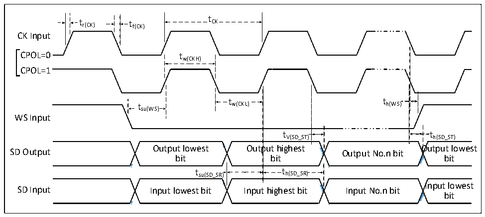

<!-- source-page: 66 -->

[← p.65](0065.md) · [index](../README.md) · [PDF p.66](https://ch32-riscv-ug.github.io/CH32V407/datasheet_en/CH32V407DS0.PDF#page=66) · [p.67 →](0067.md)

<!-- header: CH32V407/V467 Datasheet https://wch-ic.com -->

Figure 3-13 I2S Bus slave mode timing diagram  
 <!-- rendered from the PDF; verify at https://ch32-riscv-ug.github.io/CH32V407/datasheet_en/CH32V407DS0.PDF#page=66 -->

🖼 Text parsed from the figure above

t  
t r(CK) t f(CK) CK  
CK Input  
CPOL=0 tw(CKH)  
CPOL=1  
t t  
t w(CKL) h(WS)  
su(WS)  
WS Input  
t V(SD_ST)  
tV(SD_ST) th(SD_ST)  
<!-- image: p66-draw-image-00002 inside the figure -->
<!-- image: p66-draw-image-00003 inside the figure -->
<!-- image: p66-draw-image-00004 inside the figure -->
<!-- image: p66-draw-image-00005 inside the figure -->
Output lowest Output highest Output lowest  
SD Output Output No.n bit  
bit bit bit  
t  t h(SD_SR)  t  th(SD_SR)  
t su(SD_SR) t h(SD_SR)  
<!-- image: p66-draw-image-00006 inside the figure -->
<!-- image: p66-draw-image-00007 inside the figure -->
<!-- image: p66-draw-image-00008 inside the figure -->
<!-- image: p66-draw-image-00009 inside the figure -->
Input lowest  
SD Input Input lowest bit Input highest bit Input No.n bit  
bit  

<!-- p66-table-003 (table-3-27@1) -->
<table><caption>Table 3-27 I2S interface characteristics</caption><tr><th>Symbol</th><th>Parameter</th><th>Condition</th><th>Min.</th><th>Max.</th><th>Unit</th></tr><tr><td rowspan="2" style="text-align:left">f /t CK CK</td><td rowspan="2">I2S clock frequency</td><td>Master mode</td><td></td><td>8</td><td>MHz</td></tr><tr><td>Slave mode</td><td></td><td>8</td><td>MHz</td></tr><tr><td style="text-align:left">t /t r(CK) f(CK)</td><td>I2S clock rise and fall time</td><td>Load capacitance: C = 30pF</td><td></td><td>20</td><td>ns</td></tr><tr><td style="text-align:left">t V(WS)</td><td>WS valid time</td><td>Master mode</td><td></td><td>5</td><td>ns</td></tr><tr><td style="text-align:left">t SU(WS)</td><td>WS setup time</td><td>Slave mode</td><td>10</td><td></td><td>ns</td></tr><tr><td rowspan="2" style="text-align:left">t h(WS)</td><td rowspan="2">WS hold time</td><td>Master mode</td><td>0</td><td></td><td>ns</td></tr><tr><td>Slave mode</td><td>0</td><td></td><td>ns</td></tr><tr><td style="text-align:left">t /t w(CKH) w(CKL)</td><td style="text-align:left">SCK high level and low level time</td><td style="text-align:left">Master mode, f = 36MHz HCLK prescaler factor = 4</td><td>40</td><td>60</td><td>%</td></tr><tr><td rowspan="2" style="text-align:left">t SU(SD_MR) t SU(SD_SR)</td><td rowspan="2">Data input setup time</td><td>Master mode</td><td>8</td><td></td><td>ns</td></tr><tr><td>Slave mode</td><td>8</td><td></td><td>ns</td></tr><tr><td rowspan="2" style="text-align:left">t h(SD_MR) t h(SD_SR)</td><td rowspan="2">Data input hold time</td><td>Master mode</td><td>5</td><td></td><td>ns</td></tr><tr><td>Slave mode</td><td>4</td><td></td><td>ns</td></tr><tr><td style="text-align:left">t h(SD_MT)</td><td rowspan="2">Data output hold time</td><td>Slave mode (After enabling edge)</td><td></td><td>5</td><td>ns</td></tr><tr><td style="text-align:left">t h(SD_ST)</td><td style="text-align:left">Master mode (After enabling edge)</td><td></td><td>5</td><td>ns</td></tr><tr><td style="text-align:left">t V(SD_MT)</td><td rowspan="2">Data output valid time</td><td>Slave mode (After enabling edge)</td><td></td><td>5</td><td>ns</td></tr><tr><td style="text-align:left">t v(SD_ST)</td><td style="text-align:left">Master mode (After enabling edge)</td><td></td><td>4</td><td>ns</td></tr></table>

### 3.3.17 USB 2.0 Interface Characteristics

<!-- p66-table-004 (table-3-28@1) pages 66-67 -->
<table><caption>Table 3-28 USB 2.0 interface I/O characteristics</caption><tr><th>Symbol</th><th>Parameter</th><th>Condition</th><th>Min.</th><th>Typ.</th><th>Max.</th><th>Unit</th></tr><tr><td style="text-align:left">VDD33</td><td>USB 2.0 operating voltage</td><td></td><td>3.15</td><td></td><td>3.45</td><td>V</td></tr><tr><td style="text-align:left">VSE</td><td style="text-align:left">Single ended receiver threshold</td><td style="text-align:left">V = 3.3VDD33</td><td>1.2</td><td></td><td>1.9</td><td>V</td></tr><tr><td style="text-align:left">VOL</td><td>Static output low level</td><td></td><td></td><td></td><td>0.3</td><td>V</td></tr><tr><td style="text-align:left">VOH</td><td>Static output high level</td><td></td><td>2.8</td><td></td><td style="text-align:left">VDD</td><td>V</td></tr><tr><td style="text-align:left">VHSSQ</td><td style="text-align:left">Detection threshold of high-speed pressing information</td><td></td><td>100</td><td></td><td>150</td><td>mV</td></tr><tr><td style="text-align:left">VHSDSC</td><td style="text-align:left">Detection threshold of high-speed disconnection</td><td></td><td>500</td><td></td><td>625</td><td>mV</td></tr><tr><td style="text-align:left">VHSOI</td><td>High-speed idle level</td><td></td><td>-10</td><td></td><td>10</td><td>mV</td></tr><tr><td style="text-align:left">VHSOH</td><td>High-speed data high level</td><td></td><td>360</td><td></td><td>440</td><td>mV</td></tr><tr><td style="text-align:left">VHSOL</td><td>High-speed data low level</td><td></td><td>-10</td><td></td><td>10</td><td>mV</td></tr><tr><td style="text-align:left">RUSBPU</td><td>USB pin pull-up resistor</td><td></td><td>1.3</td><td>1.5</td><td>1.8</td><td>kΩ</td></tr><tr><td style="text-align:left">RUSBPD</td><td>USB pin pull-down resistor</td><td></td><td>13</td><td>15</td><td>18</td><td>kΩ</td></tr><tr><td style="text-align:left">VBC_REF</td><td>BC CMP reference voltage</td><td></td><td></td><td>0.4</td><td></td><td>V</td></tr><tr><td style="text-align:left">VBC_SRC</td><td>BC protocol output voltage</td><td></td><td></td><td>0.6</td><td></td><td>V</td></tr></table>

<!-- image: p66-draw-image-00001 bbox=[518.4, 783.36, 537.84, 793.92] -->
<!-- footer: V1.2 63 -->
