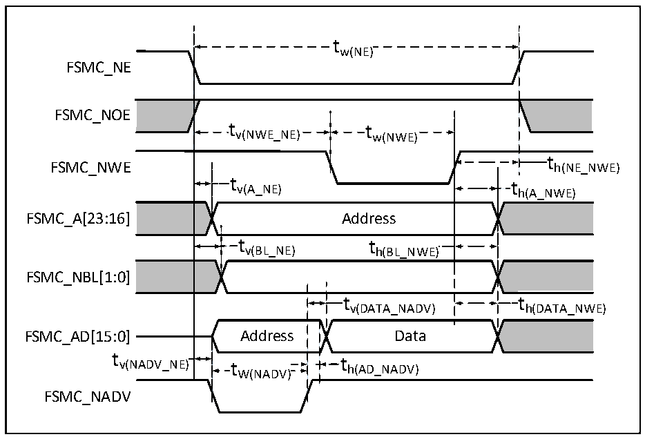

<!-- source-page: 69 -->

[← p.68](0068.md) · [index](../README.md) · [PDF p.69](https://ch32-riscv-ug.github.io/CH32V407/datasheet_en/CH32V407DS0.PDF#page=69) · [p.70 →](0070.md)

<!-- header: CH32V407/V467 Datasheet https://wch-ic.com -->

Figure 3-15 Asynchronous bus multiplexing PSRAM/NOR write operation waveform  
 <!-- rendered from the PDF; verify at https://ch32-riscv-ug.github.io/CH32V407/datasheet_en/CH32V407DS0.PDF#page=69 -->

🖼 Text parsed from the figure above

tw(NE)  
FSMC_NE  
FSMC_NOE  
tv(NWE_NE) tw(NWE)  
t h(NE_NWE)  
FSMC_NWE h(NE_NWE)  
t v(A_NE)  Address  t v(BL_NE)  )  t h(BL_NWE)  )  )  
FSMC_A[23:16] Address  
FSMC_NBL[1:0]  
t v(DATA_NADV)  
FSMC_AD[15:0] Address Data  
t  
v(NADV_NE) t t h(AD_NADV)  
th(AD_NADV)  
W(NADV)  
FSMC_NADV  

<!-- p69-table-006 (table-3-31@1) -->
<table><caption>Table 3-31 Timing of PSRAM/NOR write operation for asynchronous bus multiplexing</caption><tr><th>Symbol</th><th>Parameter</th><th>Min.</th><th>Max.</th><th>Unit</th></tr><tr><td style="text-align:left">t W（NE）</td><td>FSMC_NE low level time</td><td style="text-align:left">5*t HCLK</td><td></td><td rowspan="13">ns</td></tr><tr><td style="text-align:left">t V（NEW_NE）</td><td>FSMC_NE low to FSMC_NWE low</td><td style="text-align:left">3*t HCLK</td><td></td></tr><tr><td style="text-align:left">t W（NWE）</td><td>FSMC_NWE low time</td><td style="text-align:left">2*t HCLK</td><td></td></tr><tr><td style="text-align:left">t h（NE_NWE）</td><td style="text-align:left">Retention time from FSMC_NWE high to FSMC_NE high</td><td style="text-align:left">t HCLK</td><td></td></tr><tr><td style="text-align:left">t V（A_NE）</td><td>FSMC_NE low to FSMC_A valid</td><td>0</td><td>5</td></tr><tr><td style="text-align:left">t V（NADV_NE）</td><td>FSMC_NE low to FSMC_NADV low</td><td>0</td><td>5</td></tr><tr><td style="text-align:left">t W（NADV）</td><td>FSMC_NADV low time</td><td style="text-align:left">t HCLK</td><td></td></tr><tr><td style="text-align:left">t h（AD_NADV）</td><td style="text-align:left">Effective retention time of FSMC_AD (address) after FSMC_NADV is high.</td><td style="text-align:left">2*t HCLK</td><td></td></tr><tr><td style="text-align:left">t h（A_NWE）</td><td style="text-align:left">Address retention time after FSMC_NWE is high</td><td style="text-align:left">t HCLK</td><td></td></tr><tr><td style="text-align:left">t V（BL_NE）</td><td>FSMC_NE low to FSMC_BL valid</td><td>0</td><td>5</td></tr><tr><td style="text-align:left">t h（BL_NWE）</td><td style="text-align:left">FSMC_BL retention time after FSMC_NWE is high</td><td style="text-align:left">t HCLK</td><td></td></tr><tr><td style="text-align:left">t V（DATA_NADV）</td><td>FSMC_NADV high to data retention time</td><td style="text-align:left">2*t HCLK</td><td></td></tr><tr><td style="text-align:left">t h（DATA_NWE）</td><td style="text-align:left">Data retention time after FSMC_NWE is high</td><td style="text-align:left">t HCLK</td><td></td></tr></table>

<!-- image: p69-draw-image-00001 bbox=[518.4, 783.36, 537.84, 793.92] -->
<!-- footer: V1.2 66 -->
