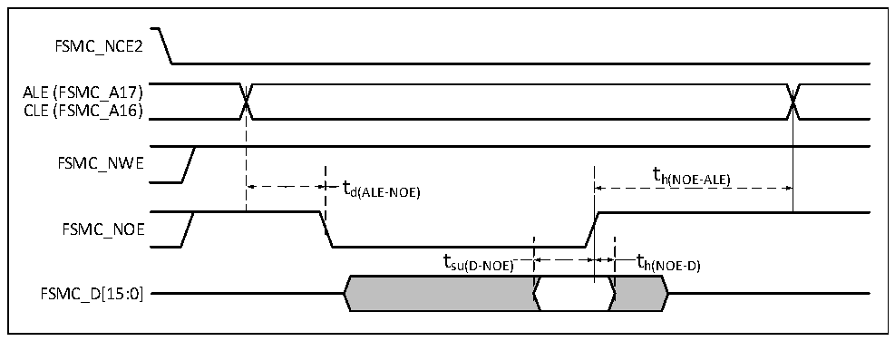
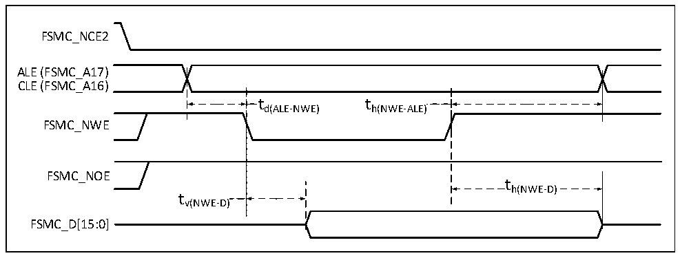
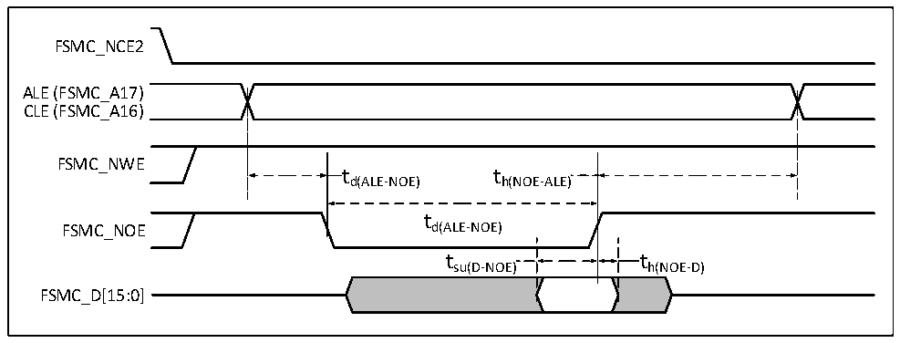

<!-- source-page: 72 -->

[← p.71](0071.md) · [index](../README.md) · [PDF p.72](https://ch32-riscv-ug.github.io/CH32V407/datasheet_en/CH32V407DS0.PDF#page=72) · [p.73 →](0073.md)

<!-- header: CH32V407/V467 Datasheet https://wch-ic.com -->

Figure 3-18 NAND controller read operation waveform  
 <!-- rendered from the PDF; verify at https://ch32-riscv-ug.github.io/CH32V407/datasheet_en/CH32V407DS0.PDF#page=72 -->

🖼 Text parsed from the figure above

FSMC_NCE2  
ALE (FSMC_A17)  
CLE (FSMC_A16)  
FSMC_NWE  
t  
t h(NOE-ALE)  
d(ALE-NOE)  
FSMC_NOE  
t su(D-NOE)  )  t h(NOE-D)  )  
FSMC_D[15:0]  

Figure 3-19 NAND controller write operation waveform  
 <!-- rendered from the PDF; verify at https://ch32-riscv-ug.github.io/CH32V407/datasheet_en/CH32V407DS0.PDF#page=72 -->

🖼 Text parsed from the figure above

FSMC_NCE2  
ALE (FSMC_A17)  
CLE (FSMC_A16)  
t  t d(ALE-NWE)  
t h(NWE-ALE)  )  
FSMC_NWE  
FSMC_NOE  
th(NWE-D)  
tv(NWE-D)  
FSMC_D[15:0]  

Figure 3-20 Read operation waveform of NAND controller in general storage space  
 <!-- rendered from the PDF; verify at https://ch32-riscv-ug.github.io/CH32V407/datasheet_en/CH32V407DS0.PDF#page=72 -->

🖼 Text parsed from the figure above

FSMC_NCE2  
ALE (FSMC_A17)  
CLE (FSMC_A16)  
FSMC_NWE  
td(ALE-NOE) th(NOE-ALE)  
t  
FSMC_NOE d(ALE-NOE)  
t su(D-NOE)  )  t h(NOE-D)  )  
FSMC_D[15:0]  

<!-- image: p72-draw-image-00001 bbox=[518.4, 783.36, 537.84, 793.92] -->
<!-- footer: V1.2 69 -->
