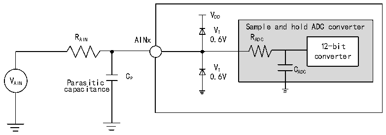
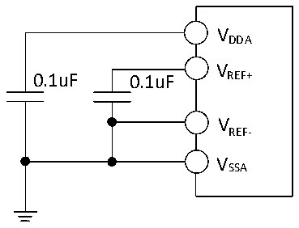

<!-- source-page: 75 -->

[← p.74](0074.md) · [index](../README.md) · [PDF p.75](https://ch32-riscv-ug.github.io/CH32V407/datasheet_en/CH32V407DS0.PDF#page=75) · [p.76 →](0076.md)

<!-- header: CH32V407/V467 Datasheet https://wch-ic.com -->

> ⬆ **Table continued** — rendered in full at [page 74](0074.md). <!-- p75-table-001 -->

<!-- p75-table-002 (table-3-38@1) -->
<table><caption>Table 3-38 ADC error</caption><tr><th>Symbol</th><th>Parameter</th><th>Condition</th><th>Min.</th><th>Typ.</th><th>Max.</th><th>Unit</th></tr><tr><td>E0</td><td>Offset error</td><td rowspan="3" style="text-align:left">f = 30MHz, ADC R &lt; 2kΩ, AIN V = 3.3VDDA</td><td></td><td>±3</td><td>±6</td><td rowspan="3">LSB</td></tr><tr><td>ED</td><td>Differential nonlinearity error</td><td></td><td>±3</td><td>±5</td></tr><tr><td>EL</td><td>Integral nonlinearity error</td><td></td><td>±3</td><td>±6</td></tr></table>

Cp represents the parasitic capacitance on the PCB and the pad (about 5pF), which may be related to the  
quality of the pad and PCB layout. A larger Cp value will reduce the conversion accuracy, the solution is to  
reduce the fADC value.  

Figure 3-23 ADC typical connection diagram  
 <!-- rendered from the PDF; verify at https://ch32-riscv-ug.github.io/CH32V407/datasheet_en/CH32V407DS0.PDF#page=75 -->

🖼 Text parsed from the figure above

VDD  
Sample and hold ADC converter  
VT  
R AIN AINx 0.6V R ADC  
12-bit  
converter  
C 0 V . T 6V C ADC  
V AIN Parasitic P  
capacitance  

Figure 3-24 Analog power supply and decoupling circuit reference  
 <!-- rendered from the PDF; verify at https://ch32-riscv-ug.github.io/CH32V407/datasheet_en/CH32V407DS0.PDF#page=75 -->

🖼 Text parsed from the figure above

VDDA  
V  
0.1uF 0.1uF REF+  
VREF-  
VSSA  

### 3.3.22 Temperature Sensor Characteristics

<!-- p75-table-003 (table-3-39@1) pages 75-76 -->
<table><caption>Table 3-39 Temperature sensor characteristics</caption><tr><th>Symbol</th><th>Parameter</th><th>Condition</th><th>Min.</th><th>Typ.</th><th>Max.</th><th>Unit</th></tr><tr><td style="text-align:left">RTS</td><td style="text-align:left">Measurement range of temperature sensor</td><td></td><td>-40</td><td></td><td>85</td><td>℃</td></tr><tr><td style="text-align:left">ATSC</td><td style="text-align:left">Measurement range of temperature sensor after software calibration</td><td></td><td></td><td>±12</td><td></td><td></td></tr><tr><td>Avg_Slope</td><td style="text-align:left">Average slope (negative temperature coefficient)</td><td></td><td>3.8</td><td>4.3</td><td>4.8</td><td>mV/℃</td></tr><tr><td style="text-align:left">V25</td><td>Voltage at 25℃</td><td></td><td>1.34</td><td>1.40</td><td>1.46</td><td>V</td></tr><tr><td style="text-align:left">TS_temp</td><td style="text-align:left">ADC sampling time when reading temperature</td><td style="text-align:left">f = 14MHz ADC</td><td></td><td></td><td>17.1</td><td>us</td></tr></table>

<!-- image: p75-draw-image-00001 bbox=[518.4, 783.36, 537.84, 793.92] -->
<!-- footer: V1.2 72 -->
