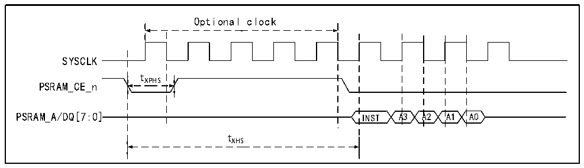
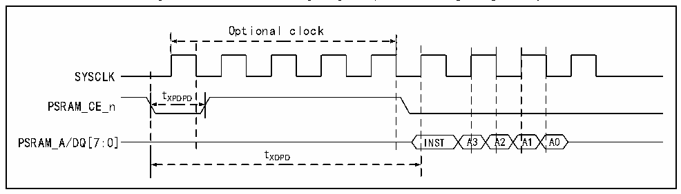

<!-- source-page: 80 -->

[← p.79](0079.md) · [index](../README.md) · [PDF p.80](https://ch32-riscv-ug.github.io/CH32V407/datasheet_en/CH32V407DS0.PDF#page=80) · [p.81 →](0081.md)

<!-- header: CH32V407/V467 Datasheet https://wch-ic.com -->

> ⬆ **Table continued** — rendered in full at [page 79](0079.md). <!-- p80-table-001 -->

<em>Note: 1. Only for CH32V467 chips w with the fifth last digit of the lot number is not 0, PSRAM can support</em>  
<em>clocks exceeding 200MHz, support variable and instruction access, and support byte writing; and in stop</em>  
<em>mode (the voltage regulator is in low-power mode), data can be maintained.</em>  

Figure 3-25 PSRAM timing diagram (exit from semi-sleep mode)  
 <!-- rendered from the PDF; verify at https://ch32-riscv-ug.github.io/CH32V407/datasheet_en/CH32V407DS0.PDF#page=80 -->

🖼 Text parsed from the figure above

Optional clock  
SYSCLK  
tXPHS  
PSRAM_CE_n  
PSRAM_A/DQ[7:0] INST A3 A2 A1 A0  
tXHS  

Figure 3-26 PSRAM timing diagram (exit from deep sleep mode)  
 <!-- rendered from the PDF; verify at https://ch32-riscv-ug.github.io/CH32V407/datasheet_en/CH32V407DS0.PDF#page=80 -->

🖼 Text parsed from the figure above

Optional clock  
SYSCLK  
tXPDPD  
PSRAM_CE_n  
PSRAM_A/DQ[7:0] INST A3 A2 A1 A0  
tXDPD  

<!-- image: p80-draw-image-00001 bbox=[518.4, 783.36, 537.84, 793.92] -->
<!-- footer: V1.2 77 -->
