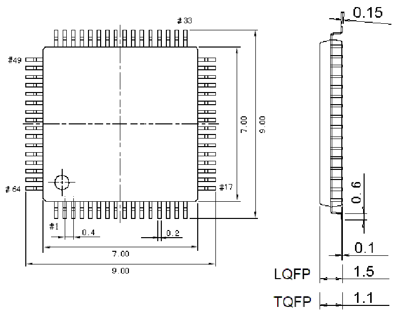

<!-- source-page: 83 -->

[← p.82](0082.md) · [index](../README.md) · [PDF p.83](https://ch32-riscv-ug.github.io/CH32V407/datasheet_en/CH32V407DS0.PDF#page=83) · [p.84 →](0084.md)

<!-- header: CH32V407/V467 Datasheet https://wch-ic.com -->

## 4.3 LQFP64 Package

 <!-- p83-draw-image-00002 rendered from the PDF -->

<!-- image: p83-draw-image-00001 bbox=[518.4, 783.36, 537.84, 793.92] -->
<!-- footer: V1.2 80 -->
