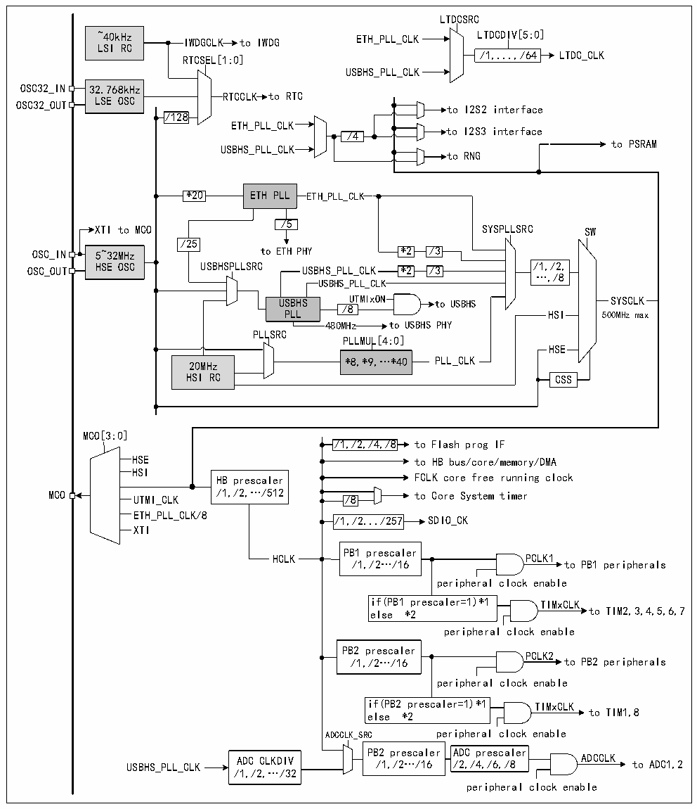

<!-- source-page: 6 -->

[← p.5](0005.md) · [index](../README.md) · [PDF p.6](https://ch32-riscv-ug.github.io/CH32V407/datasheet_zh/CH32V407DS0.PDF#page=6) · [p.7 →](0007.md)

<!-- header: CH32V407、V467数据手册 https://wch.cn -->

## 1.3 时钟树

系统中引入4组时钟源：内部高频RC振荡器（HSI）、内部低频RC振荡器（LSI）、外接高频振荡  
器（HSE）以及外接低频振荡器（LSE）。  

图1-3 时钟树框图  
 <!-- rendered from the PDF; verify at https://ch32-riscv-ug.github.io/CH32V407/datasheet_zh/CH32V407DS0.PDF#page=6 -->

🖼 Text parsed from the figure above

LTDCSRC  
~40kHz IWDGCLK to IWDG ETH_PLL_CLK LTDCDIV[5:0]  
LSI RC  
/1,...,/64 LTDC_CLK  
RTCSEL[1:0]  
USBHS_PLL_CLK  
32.768kHz LSE OSC  
RTCCLK to RTC  
OSC32_OUT LSE OSC to I2S2 interface  
/128  
ETH_PLL_CLK  
to I2S3 interface  
/4  
to PSRAM  
USBHS_PLL_CLK  
to RNG  
*20 ETH PLL ETH_PLL_CLK  
/5  
XTI to MCO SYSPLLSRC SW  
/25  
OSC_IN 5~32MHz to ETH PHY *2 /3  
OSC_OUT HSE OSC USBHSPLLSRC USBHS_PLL_CLK *2 /3 /1,/2,  
…,/8  
USBHS_PLL_CLK  
USBHS UTMIxON to USBHS SYSCLK  
/8  
PLL HSI 500MHz max  
480MHz to USBHS PHY  
PLLSRC  
PLLMUL[4:0]  
HSE  
20MHz *8,*9,…*40 PLL_CLK  
HSI RC CSS  
MCO[3:0]  
/1,/2,/4,/8 to Flash prog IF  
/1,/2,/4,/8  /1,/2,/4,/8  
HSE to HB bus/core/memory/DMA  
HSI  
HB prescaler FCLK core free running clock  
MCO UTMI_CLK /1,/2,…/512 /8 to Core System timer  
UTMI_CLK  
ETH_PLL_CLK/8  
/1,/2.../257  /1,/2.../257  
XTI  
PB1 prescaler  
HCLK PCLK1  
/1,/2…/16 to PB1 peripherals  
peripheral clock enable  
if(PB1 prescaler=1)*1 TIMxCLK  
else *2 to TIM2,3,4,5,6,7  
peripheral clock enable  
PB2 prescaler  
PCLK2  
/1,/2…/16 to PB2 peripherals  
peripheral clock enable  
if(PB2 prescaler=1)*1 TIMxCLK  
else *2 to TIM1,8  
ADCCLK_SRC peripheral clock enable  
PB2 prescaler ADC prescaler  
USBHS_PLL_CLK ADC CLKDIV /1,/2…/16 /2,/4,/6,/8 ADCCLK to ADC1,2  
/1,/2,…/32  
peripheral clock enable  

<!-- image: p6-draw-image-00001 bbox=[507.72, 779.28, 527.16, 789.6] -->
<!-- footer: V1.2 4 -->
