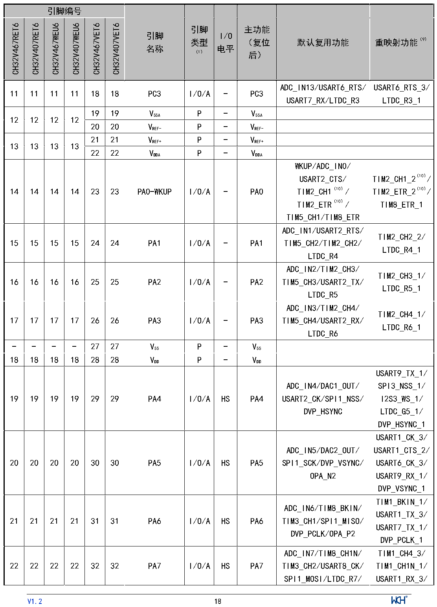

<!-- source-page: 20 -->

[← p.19](0019.md) · [index](../README.md) · [PDF p.20](https://ch32-riscv-ug.github.io/CH32V407/datasheet_zh/CH32V407DS0.PDF#page=20) · [p.21 →](0021.md)

<!-- header: CH32V407、V467数据手册 https://wch.cn -->

 <!-- p20-cluster-01 uncaptioned graphics, rendered from the PDF; verify at https://ch32-riscv-ug.github.io/CH32V407/datasheet_zh/CH32V407DS0.PDF#page=20 -->

🖼 Text parsed from the figure above

<!-- p20-table-001 (table-2-1@1) -->
<table><tr><th colspan="6">引脚编号</th><th rowspan="2" style="text-align:left">引脚名称</th><th rowspan="2" style="text-align:left">引脚类型 （1）</th><th rowspan="2" style="text-align:left">I/O电平</th><th rowspan="2" style="text-align:left">主功能 （复位后）</th><th rowspan="2">默认复用功能</th><th rowspan="2">重映射功能（9）</th></tr><tr><td>CH32V467RET6</td><td>CH32V407RET6</td><td>CH32V467WEU6</td><td>CH32V407WEU6</td><td>CH32V467VET6</td><td>CH32V407VET6</td></tr><tr><td>11</td><td>11</td><td>11</td><td>11</td><td>18</td><td>18</td><td>PC3</td><td>I/O/A</td><td>-</td><td>PC3</td><td style="text-align:left">ADC_IN13/USART6_RTS/ USART7_RX/LTDC_R3</td><td style="text-align:left">USART6_RTS_3/ LTDC_R3_1</td></tr><tr><td rowspan="2">12</td><td rowspan="2">12</td><td rowspan="2">12</td><td rowspan="2">12</td><td>19</td><td>19</td><td style="text-align:left">VSSA</td><td>P</td><td>-</td><td style="text-align:left">VSSA</td><td></td><td></td></tr><tr><td>20</td><td>20</td><td style="text-align:left">VREF-</td><td>P</td><td>-</td><td style="text-align:left">VREF-</td><td></td><td></td></tr><tr><td rowspan="2">13</td><td rowspan="2">13</td><td rowspan="2">13</td><td rowspan="2">13</td><td>21</td><td>21</td><td style="text-align:left">VREF+</td><td>P</td><td>-</td><td style="text-align:left">VREF+</td><td></td><td></td></tr><tr><td>22</td><td>22</td><td style="text-align:left">VDDA</td><td>P</td><td>-</td><td style="text-align:left">VDDA</td><td></td><td></td></tr><tr><td>14</td><td>14</td><td>14</td><td>14</td><td>23</td><td>23</td><td>PA0-WKUP</td><td>I/O/A</td><td>-</td><td>PA0</td><td style="text-align:left">WKUP/ADC_IN0/ USART2_CTS/ TIM2_CH1（10）/ TIM2_ETR（10）/ TIM5_CH1/TIM8_ETR</td><td style="text-align:left">TIM2_CH1_2（10）/ TIM2_ETR_2（10）/ TIM8_ETR_1</td></tr><tr><td>15</td><td>15</td><td>15</td><td>15</td><td>24</td><td>24</td><td>PA1</td><td>I/O/A</td><td>-</td><td>PA1</td><td style="text-align:left">ADC_IN1/USART2_RTS/ TIM5_CH2/TIM2_CH2/ LTDC_R4</td><td style="text-align:left">TIM2_CH2_2/ LTDC_R4_1</td></tr><tr><td>16</td><td>16</td><td>16</td><td>16</td><td>25</td><td>25</td><td>PA2</td><td>I/O/A</td><td>-</td><td>PA2</td><td style="text-align:left">ADC_IN2/TIM2_CH3/ TIM5_CH3/USART2_TX/ LTDC_R5</td><td style="text-align:left">TIM2_CH3_1/ LTDC_R5_1</td></tr><tr><td>17</td><td>17</td><td>17</td><td>17</td><td>26</td><td>26</td><td>PA3</td><td>I/O/A</td><td>-</td><td>PA3</td><td style="text-align:left">ADC_IN3/TIM2_CH4/ TIM5_CH4/USART2_RX/ LTDC_R6</td><td style="text-align:left">TIM2_CH4_1/ LTDC_R6_1</td></tr><tr><td>-</td><td>-</td><td>-</td><td>-</td><td>27</td><td>27</td><td style="text-align:left">VSS</td><td>P</td><td>-</td><td style="text-align:left">VSS</td><td></td><td></td></tr><tr><td>18</td><td>18</td><td>18</td><td>18</td><td>28</td><td>28</td><td style="text-align:left">VDD</td><td>P</td><td>-</td><td style="text-align:left">VDD</td><td></td><td></td></tr><tr><td>19</td><td>19</td><td>19</td><td>19</td><td>29</td><td>29</td><td>PA4</td><td>I/O/A</td><td>HS</td><td>PA4</td><td style="text-align:left">ADC_IN4/DAC1_OUT/ USART2_CK/SPI1_NSS/ DVP_HSYNC</td><td style="text-align:left">USART9_TX_1/ SPI3_NSS_1/ I2S3_WS_1/ LTDC_G5_1/ DVP_HSYNC_1</td></tr><tr><td>20</td><td>20</td><td>20</td><td>20</td><td>30</td><td>30</td><td>PA5</td><td>I/O/A</td><td>HS</td><td>PA5</td><td style="text-align:left">ADC_IN5/DAC2_OUT/ SPI1_SCK/DVP_VSYNC/ OPA_N2</td><td style="text-align:left">USART1_CK_3/ USART1_CTS_2/ USART6_CK_3/ USART9_RX_1/ DVP_VSYNC_1</td></tr><tr><td>21</td><td>21</td><td>21</td><td>21</td><td>31</td><td>31</td><td>PA6</td><td>I/O/A</td><td>HS</td><td>PA6</td><td style="text-align:left">ADC_IN6/TIM8_BKIN/ TIM3_CH1/SPI1_MISO/ DVP_PCLK/OPA_P2</td><td style="text-align:left">TIM1_BKIN_1/ USART1_TX_3/ USART7_TX_1/ DVP_PCLK_1</td></tr><tr><td>22</td><td>22</td><td>22</td><td>22</td><td>32</td><td>32</td><td>PA7</td><td>I/O/A</td><td>HS</td><td>PA7</td><td style="text-align:left">ADC_IN7/TIM8_CH1N/ TIM3_CH2/USART8_CK/ SPI1_MOSI/LTDC_R7/</td><td style="text-align:left">TIM1_CH4_3/ TIM1_CH1N_1/ USART1_RX_3/</td></tr></table>

<!-- image: p20-draw-image-00001 inside the figure -->
<!-- footer: V1.2 18 -->

