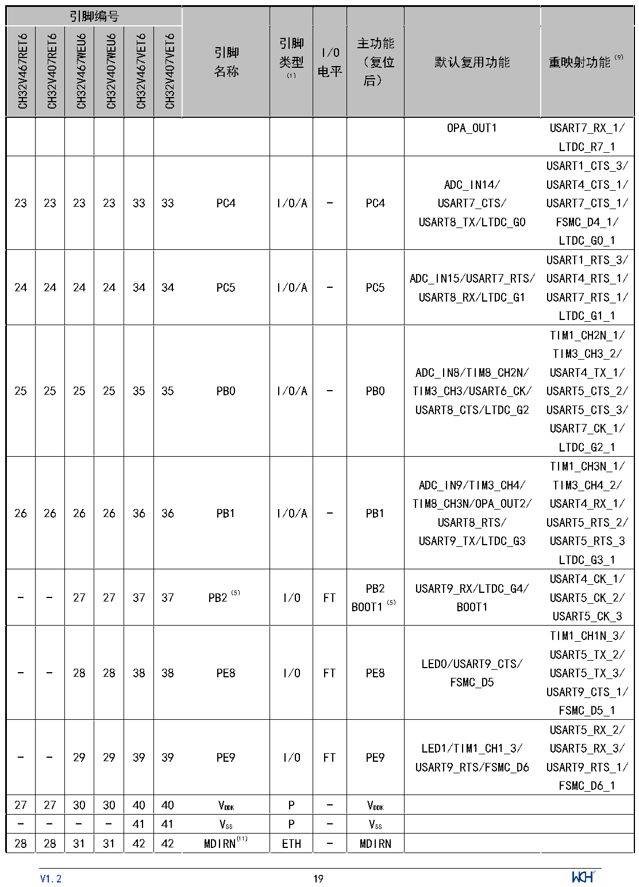

<!-- source-page: 21 -->

[← p.20](0020.md) · [index](../README.md) · [PDF p.21](https://ch32-riscv-ug.github.io/CH32V407/datasheet_zh/CH32V407DS0.PDF#page=21) · [p.22 →](0022.md)

<!-- header: CH32V407、V467数据手册 https://wch.cn -->

 <!-- p21-cluster-01 uncaptioned graphics, rendered from the PDF; verify at https://ch32-riscv-ug.github.io/CH32V407/datasheet_zh/CH32V407DS0.PDF#page=21 -->

🖼 Text parsed from the figure above

<!-- p21-table-001 (table-2-1@1) -->
<table><tr><th colspan="6">引脚编号</th><th rowspan="2" style="text-align:left">引脚名称</th><th rowspan="2" style="text-align:left">引脚类型 （1）</th><th rowspan="2" style="text-align:left">I/O电平</th><th rowspan="2" style="text-align:left">主功能 （复位后）</th><th rowspan="2">默认复用功能</th><th rowspan="2">重映射功能（9）</th></tr><tr><td>CH32V467RET6</td><td>CH32V407RET6</td><td>CH32V467WEU6</td><td>CH32V407WEU6</td><td>CH32V467VET6</td><td>CH32V407VET6</td></tr><tr><td></td><td></td><td></td><td></td><td></td><td></td><td></td><td></td><td></td><td></td><td>OPA_OUT1</td><td style="text-align:left">USART7_RX_1/ LTDC_R7_1</td></tr><tr><td>23</td><td>23</td><td>23</td><td>23</td><td>33</td><td>33</td><td>PC4</td><td>I/O/A</td><td>-</td><td>PC4</td><td style="text-align:left">ADC_IN14/ USART7_CTS/ USART8_TX/LTDC_G0</td><td style="text-align:left">USART1_CTS_3/ USART4_CTS_1/ USART7_CTS_1/ FSMC_D4_1/ LTDC_G0_1</td></tr><tr><td>24</td><td>24</td><td>24</td><td>24</td><td>34</td><td>34</td><td>PC5</td><td>I/O/A</td><td>-</td><td>PC5</td><td style="text-align:left">ADC_IN15/USART7_RTS/ USART8_RX/LTDC_G1</td><td style="text-align:left">USART1_RTS_3/ USART4_RTS_1/ USART7_RTS_1/ LTDC_G1_1</td></tr><tr><td>25</td><td>25</td><td>25</td><td>25</td><td>35</td><td>35</td><td>PB0</td><td>I/O/A</td><td>-</td><td>PB0</td><td style="text-align:left">ADC_IN8/TIM8_CH2N/ TIM3_CH3/USART6_CK/ USART8_CTS/LTDC_G2</td><td style="text-align:left">TIM1_CH2N_1/ TIM3_CH3_2/ USART4_TX_1/ USART5_CTS_2/ USART5_CTS_3/ USART7_CK_1/ LTDC_G2_1</td></tr><tr><td>26</td><td>26</td><td>26</td><td>26</td><td>36</td><td>36</td><td>PB1</td><td>I/O/A</td><td>-</td><td>PB1</td><td style="text-align:left">ADC_IN9/TIM3_CH4/ TIM8_CH3N/OPA_OUT2/ USART8_RTS/ USART9_TX/LTDC_G3</td><td style="text-align:left">TIM1_CH3N_1/ TIM3_CH4_2/ USART4_RX_1/ USART5_RTS_2/ USART5_RTS_3LTDC_G3_1</td></tr><tr><td>-</td><td>-</td><td>27</td><td>27</td><td>37</td><td>37</td><td>PB2（5）</td><td>I/O</td><td>FT</td><td style="text-align:left">PB2BOOT1（5）</td><td style="text-align:left">USART9_RX/LTDC_G4/ BOOT1</td><td style="text-align:left">USART4_CK_1/ USART5_CK_2/ USART5_CK_3</td></tr><tr><td>-</td><td>-</td><td>28</td><td>28</td><td>38</td><td>38</td><td>PE8</td><td>I/O</td><td>FT</td><td>PE8</td><td style="text-align:left">LED0/USART9_CTS/ FSMC_D5</td><td style="text-align:left">TIM1_CH1N_3/ USART5_TX_2/ USART5_TX_3/ USART9_CTS_1/ FSMC_D5_1</td></tr><tr><td>-</td><td>-</td><td>29</td><td>29</td><td>39</td><td>39</td><td>PE9</td><td>I/O</td><td>FT</td><td>PE9</td><td style="text-align:left">LED1/TIM1_CH1_3/ USART9_RTS/FSMC_D6</td><td style="text-align:left">USART5_RX_2/ USART5_RX_3/ USART9_RTS_1/ FSMC_D6_1</td></tr><tr><td>27</td><td>27</td><td>30</td><td>30</td><td>40</td><td>40</td><td style="text-align:left">VDDK</td><td>P</td><td>-</td><td style="text-align:left">VDDK</td><td></td><td></td></tr><tr><td>-</td><td>-</td><td>-</td><td>-</td><td>41</td><td>41</td><td style="text-align:left">VSS</td><td>P</td><td>-</td><td style="text-align:left">VSS</td><td></td><td></td></tr><tr><td>28</td><td>28</td><td>31</td><td>31</td><td>42</td><td>42</td><td>MDIRN(11)</td><td>ETH</td><td>-</td><td>MDIRN</td><td></td><td></td></tr></table>

<!-- image: p21-draw-image-00001 inside the figure -->
<!-- footer: V1.2 19 -->

