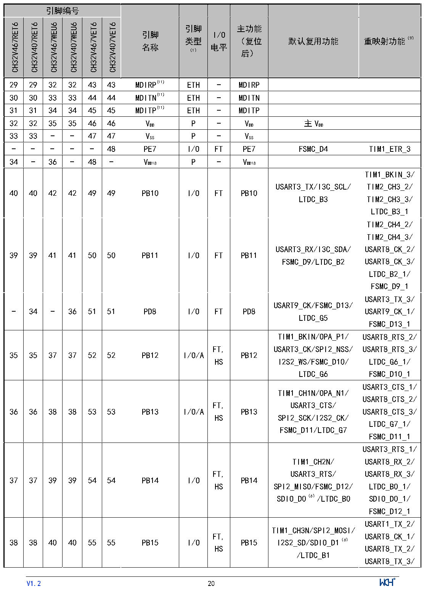

<!-- source-page: 22 -->

[← p.21](0021.md) · [index](../README.md) · [PDF p.22](https://ch32-riscv-ug.github.io/CH32V407/datasheet_zh/CH32V407DS0.PDF#page=22) · [p.23 →](0023.md)

<!-- header: CH32V407、V467数据手册 https://wch.cn -->

 <!-- p22-cluster-01 uncaptioned graphics, rendered from the PDF; verify at https://ch32-riscv-ug.github.io/CH32V407/datasheet_zh/CH32V407DS0.PDF#page=22 -->

🖼 Text parsed from the figure above

<!-- p22-table-001 (table-2-1@1) -->
<table><tr><th colspan="6">引脚编号</th><th rowspan="2" style="text-align:left">引脚名称</th><th rowspan="2" style="text-align:left">引脚类型 （1）</th><th rowspan="2" style="text-align:left">I/O电平</th><th rowspan="2" style="text-align:left">主功能 （复位后）</th><th rowspan="2">默认复用功能</th><th rowspan="2">重映射功能（9）</th></tr><tr><td>CH32V467RET6</td><td>CH32V407RET6</td><td>CH32V467WEU6</td><td>CH32V407WEU6</td><td>CH32V467VET6</td><td>CH32V407VET6</td></tr><tr><td>29</td><td>29</td><td>32</td><td>32</td><td>43</td><td>43</td><td>MDIRP(11)</td><td>ETH</td><td>-</td><td>MDIRP</td><td></td><td></td></tr><tr><td>30</td><td>30</td><td>33</td><td>33</td><td>44</td><td>44</td><td>MDITN(11)</td><td>ETH</td><td>-</td><td>MDITN</td><td></td><td></td></tr><tr><td>31</td><td>31</td><td>34</td><td>34</td><td>45</td><td>45</td><td>MDITP(11)</td><td>ETH</td><td>-</td><td>MDITP</td><td></td><td></td></tr><tr><td>32</td><td>32</td><td>35</td><td>35</td><td>46</td><td>46</td><td style="text-align:left">VDD</td><td>P</td><td>-</td><td style="text-align:left">VDD</td><td style="text-align:left">主VDD</td><td></td></tr><tr><td>33</td><td>33</td><td>-</td><td>-</td><td>47</td><td>47</td><td style="text-align:left">VSS</td><td>P</td><td>-</td><td style="text-align:left">VSS</td><td></td><td></td></tr><tr><td>-</td><td>-</td><td>-</td><td>-</td><td>-</td><td>48</td><td>PE7</td><td>I/O</td><td>FT</td><td>PE7</td><td>FSMC_D4</td><td>TIM1_ETR_3</td></tr><tr><td>34</td><td>-</td><td>36</td><td>-</td><td>48</td><td>-</td><td style="text-align:left">VDD18</td><td>P</td><td>-</td><td style="text-align:left">VDD18</td><td></td><td></td></tr><tr><td>40</td><td>40</td><td>42</td><td>42</td><td>49</td><td>49</td><td>PB10</td><td>I/O</td><td>FT</td><td>PB10</td><td style="text-align:left">USART3_TX/I3C_SCL/ LTDC_B3</td><td style="text-align:left">TIM1_BKIN_3/ TIM2_CH3_2/ TIM2_CH3_3/ LTDC_B3_1</td></tr><tr><td>39</td><td>39</td><td>41</td><td>41</td><td>50</td><td>50</td><td>PB11</td><td>I/O</td><td>FT</td><td>PB11</td><td style="text-align:left">USART3_RX/I3C_SDA/ FSMC_D9/LTDC_B2</td><td style="text-align:left">TIM2_CH4_2/ TIM2_CH4_3/ USART8_CK_2/ USART8_CK_3/ LTDC_B2_1/ FSMC_D9_1</td></tr><tr><td>-</td><td>34</td><td>-</td><td>36</td><td>51</td><td>51</td><td>PD8</td><td>I/O</td><td>FT</td><td>PD8</td><td style="text-align:left">USART9_CK/FSMC_D13/ LTDC_G5</td><td style="text-align:left">USART3_TX_3/ USART9_CK_1/ FSMC_D13_1</td></tr><tr><td>35</td><td>35</td><td>37</td><td>37</td><td>52</td><td>52</td><td>PB12</td><td>I/O/A</td><td style="text-align:left">FT, HS</td><td>PB12</td><td style="text-align:left">TIM1_BKIN/OPA_P1/ USART3_CK/SPI2_NSS/ I2S2_WS/FSMC_D10/ LTDC_G6</td><td style="text-align:left">USART8_RTS_2/ USART8_RTS_3/ LTDC_G6_1/ FSMC_D10_1</td></tr><tr><td>36</td><td>36</td><td>38</td><td>38</td><td>53</td><td>53</td><td>PB13</td><td>I/O/A</td><td style="text-align:left">FT, HS</td><td>PB13</td><td style="text-align:left">TIM1_CH1N/OPA_N1/ USART3_CTS/ SPI2_SCK/I2S2_CK/ FSMC_D11/LTDC_G7</td><td style="text-align:left">USART3_CTS_1/ USART8_CTS_2/ USART8_CTS_3/ LTDC_G7_1/ FSMC_D11_1</td></tr><tr><td>37</td><td>37</td><td>39</td><td>39</td><td>54</td><td>54</td><td>PB14</td><td>I/O</td><td style="text-align:left">FT, HS</td><td>PB14</td><td style="text-align:left">TIM1_CH2N/ USART3_RTS/ SPI2_MISO/FSMC_D12/ SDIO_D0（6）/LTDC_B0</td><td style="text-align:left">USART3_RTS_1/ USART8_RX_2/ USART8_RX_3/ LTDC_B0_1/ SDIO_D0_1/ FSMC_D12_1</td></tr><tr><td>38</td><td>38</td><td>40</td><td>40</td><td>55</td><td>55</td><td>PB15</td><td>I/O</td><td style="text-align:left">FT, HS</td><td>PB15</td><td style="text-align:left">TIM1_CH3N/SPI2_MOSI/ I2S2_SD/SDIO_D1（6） /LTDC_B1</td><td style="text-align:left">USART1_TX_2/ USART8_CK_1/ USART8_TX_2/ USART8_TX_3/</td></tr></table>

<!-- image: p22-draw-image-00001 inside the figure -->
<!-- footer: V1.2 20 -->

