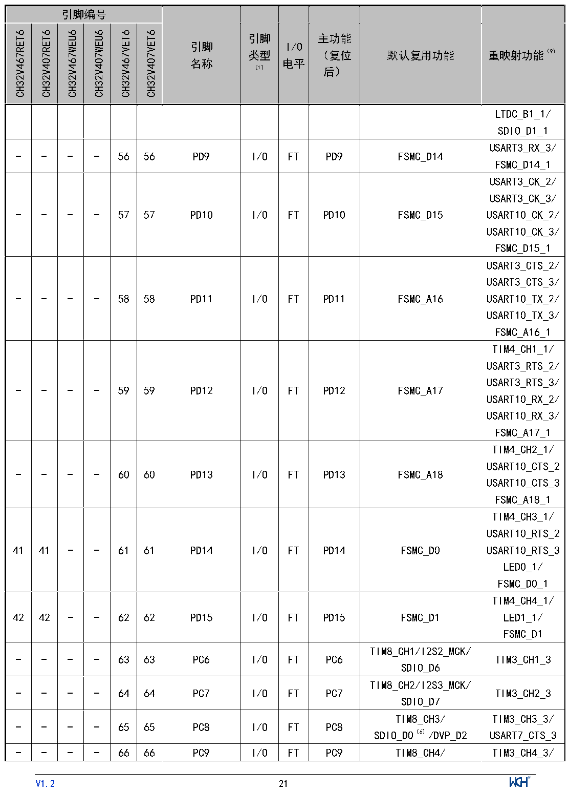

<!-- source-page: 23 -->

[← p.22](0022.md) · [index](../README.md) · [PDF p.23](https://ch32-riscv-ug.github.io/CH32V407/datasheet_zh/CH32V407DS0.PDF#page=23) · [p.24 →](0024.md)

<!-- header: CH32V407、V467数据手册 https://wch.cn -->

 <!-- p23-cluster-01 uncaptioned graphics, rendered from the PDF; verify at https://ch32-riscv-ug.github.io/CH32V407/datasheet_zh/CH32V407DS0.PDF#page=23 -->

🖼 Text parsed from the figure above

<!-- p23-table-001 (table-2-1@1) -->
<table><tr><th colspan="6">引脚编号</th><th rowspan="2" style="text-align:left">引脚名称</th><th rowspan="2" style="text-align:left">引脚类型 （1）</th><th rowspan="2" style="text-align:left">I/O电平</th><th rowspan="2" style="text-align:left">主功能 （复位后）</th><th rowspan="2">默认复用功能</th><th rowspan="2">重映射功能（9）</th></tr><tr><td>CH32V467RET6</td><td>CH32V407RET6</td><td>CH32V467WEU6</td><td>CH32V407WEU6</td><td>CH32V467VET6</td><td>CH32V407VET6</td></tr><tr><td></td><td></td><td></td><td></td><td></td><td></td><td></td><td></td><td></td><td></td><td></td><td style="text-align:left">LTDC_B1_1/ SDIO_D1_1</td></tr><tr><td>-</td><td>-</td><td>-</td><td>-</td><td>56</td><td>56</td><td>PD9</td><td>I/O</td><td>FT</td><td>PD9</td><td>FSMC_D14</td><td style="text-align:left">USART3_RX_3/ FSMC_D14_1</td></tr><tr><td>-</td><td>-</td><td>-</td><td>-</td><td>57</td><td>57</td><td>PD10</td><td>I/O</td><td>FT</td><td>PD10</td><td>FSMC_D15</td><td style="text-align:left">USART3_CK_2/ USART3_CK_3/ USART10_CK_2/ USART10_CK_3/ FSMC_D15_1</td></tr><tr><td>-</td><td>-</td><td>-</td><td>-</td><td>58</td><td>58</td><td>PD11</td><td>I/O</td><td>FT</td><td>PD11</td><td>FSMC_A16</td><td style="text-align:left">USART3_CTS_2/ USART3_CTS_3/ USART10_TX_2/ USART10_TX_3/ FSMC_A16_1</td></tr><tr><td>-</td><td>-</td><td>-</td><td>-</td><td>59</td><td>59</td><td>PD12</td><td>I/O</td><td>FT</td><td>PD12</td><td>FSMC_A17</td><td style="text-align:left">TIM4_CH1_1/ USART3_RTS_2/ USART3_RTS_3/ USART10_RX_2/ USART10_RX_3/ FSMC_A17_1</td></tr><tr><td>-</td><td>-</td><td>-</td><td>-</td><td>60</td><td>60</td><td>PD13</td><td>I/O</td><td>FT</td><td>PD13</td><td>FSMC_A18</td><td style="text-align:left">TIM4_CH2_1/ USART10_CTS_2USART10_CTS_3FSMC_A18_1</td></tr><tr><td>41</td><td>41</td><td>-</td><td>-</td><td>61</td><td>61</td><td>PD14</td><td>I/O</td><td>FT</td><td>PD14</td><td>FSMC_D0</td><td style="text-align:left">TIM4_CH3_1/ USART10_RTS_2USART10_RTS_3LED0_1/ FSMC_D0_1</td></tr><tr><td>42</td><td>42</td><td>-</td><td>-</td><td>62</td><td>62</td><td>PD15</td><td>I/O</td><td>FT</td><td>PD15</td><td>FSMC_D1</td><td style="text-align:left">TIM4_CH4_1/ LED1_1/ FSMC_D1</td></tr><tr><td>-</td><td>-</td><td>-</td><td>-</td><td>63</td><td>63</td><td>PC6</td><td>I/O</td><td>FT</td><td>PC6</td><td style="text-align:left">TIM8_CH1/I2S2_MCK/ SDIO_D6</td><td>TIM3_CH1_3</td></tr><tr><td>-</td><td>-</td><td>-</td><td>-</td><td>64</td><td>64</td><td>PC7</td><td>I/O</td><td>FT</td><td>PC7</td><td style="text-align:left">TIM8_CH2/I2S3_MCK/ SDIO_D7</td><td>TIM3_CH2_3</td></tr><tr><td>-</td><td>-</td><td>-</td><td>-</td><td>65</td><td>65</td><td>PC8</td><td>I/O</td><td>FT</td><td>PC8</td><td style="text-align:left">TIM8_CH3/ SDIO_D0（6）/DVP_D2</td><td style="text-align:left">TIM3_CH3_3/ USART7_CTS_3</td></tr><tr><td>-</td><td>-</td><td>-</td><td>-</td><td>66</td><td>66</td><td>PC9</td><td>I/O</td><td>FT</td><td>PC9</td><td>TIM8_CH4/</td><td>TIM3_CH4_3/</td></tr></table>

<!-- image: p23-draw-image-00001 inside the figure -->
<!-- footer: V1.2 21 -->

