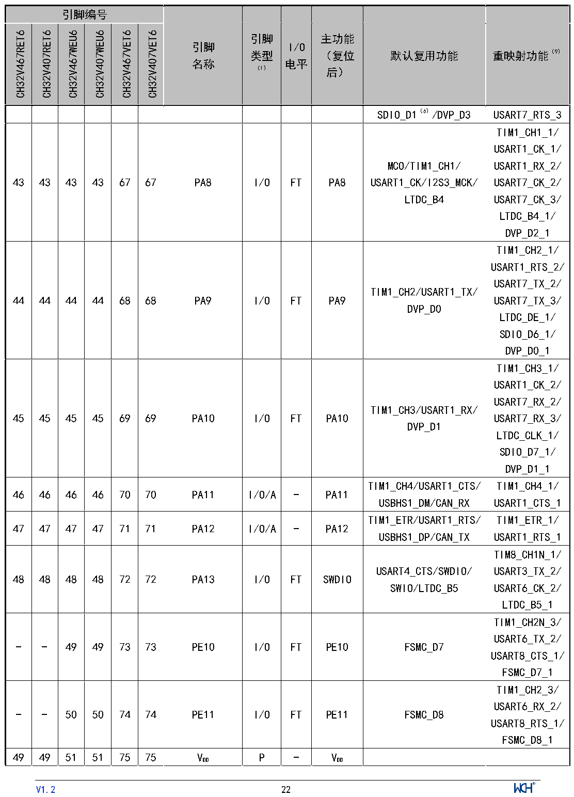

<!-- source-page: 24 -->

[← p.23](0023.md) · [index](../README.md) · [PDF p.24](https://ch32-riscv-ug.github.io/CH32V407/datasheet_zh/CH32V407DS0.PDF#page=24) · [p.25 →](0025.md)

<!-- header: CH32V407、V467数据手册 https://wch.cn -->

 <!-- p24-cluster-01 uncaptioned graphics, rendered from the PDF; verify at https://ch32-riscv-ug.github.io/CH32V407/datasheet_zh/CH32V407DS0.PDF#page=24 -->

🖼 Text parsed from the figure above

<!-- p24-table-001 (table-2-1@1) -->
<table><tr><th colspan="6">引脚编号</th><th rowspan="2" style="text-align:left">引脚名称</th><th rowspan="2" style="text-align:left">引脚类型 （1）</th><th rowspan="2" style="text-align:left">I/O电平</th><th rowspan="2" style="text-align:left">主功能 （复位后）</th><th rowspan="2">默认复用功能</th><th rowspan="2">重映射功能（9）</th></tr><tr><td>CH32V467RET6</td><td>CH32V407RET6</td><td>CH32V467WEU6</td><td>CH32V407WEU6</td><td>CH32V467VET6</td><td>CH32V407VET6</td></tr><tr><td></td><td></td><td></td><td></td><td></td><td></td><td></td><td></td><td></td><td></td><td>SDIO_D1（6）/DVP_D3</td><td>USART7_RTS_3</td></tr><tr><td>43</td><td>43</td><td>43</td><td>43</td><td>67</td><td>67</td><td>PA8</td><td>I/O</td><td>FT</td><td>PA8</td><td style="text-align:left">MCO/TIM1_CH1/ USART1_CK/I2S3_MCK/ LTDC_B4</td><td style="text-align:left">TIM1_CH1_1/ USART1_CK_1/ USART1_RX_2/ USART7_CK_2/ USART7_CK_3/ LTDC_B4_1/ DVP_D2_1</td></tr><tr><td>44</td><td>44</td><td>44</td><td>44</td><td>68</td><td>68</td><td>PA9</td><td>I/O</td><td>FT</td><td>PA9</td><td style="text-align:left">TIM1_CH2/USART1_TX/ DVP_D0</td><td style="text-align:left">TIM1_CH2_1/ USART1_RTS_2/ USART7_TX_2/ USART7_TX_3/ LTDC_DE_1/ SDIO_D6_1/ DVP_D0_1</td></tr><tr><td>45</td><td>45</td><td>45</td><td>45</td><td>69</td><td>69</td><td>PA10</td><td>I/O</td><td>FT</td><td>PA10</td><td style="text-align:left">TIM1_CH3/USART1_RX/ DVP_D1</td><td style="text-align:left">TIM1_CH3_1/ USART1_CK_2/ USART7_RX_2/ USART7_RX_3/ LTDC_CLK_1/ SDIO_D7_1/ DVP_D1_1</td></tr><tr><td>46</td><td>46</td><td>46</td><td>46</td><td>70</td><td>70</td><td>PA11</td><td>I/O/A</td><td>-</td><td>PA11</td><td style="text-align:left">TIM1_CH4/USART1_CTS/ USBHS1_DM/CAN_RX</td><td style="text-align:left">TIM1_CH4_1/ USART1_CTS_1</td></tr><tr><td>47</td><td>47</td><td>47</td><td>47</td><td>71</td><td>71</td><td>PA12</td><td>I/O/A</td><td>-</td><td>PA12</td><td style="text-align:left">TIM1_ETR/USART1_RTS/ USBHS1_DP/CAN_TX</td><td style="text-align:left">TIM1_ETR_1/ USART1_RTS_1</td></tr><tr><td>48</td><td>48</td><td>48</td><td>48</td><td>72</td><td>72</td><td>PA13</td><td>I/O</td><td>FT</td><td>SWDIO</td><td style="text-align:left">USART4_CTS/SWDIO/ SWIO/LTDC_B5</td><td style="text-align:left">TIM8_CH1N_1/ USART3_TX_2/ USART6_CK_2/ LTDC_B5_1</td></tr><tr><td>-</td><td>-</td><td>49</td><td>49</td><td>73</td><td>73</td><td>PE10</td><td>I/O</td><td>FT</td><td>PE10</td><td>FSMC_D7</td><td style="text-align:left">TIM1_CH2N_3/ USART6_TX_2/ USART8_CTS_1/ FSMC_D7_1</td></tr><tr><td>-</td><td>-</td><td>50</td><td>50</td><td>74</td><td>74</td><td>PE11</td><td>I/O</td><td>FT</td><td>PE11</td><td>FSMC_D8</td><td style="text-align:left">TIM1_CH2_3/ USART6_RX_2/ USART8_RTS_1/ FSMC_D8_1</td></tr><tr><td>49</td><td>49</td><td>51</td><td>51</td><td>75</td><td>75</td><td style="text-align:left">VDD</td><td>P</td><td>-</td><td style="text-align:left">VDD</td><td></td><td></td></tr></table>

<!-- image: p24-draw-image-00001 inside the figure -->
<!-- footer: V1.2 22 -->

