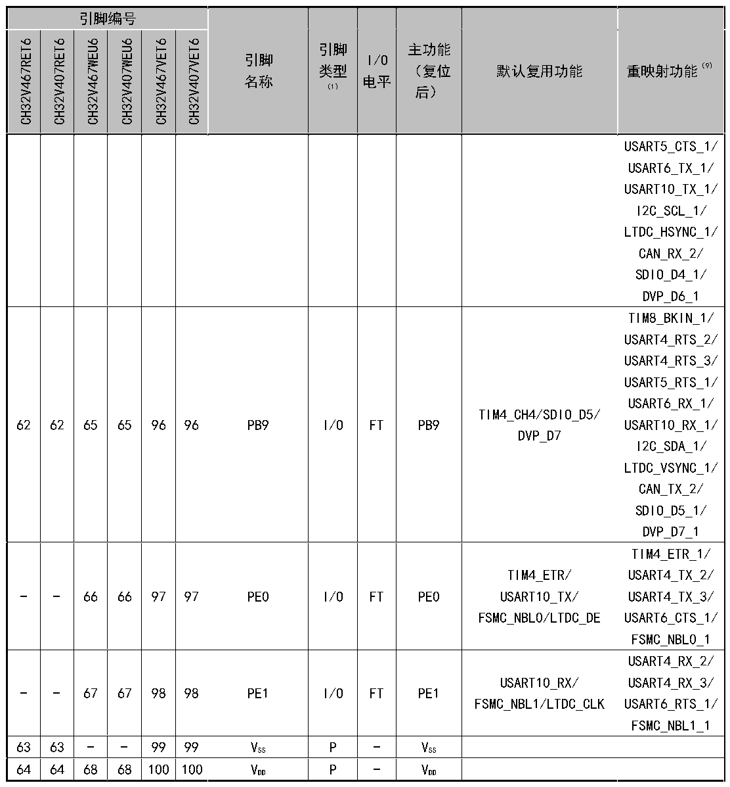

<!-- source-page: 27 -->

[← p.26](0026.md) · [index](../README.md) · [PDF p.27](https://ch32-riscv-ug.github.io/CH32V407/datasheet_zh/CH32V407DS0.PDF#page=27) · [p.28 →](0028.md)

<!-- header: CH32V407、V467数据手册 https://wch.cn -->

 <!-- p27-cluster-01 uncaptioned graphics, rendered from the PDF; verify at https://ch32-riscv-ug.github.io/CH32V407/datasheet_zh/CH32V407DS0.PDF#page=27 -->

🖼 Text parsed from the figure above

<!-- p27-table-001 (table-2-1@1) -->
<table><tr><th colspan="6">引脚编号</th><th rowspan="2" style="text-align:left">引脚名称</th><th rowspan="2" style="text-align:left">引脚类型 （1）</th><th rowspan="2" style="text-align:left">I/O电平</th><th rowspan="2" style="text-align:left">主功能 （复位后）</th><th rowspan="2">默认复用功能</th><th rowspan="2">重映射功能（9）</th></tr><tr><td>CH32V467RET6</td><td>CH32V407RET6</td><td>CH32V467WEU6</td><td>CH32V407WEU6</td><td>CH32V467VET6</td><td>CH32V407VET6</td></tr><tr><td></td><td></td><td></td><td></td><td></td><td></td><td></td><td></td><td></td><td></td><td></td><td style="text-align:left">USART5_CTS_1/ USART6_TX_1/ USART10_TX_1/ I2C_SCL_1/ LTDC_HSYNC_1/ CAN_RX_2/ SDIO_D4_1/ DVP_D6_1</td></tr><tr><td>62</td><td>62</td><td>65</td><td>65</td><td>96</td><td>96</td><td>PB9</td><td>I/O</td><td>FT</td><td>PB9</td><td style="text-align:left">TIM4_CH4/SDIO_D5/ DVP_D7</td><td style="text-align:left">TIM8_BKIN_1/ USART4_RTS_2/ USART4_RTS_3/ USART5_RTS_1/ USART6_RX_1/ USART10_RX_1/ I2C_SDA_1/ LTDC_VSYNC_1/ CAN_TX_2/ SDIO_D5_1/ DVP_D7_1</td></tr><tr><td>-</td><td>-</td><td>66</td><td>66</td><td>97</td><td>97</td><td>PE0</td><td>I/O</td><td>FT</td><td>PE0</td><td style="text-align:left">TIM4_ETR/ USART10_TX/ FSMC_NBL0/LTDC_DE</td><td style="text-align:left">TIM4_ETR_1/ USART4_TX_2/ USART4_TX_3/ USART6_CTS_1/ FSMC_NBL0_1</td></tr><tr><td>-</td><td>-</td><td>67</td><td>67</td><td>98</td><td>98</td><td>PE1</td><td>I/O</td><td>FT</td><td>PE1</td><td style="text-align:left">USART10_RX/ FSMC_NBL1/LTDC_CLK</td><td style="text-align:left">USART4_RX_2/ USART4_RX_3/ USART6_RTS_1/ FSMC_NBL1_1</td></tr><tr><td>63</td><td>63</td><td>-</td><td>-</td><td>99</td><td>99</td><td style="text-align:left">VSS</td><td>P</td><td>-</td><td style="text-align:left">VSS</td><td></td><td></td></tr><tr><td>64</td><td>64</td><td>68</td><td>68</td><td>100</td><td>100</td><td style="text-align:left">VDD</td><td>P</td><td>-</td><td style="text-align:left">VDD</td><td></td><td></td></tr></table>

注1：表格缩写解释：  
I = TTL/CMOS电平斯密特输入； O = CMOS电平三态输出； A = 模拟信号输入或输出；  
P = 电源； ETH = 以太网信号； FT = 耐受5V； HS = 支持100MHz高速。  
注2：VDD 和VBAT 均可连接内部模拟开关为备份区域以及PC13、PC14和PC15引脚供电，这个模拟开关只能够  
通过有限的电流(3mA)。当由VDD 供电时：PC14和PC15可用于GPIO或LSE引脚、PC13可作为通用I/O口、  
TAMPER引脚、RTC校准时钟、RTC闹钟或秒输出；PC13、PC14和PC15作为GPIO输出脚时只能工作在2MHz  
模式下，最大驱动负载为30pF，并且不能作为电流源(如驱动LED)。而当由VBAT 供电时：PC14和PC15  
只能用于LSE引脚、PC13可作为TAMPER引脚、RTC闹钟或秒输出。  
<!-- image: p27-draw-image-00001 bbox=[500.88, 779.28, 520.32, 789.6] -->
<!-- footer: V1.2 25 -->
