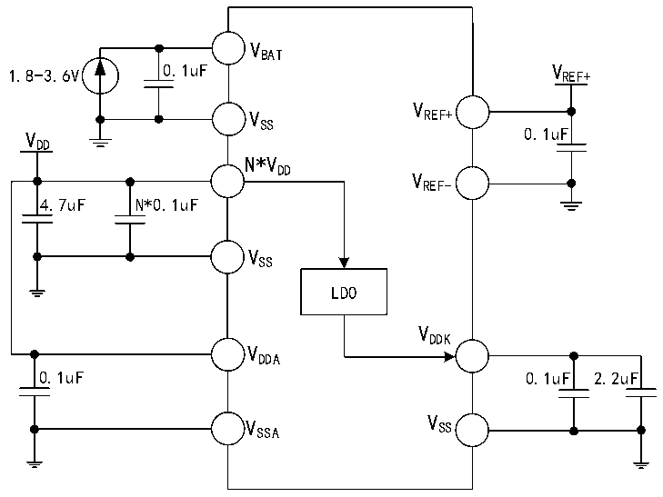

<!-- source-page: 43 -->

[← p.42](0042.md) · [index](../README.md) · [PDF p.43](https://ch32-riscv-ug.github.io/CH32V407/datasheet_zh/CH32V407DS0.PDF#page=43) · [p.44 →](0044.md)

<!-- header: CH32V407、V467数据手册 https://wch.cn -->

# 第 3 章 电气特性

## 3.1 测试条件

除非特殊说明和标注，所有电压都以VSS 为基准。  
所有最小值和最大值将在最坏的环境温度、供电电压和时钟频率条件下得到保证。  
CH32V407的典型数值是基于常温25℃，供电VDD= VDDA= 3.3V，产生VDDK= 1.2V的环境下用于设  
计指导。  
CH32V467 的典型数值是基于常温 25℃，供电 VDD= VDDA= 3.3V，产生 VDD18= 1.8V、VDDK= 1.2V  
的环境下用于设计指导。  
对于通过综合评估、设计模拟或工艺特性得到的数据，不会在生产线进行测试。在综合评估的基  
础上，最小和最大值是通过样本测试后统计得到。除非特殊说明为实测值，否则特性参数以综合评估  
或设计保证。  
供电方案：  

图3-1-1 CH32V407常规供电典型电路  
 <!-- rendered from the PDF; verify at https://ch32-riscv-ug.github.io/CH32V407/datasheet_zh/CH32V407DS0.PDF#page=43 -->

🖼 Text parsed from the figure above

VBAT  
1.8-3.6V 0.1uF V REF+  
V  
V REF+  
SS  
V 0.1uF  
DD  
N*VDD  
VREF-  
4.7uF N*0.1uF  
VSS  
LDO  
VDDK  
VDDA  
0.1uF 0.1uF 2.2uF  
V SSA V SS  

注：对于CH32V407芯片，VDD 在芯片封装中有多个引脚，同名电源引脚必须短接。  
主VDD 引脚（与以太网信号引脚相邻）外接0.1uF并联至少4.7uF容量的退耦电容，剩余VDD 引脚  
只需外接0.1uF容量的退耦电容即可。  
<!-- image: p43-draw-image-00001 bbox=[502.8, 786.36, 522.24, 796.68] -->
<!-- footer: V1.2 41 -->
