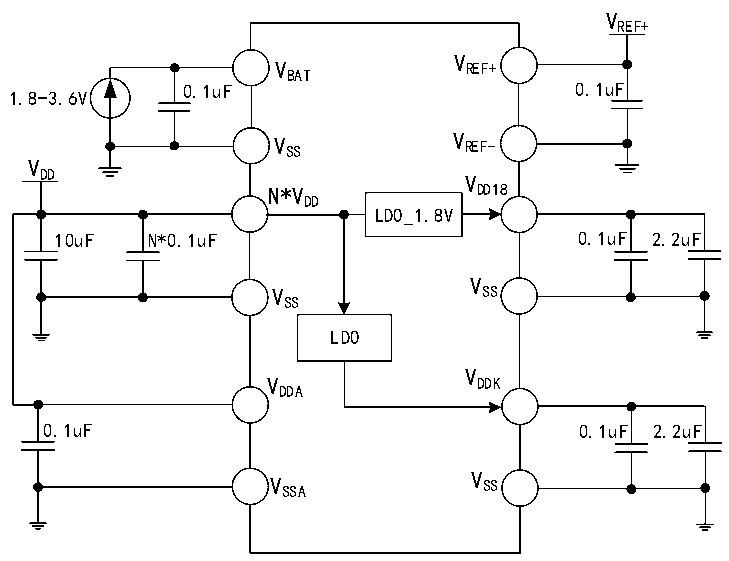

<!-- source-page: 44 -->

[← p.43](0043.md) · [index](../README.md) · [PDF p.44](https://ch32-riscv-ug.github.io/CH32V407/datasheet_zh/CH32V407DS0.PDF#page=44) · [p.45 →](0045.md)

<!-- header: CH32V407、V467数据手册 https://wch.cn -->

图3-1-2 CH32V467常规供电典型电路  
 <!-- rendered from the PDF; verify at https://ch32-riscv-ug.github.io/CH32V407/datasheet_zh/CH32V407DS0.PDF#page=44 -->

🖼 Text parsed from the figure above

VREF+  
V  
V REF+  
BAT  
1.8-3.6V 0.1uF 0.1uF  
V SS V REF-  
V  
DD V  
N*V DD18  
DD  
LDO_1.8V  
10uF N*0.1uF 0.1uF 2.2uF  
V  
V SS  
SS  
LDO  
V  
V DDK  
DDA  
0.1uF 0.1uF 2.2uF  
V SSA V SS  

注：对于CH32V467芯片，VDD 引脚在芯片封装中有多个引脚，同名电源引脚必须短接。  
主VDD 引脚（与以太网信号引脚相邻）外接0.1uF并联10uF容量的退耦电容，并且不小于VDDK 和  
VDD18 累计总电容量，剩余VDD 引脚只需外接0.1uF容量的退耦电容即可。  

## 3.2 绝对最大值

临界或者超过绝对最大值将可能导致芯片工作不正常甚至损坏。  

<!-- p44-table-001 (table-3-1@1) -->
<table><caption>表3-1 绝对最大值参数表</caption><tr><th>符号</th><th>描述</th><th>最小值</th><th>最大值</th><th>单位</th></tr><tr><td style="text-align:left">TA</td><td>工作时的环境温度</td><td>-40</td><td>85</td><td>℃</td></tr><tr><td style="text-align:left">TS</td><td>存储时的环境温度</td><td>-40</td><td>125</td><td>℃</td></tr><tr><td style="text-align:left">VDD</td><td style="text-align:left">外部主供电电压（包含V 和V ） DD DDA</td><td>-0.3</td><td>4.0</td><td>V</td></tr><tr><td style="text-align:left">VDDK</td><td>内核电路的电源退耦端</td><td>-0.2</td><td>1.5</td><td>V</td></tr><tr><td style="text-align:left">VREF+</td><td>ADC、DAC模块的正参考电压</td><td>-0.3</td><td style="text-align:left">V +0.3DDA</td><td>V</td></tr><tr><td rowspan="3" style="text-align:left">VIN</td><td>FT（耐受5V）引脚上的输入电压</td><td>-0.3</td><td>5.5</td><td>V</td></tr><tr><td>USB 2.0和以太网PHY引脚上的输入电压</td><td>-0.3</td><td style="text-align:left">V +0.3DD</td><td>V</td></tr><tr><td style="text-align:left">其他引脚上的输入电压（V 供电） DD</td><td>-0.3</td><td style="text-align:left">V +0.3DD</td><td>V</td></tr><tr><td style="text-align:left">|△V | DD_x</td><td style="text-align:left">主供电引脚各V 之间的电压差DD</td><td></td><td>20</td><td>mV</td></tr><tr><td style="text-align:left">|△V | SS_x</td><td style="text-align:left">公共地引脚各V 之间的电压差SS</td><td></td><td>20</td><td>mV</td></tr><tr><td rowspan="3" style="text-align:left">VESDIO(HBM)</td><td>I/O引脚的ESD静电放电电压（HBM）</td><td colspan="2">4K</td><td>V</td></tr><tr><td>USB引脚（PA11、PA12、PB6、PB7）</td><td colspan="2">4K</td><td>V</td></tr><tr><td>ETH引脚（MDI*）</td><td colspan="2">4K</td><td>V</td></tr><tr><td style="text-align:left">IVDD</td><td style="text-align:left">所有V 主供电引脚的合计总电流DD</td><td></td><td>250</td><td>mA</td></tr><tr><td style="text-align:left">IVSS</td><td style="text-align:left">所有V 公共地引脚的合计总电流SS</td><td></td><td>250</td><td>mA</td></tr><tr><td rowspan="2" style="text-align:left">IIO</td><td>任意I/O和控制引脚上的灌电流</td><td></td><td>25</td><td rowspan="2">mA</td></tr><tr><td>任意I/O和控制引脚上的源电流</td><td></td><td>-25</td></tr></table>

<!-- image: p44-draw-image-00001 bbox=[502.8, 786.36, 522.24, 796.68] -->
<!-- footer: V1.2 42 -->
