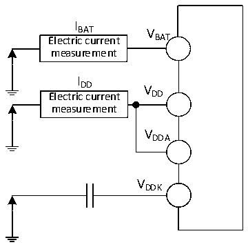
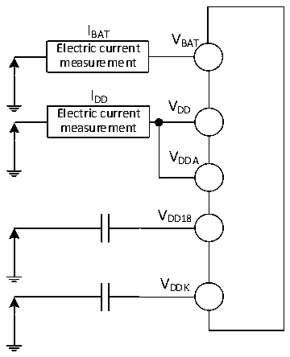

<!-- source-page: 46 -->

[← p.45](0045.md) · [index](../README.md) · [PDF p.46](https://ch32-riscv-ug.github.io/CH32V407/datasheet_zh/CH32V407DS0.PDF#page=46) · [p.47 →](0047.md)

<!-- header: CH32V407、V467数据手册 https://wch.cn -->

> ⬆ **Table continued** — rendered in full at [page 45](0045.md). <!-- p46-table-001 -->

注：1.常温测试值。  

### 3.3.3 内置的参考电压

<!-- p46-table-002 (table-3-5@1) -->
<table><caption>表3-5 内置参考电压</caption><tr><th>符号</th><th>参数</th><th>条件</th><th>最小值</th><th>典型值</th><th>最大值</th><th>单位</th></tr><tr><td style="text-align:left">VREFINT</td><td>内置参考电压</td><td style="text-align:left">T = -40℃～85℃ A</td><td>1.17</td><td>1.2</td><td>1.23</td><td>V</td></tr><tr><td style="text-align:left">TS_vrefint</td><td style="text-align:left">当读出内部参考电压时， ADC的采样时间</td><td></td><td>8</td><td></td><td></td><td>us</td></tr></table>

### 3.3.4 供电电流特性

电流消耗是多种参数和因素的综合指标，这些参数和因素包括工作电压、环境温度、I/O 引脚的  
负载、产品的软件配置、工作频率、I/O 脚的翻转速率、程序在存储器中的位置以及执行的代码等。  
电流消耗测量方法如下图：  

图3-2-1 CH32V407电流消耗测量  
 <!-- rendered from the PDF; verify at https://ch32-riscv-ug.github.io/CH32V407/datasheet_zh/CH32V407DS0.PDF#page=46 -->

🖼 Text parsed from the figure above

I  
BAT V  
Electric current BAT  
measurement  
I  
DD V  
Electric current DD  
measurement  
VDDA  
VDDK  

图3-2-2 CH32V467电流消耗测量  
 <!-- rendered from the PDF; verify at https://ch32-riscv-ug.github.io/CH32V407/datasheet_zh/CH32V407DS0.PDF#page=46 -->

🖼 Text parsed from the figure above

I  
BAT V  
Electric current BAT  
measurement  
I  
DD V  
Electric current DD  
measurement  
VDDA  
VDD18  
VDDK  

<!-- image: p46-draw-image-00001 bbox=[502.8, 786.36, 522.24, 796.68] -->
<!-- footer: V1.2 44 -->
