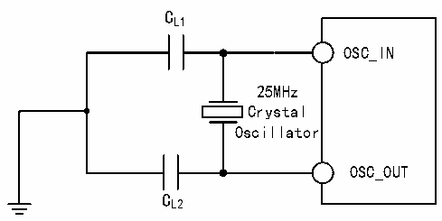
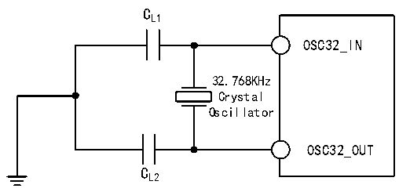

<!-- source-page: 50 -->

[← p.49](0049.md) · [index](../README.md) · [PDF p.50](https://ch32-riscv-ug.github.io/CH32V407/datasheet_zh/CH32V407DS0.PDF#page=50) · [p.51 →](0051.md)

<!-- header: CH32V407、V467数据手册 https://wch.cn -->
电路参考设计及要求：  
晶体的负载电容以晶体厂商建议为准，通常情况CL1= CL2。  

图3-5 外接25M晶体典型电路  
 <!-- rendered from the PDF; verify at https://ch32-riscv-ug.github.io/CH32V407/datasheet_zh/CH32V407DS0.PDF#page=50 -->

🖼 Text parsed from the figure above

CL1  
OSC_IN  
25MHz  
Crystal  
Oscillator  
OSC_OUT  
CL2  

<!-- p50-table-001 (table-3-12@1) -->
<table><caption>表3-12 使用一个晶体/陶瓷谐振器产生的低速外部时钟（fLSE= 32.768kHz）</caption><tr><th>符号</th><th>参数</th><th>条件</th><th>最小值</th><th>典型值</th><th>最大值</th><th>单位</th></tr><tr><td style="text-align:left">RF</td><td>反馈电阻</td><td></td><td></td><td>5</td><td></td><td>MΩ</td></tr><tr><td>C</td><td style="text-align:left">建议的负载电容与对应晶体串行阻抗RS</td><td style="text-align:left">R＜70kΩS</td><td></td><td></td><td>15</td><td>pF</td></tr><tr><td style="text-align:left">i 2</td><td>LSE驱动电流</td><td style="text-align:left">V = 3.3VDD</td><td></td><td>0.35</td><td></td><td>uA</td></tr><tr><td style="text-align:left">g m</td><td>振荡器的跨导</td><td>启动</td><td></td><td>25.3</td><td></td><td>uA/V</td></tr><tr><td style="text-align:left">t SU（LSE）</td><td>启动时间</td><td style="text-align:left">V 是稳定的DD</td><td></td><td>800</td><td></td><td>ms</td></tr></table>

电路参考设计及要求：  
晶体的负载电容以晶体厂商建议为准，通常情况CL1=CL2，可选12pF左右。  

图3-6 外接32.768K晶体典型电路  
 <!-- rendered from the PDF; verify at https://ch32-riscv-ug.github.io/CH32V407/datasheet_zh/CH32V407DS0.PDF#page=50 -->

🖼 Text parsed from the figure above

CL1  
OSC32_IN  
32.768KHz  
Crystal  
Oscillator  
OSC32_OUT  
CL2  

注：负载电容CL由下式计算：CL= CL1 x CL2/ （CL1+ CL2） + Cstray，其中Cstray 是引脚的电容和PCB  
板或PCB相关的电容，它的典型值是介于2pF至7pF之间。  

### 3.3.6 内部时钟源特性

<!-- p50-table-002 (table-3-13@1) -->
<table><caption>表3-13 内部高速（HSI）RC振荡器特性</caption><tr><th>符号</th><th>参数</th><th>条件</th><th>最小值</th><th>典型值</th><th>最大值</th><th>单位</th></tr><tr><td style="text-align:left">FHSI</td><td>频率（校准后）</td><td></td><td></td><td>20</td><td></td><td>MHz</td></tr><tr><td style="text-align:left">DuCy HSI</td><td>占空比（Duty cycle）</td><td></td><td>45</td><td>50</td><td>55</td><td>%</td></tr><tr><td rowspan="2" style="text-align:left">ACCHSI</td><td rowspan="2">HSI振荡器的精度（校准后）</td><td style="text-align:left">T = 0℃～70℃ A</td><td>-1.6</td><td></td><td>1.6</td><td>%</td></tr><tr><td style="text-align:left">T = -40℃～85℃ A</td><td>-2.2</td><td></td><td>2.2</td><td>%</td></tr><tr><td style="text-align:left">t SU（HSI）</td><td>HSI振荡器启动稳定时间（1）</td><td></td><td></td><td></td><td>8</td><td>us</td></tr><tr><td style="text-align:left">IDD（HSI）</td><td>HSI振荡器功耗</td><td></td><td>140</td><td>200</td><td>280</td><td>uA</td></tr></table>

<!-- image: p50-draw-image-00001 bbox=[502.8, 786.36, 522.24, 796.68] -->
<!-- footer: V1.2 48 -->
