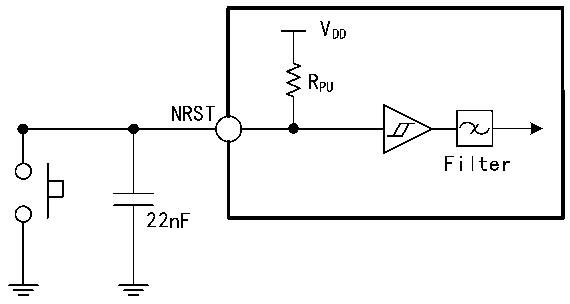

<!-- source-page: 53 -->

[← p.52](0052.md) · [index](../README.md) · [PDF p.53](https://ch32-riscv-ug.github.io/CH32V407/datasheet_zh/CH32V407DS0.PDF#page=53) · [p.54 →](0054.md)

<!-- header: CH32V407、V467数据手册 https://wch.cn -->

<!-- p53-table-001 (table-3-21@1) -->
<table><caption>表3-21 输出交流特性（不包括PC13～PC15引脚）</caption><tr><th style="text-align:left">MODEx[1:0] 配置</th><th>符号</th><th>参数</th><th>条件</th><th>最小值</th><th>最大值</th><th style="text-align:left">单位</th></tr><tr><td rowspan="3" style="text-align:left">10 （2MHz）</td><td style="text-align:left">F max（IO）out</td><td>最大频率</td><td>CL=50pF</td><td></td><td>2</td><td>MHz</td></tr><tr><td style="text-align:left">t f（IO）out</td><td>输出高至低电平的下降时间</td><td rowspan="2">CL=50pF</td><td></td><td>125</td><td>ns</td></tr><tr><td style="text-align:left">t r（IO）out</td><td>输出低至高电平的上升时间</td><td></td><td>125</td><td>ns</td></tr><tr><td rowspan="3" style="text-align:left">01 （10MHz）</td><td style="text-align:left">F max（IO）out</td><td>最大频率</td><td>CL=50pF</td><td></td><td>10</td><td>MHz</td></tr><tr><td style="text-align:left">t f（IO）out</td><td>输出高至低电平的下降时间</td><td rowspan="2">CL=50pF</td><td></td><td>25</td><td>ns</td></tr><tr><td style="text-align:left">t r（IO）out</td><td>输出低至高电平的上升时间</td><td></td><td>25</td><td>ns</td></tr><tr><td rowspan="9" style="text-align:left">11 （50MHz）</td><td rowspan="5" style="text-align:left">F max（IO）out</td><td rowspan="5">最大频率</td><td>CL=10pF，非HS引脚</td><td></td><td>70</td><td>MHz</td></tr><tr><td>CL=30pF，非HS引脚</td><td></td><td>50</td><td>MHz</td></tr><tr><td>CL=50pF，非HS引脚</td><td></td><td>30</td><td>MHz</td></tr><tr><td>CL=10pF，HS引脚</td><td></td><td>100</td><td>MHz</td></tr><tr><td>CL=30pF，HS引脚</td><td></td><td>75</td><td>MHz</td></tr><tr><td rowspan="2" style="text-align:left">t f（IO）out</td><td rowspan="2">输出高至低电平的下降时间</td><td>CL=30pF</td><td></td><td>5</td><td>ns</td></tr><tr><td>CL=50pF</td><td></td><td>8</td><td>ns</td></tr><tr><td rowspan="2" style="text-align:left">t r（IO）out</td><td rowspan="2">输出低至高电平的上升时间</td><td>CL=30pF</td><td></td><td>5</td><td>ns</td></tr><tr><td>CL=50pF</td><td></td><td>8</td><td>ns</td></tr><tr><td></td><td style="text-align:left">t EXTIpw</td><td style="text-align:left">EXTI 控制器检测到外部信号的脉冲宽度</td><td></td><td>10</td><td></td><td>ns</td></tr></table>

注：1.PC13、PC14和PC15作为GPIO输出脚时只能工作在2MHz以下，最大驱动负载为30pF。  
2.USB接口I/O仅符合MODEx[1:0]=10b或01b项的参数。  

### 3.3.11 NRST引脚特性

电路参考设计及要求：  

图3-7 外部复位引脚典型电路  
 <!-- rendered from the PDF; verify at https://ch32-riscv-ug.github.io/CH32V407/datasheet_zh/CH32V407DS0.PDF#page=53 -->

🖼 Text parsed from the figure above

VDD  
RPU  
NRST  
Filter  
22nF  

注：图中的电容是可选的，可以用于滤除按键抖动。  

<!-- p53-table-003 (table-3-22@1) pages 53-54 -->
<table><caption>表3-22 外部复位引脚特性</caption><tr><th>符号</th><th>参数</th><th>条件</th><th>最小值</th><th>典型值</th><th>最大值</th><th>单位</th></tr><tr><td style="text-align:left">VIL（NRST）</td><td>NRST输入低电平电压</td><td></td><td>-0.3</td><td></td><td style="text-align:left">0.28（* V -1.8）+0.6DD</td><td>V</td></tr><tr><td style="text-align:left">VIH（NRST）</td><td>NRST输入高电平电压</td><td></td><td style="text-align:left">0.41*（V -1.8）+1.3DD</td><td></td><td style="text-align:left">V +0.3DD</td><td>V</td></tr><tr><td style="text-align:left">V hys（NRST）</td><td>NRST施密特触发器电压迟滞</td><td></td><td>150</td><td></td><td></td><td>mV</td></tr><tr><td style="text-align:left">R （1） PU</td><td>上拉等效电阻</td><td></td><td>30</td><td>40</td><td>50</td><td>kΩ</td></tr><tr><td style="text-align:left">VF（NRST）</td><td>NRST输入可被滤波脉宽</td><td></td><td></td><td></td><td>100</td><td>ns</td></tr><tr><td style="text-align:left">VNF（NRST）</td><td>NRST输入无法滤波脉宽</td><td></td><td>300</td><td></td><td></td><td>ns</td></tr></table>

<!-- image: p53-draw-image-00001 bbox=[502.8, 786.36, 522.24, 796.68] -->
<!-- footer: V1.2 51 -->
