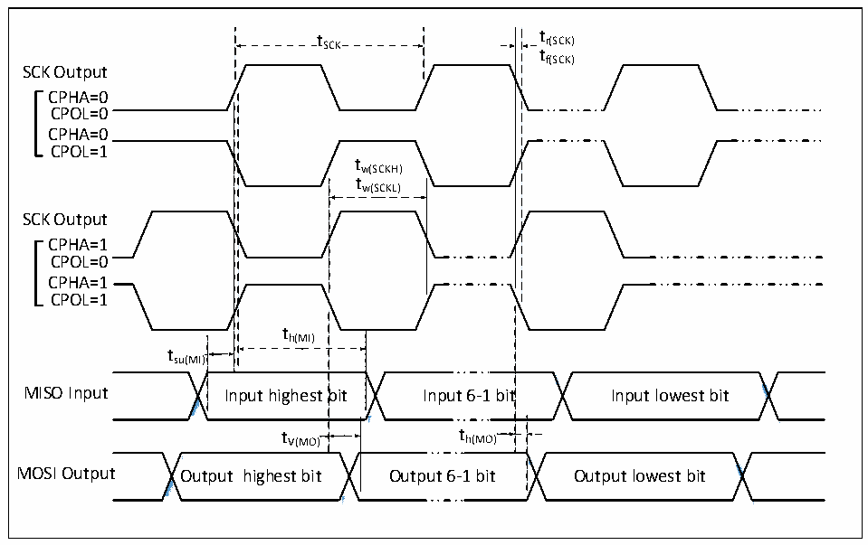

<!-- source-page: 55 -->

[← p.54](0054.md) · [index](../README.md) · [PDF p.55](https://ch32-riscv-ug.github.io/CH32V407/datasheet_zh/CH32V407DS0.PDF#page=55) · [p.56 →](0056.md)

<!-- header: CH32V407、V467数据手册 https://wch.cn -->

### 3.3.14 I3C接口特性

<!-- p55-table-001 (table-3-25@1) -->
<table><caption>表3-25 I3C接口特性</caption><tr><th>符号</th><th>参数</th><th>条件</th><th>最小值</th><th>最大值</th><th>单位</th></tr><tr><td style="text-align:left">t （1） r(SDA)_OD</td><td>开漏模式下SDA上升时间</td><td></td><td>100</td><td></td><td>ns</td></tr><tr><td style="text-align:left">t （1） r(SDA)_PP</td><td>推挽模式下SDA上升时间</td><td></td><td>5.1</td><td></td><td>ns</td></tr></table>

注：1.tr(SDA)_OD 和tr(SDA)_PP 为设计参数保证，可通过寄存器R32_I3C_TIMINGR0进行配置。其他时间参数  
可参考MIPI协议。  

### 3.3.15 SPI接口特性

图3-9 SPI主模式时序图  
 <!-- rendered from the PDF; verify at https://ch32-riscv-ug.github.io/CH32V407/datasheet_zh/CH32V407DS0.PDF#page=55 -->

🖼 Text parsed from the figure above

t SCK t r(SCK)  
tf(SCK)  
SCK Output  
CPHA=0  
CPOL=0  
CPHA=0  
CPOL=1  
tw(SCKH)  
tw(SCKL)  
SCK Output  
CPHA=1  
CPOL=0  
CPHA=1  
CPOL=1  
th(MI)  
tsu(MI)  
bit  t V(MO)  )  
<!-- image: p55-draw-image-00002 inside the figure -->
<!-- image: p55-draw-image-00003 inside the figure -->
<!-- image: p55-draw-image-00004 inside the figure -->
<!-- image: p55-draw-image-00005 inside the figure -->
)  
MISO Input Input highest bit Input 6-1 bit Input lowest bit  
t V(MO) t h(MO)  
<!-- image: p55-draw-image-00006 inside the figure -->
<!-- image: p55-draw-image-00007 inside the figure -->
<!-- image: p55-draw-image-00008 inside the figure -->
<!-- image: p55-draw-image-00009 inside the figure -->
MOSI Output Output highest bit Output 6-1 bit Output lowest bit  

<!-- image: p55-draw-image-00001 bbox=[502.8, 786.36, 522.24, 796.68] -->
<!-- footer: V1.2 53 -->
