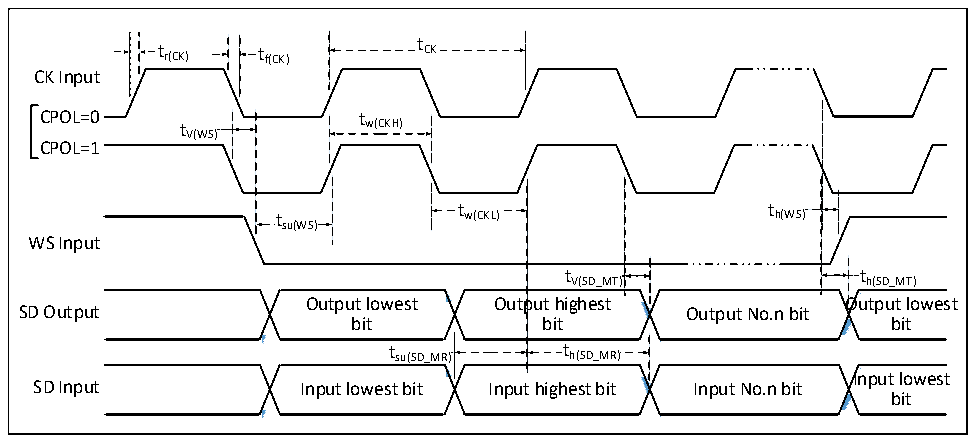
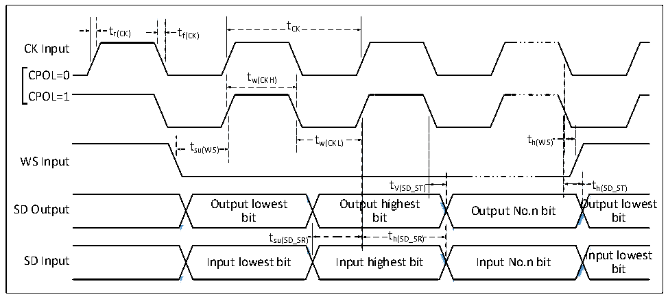

<!-- source-page: 57 -->

[← p.56](0056.md) · [index](../README.md) · [PDF p.57](https://ch32-riscv-ug.github.io/CH32V407/datasheet_zh/CH32V407DS0.PDF#page=57) · [p.58 →](0058.md)

<!-- header: CH32V407、V467数据手册 https://wch.cn -->

> ⬆ **Table continued** — rendered in full at [page 56](0056.md). <!-- p57-table-001 -->

### 3.3.16 I2S接口特性

图3-12 I2S总线主模式时序图  
 <!-- rendered from the PDF; verify at https://ch32-riscv-ug.github.io/CH32V407/datasheet_zh/CH32V407DS0.PDF#page=57 -->

🖼 Text parsed from the figure above

t  
t r(CK) t f(CK) CK  
CK Input  
CPOL=0t tw(CKH)  
V(WS)  
CPOL=1  
t t  
t w(CKL) h(WS)  
su(WS)  
WS Input  
t  t V(SD_MT)  
tV(SD_MT) th(SD_MT)  
<!-- image: p57-draw-image-00002 inside the figure -->
<!-- image: p57-draw-image-00003 inside the figure -->
<!-- image: p57-draw-image-00004 inside the figure -->
<!-- image: p57-draw-image-00005 inside the figure -->
Output lowest Output highest Output lowest  
SD Output Output No.n bit  
bit bit bit  
t  t h(SD_MR)  t  th(SD_MR)  
t su(SD_MR) t h(SD_MR)  
<!-- image: p57-draw-image-00006 inside the figure -->
<!-- image: p57-draw-image-00007 inside the figure -->
<!-- image: p57-draw-image-00008 inside the figure -->
<!-- image: p57-draw-image-00009 inside the figure -->
Input lowest  
SD Input Input lowest bit Input highest bit Input No.n bit  
bit  

图3-13 I2S总线从模式时序图  
 <!-- rendered from the PDF; verify at https://ch32-riscv-ug.github.io/CH32V407/datasheet_zh/CH32V407DS0.PDF#page=57 -->

🖼 Text parsed from the figure above

t  
t r(CK) t f(CK) CK  
CK Input  
CPOL=0 tw(CKH)  
CPOL=1  
t t  
t w(CKL) h(WS)  
su(WS)  
WS Input  
t V(SD_ST)  
tV(SD_ST) th(SD_ST)  
<!-- image: p57-draw-image-00010 inside the figure -->
<!-- image: p57-draw-image-00011 inside the figure -->
<!-- image: p57-draw-image-00012 inside the figure -->
<!-- image: p57-draw-image-00013 inside the figure -->
Output lowest Output highest Output lowest  
SD Output Output No.n bit  
bit bit bit  
t h(SD_SR)  th(SD_SR)  
t su(SD_SR) t h(SD_SR)  
<!-- image: p57-draw-image-00014 inside the figure -->
<!-- image: p57-draw-image-00015 inside the figure -->
<!-- image: p57-draw-image-00016 inside the figure -->
<!-- image: p57-draw-image-00017 inside the figure -->
Input lowest  
SD Input Input lowest bit Input highest bit Input No.n bit  
bit  

<!-- image: p57-draw-image-00001 bbox=[502.8, 786.36, 522.24, 796.68] -->
<!-- footer: V1.2 55 -->
