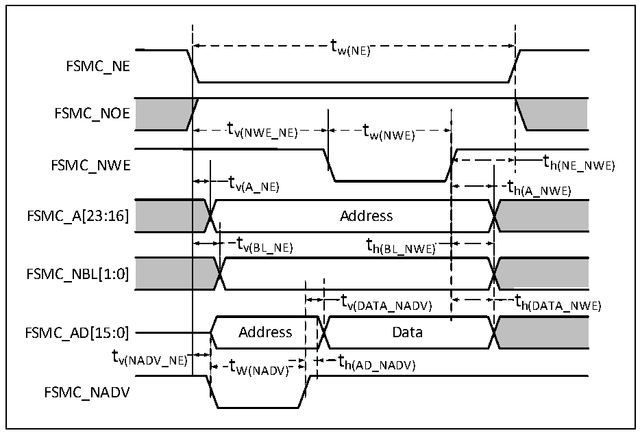

<!-- source-page: 60 -->

[← p.59](0059.md) · [index](../README.md) · [PDF p.60](https://ch32-riscv-ug.github.io/CH32V407/datasheet_zh/CH32V407DS0.PDF#page=60) · [p.61 →](0061.md)

<!-- header: CH32V407、V467数据手册 https://wch.cn -->

> ⬆ **Table continued** — rendered in full at [page 59](0059.md). <!-- p60-table-001 -->

图3-15 异步总线复用PSRAM/NOR写操作波形  
 <!-- rendered from the PDF; verify at https://ch32-riscv-ug.github.io/CH32V407/datasheet_zh/CH32V407DS0.PDF#page=60 -->

🖼 Text parsed from the figure above

tw(NE)  
FSMC_NE  
FSMC_NOE  
tv(NWE_NE) tw(NWE)  
t h(NE_NWE)  
FSMC_NWE h(NE_NWE)  
t v(A_NE)  Address  t v(BL_NE)  )  t h(BL_NWE)  )  )  
FSMC_A[23:16] Address  
FSMC_NBL[1:0]  
t v(DATA_NADV)  
FSMC_AD[15:0] Address Data  
t  
v(NADV_NE) t t h(AD_NADV)  
th(AD_NADV)  
W(NADV)  
FSMC_NADV  

<!-- p60-table-007 (table-3-31@1) pages 60-61 -->
<table><caption>表3-31 异步总线复用PSRAM/NOR写操作时序</caption><tr><th>符号</th><th>参数</th><th>最小值</th><th>最大值</th><th>单位</th></tr><tr><td style="text-align:left">t W（NE）</td><td>FSMC_NE低电平时间</td><td style="text-align:left">5*t HCLK</td><td></td><td rowspan="8">ns</td></tr><tr><td style="text-align:left">t V（NEW_NE）</td><td>FSMC_NE低至FSMC_NWE低</td><td style="text-align:left">3*t HCLK</td><td></td></tr><tr><td style="text-align:left">t W（NWE）</td><td>FSMC_NWE低时间</td><td style="text-align:left">2*t HCLK</td><td></td></tr><tr><td style="text-align:left">t h（NE_NWE）</td><td>FSMC_NWE高至FSMC_NE高保持时间</td><td style="text-align:left">t HCLK</td><td></td></tr><tr><td style="text-align:left">t V（A_NE）</td><td>FSMC_NE低至FSMC_A有效</td><td>0</td><td>5</td></tr><tr><td style="text-align:left">t V（NADV_NE）</td><td>FSMC_NE低至FSMC_NADV低</td><td>0</td><td>5</td></tr><tr><td style="text-align:left">t W（NADV）</td><td>FSMC_NADV低时间</td><td style="text-align:left">t HCLK</td><td></td></tr><tr><td style="text-align:left">t h（AD_NADV）</td><td>FSMC_NADV高之后FSMC_AD（地址）有效保持时间</td><td style="text-align:left">2*t HCLK</td><td></td></tr><tr><td style="text-align:left">t h（A_NWE）</td><td>FSMC_NWE高之后的地址保持时间</td><td style="text-align:left">t HCLK</td><td rowspan="5">5</td><td rowspan="5"></td></tr><tr><td style="text-align:left">t V（BL_NE）</td><td>FSMC_NE低至FSMC_BL有效</td><td>0</td></tr><tr><td style="text-align:left">t h（BL_NWE）</td><td>FSMC_NWE高之后的FSMC_BL保持时间</td><td style="text-align:left">t HCLK</td></tr><tr><td style="text-align:left">t V（DATA_NADV）</td><td>FSMC_NADV高至数据保持时间</td><td style="text-align:left">2*t HCLK</td></tr><tr><td style="text-align:left">t h（DATA_NWE）</td><td>FSMC_NWE高之后的数据保持时间</td><td style="text-align:left">t HCLK</td></tr></table>

<!-- image: p60-draw-image-00001 bbox=[502.8, 786.36, 522.24, 796.68] -->
<!-- footer: V1.2 58 -->
