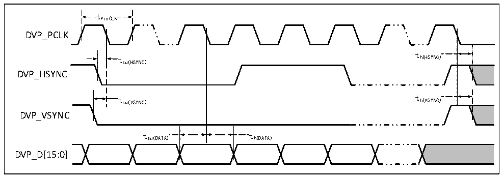

<!-- source-page: 64 -->

[← p.63](0063.md) · [index](../README.md) · [PDF p.64](https://ch32-riscv-ug.github.io/CH32V407/datasheet_zh/CH32V407DS0.PDF#page=64) · [p.65 →](0065.md)

<!-- header: CH32V407、V467数据手册 https://wch.cn -->

图3-21 NAND控制器在通用存储空间的写操作波形  
 <!-- rendered from the PDF; verify at https://ch32-riscv-ug.github.io/CH32V407/datasheet_zh/CH32V407DS0.PDF#page=64 -->

🖼 Text parsed from the figure above

FSMC_NCE2  
ALE (FSMC_A17)  
CLE (FSMC_A16)  
t d(ALE-NW  
t h(NWE-ALE)  )  t w(NWE)  
td(ALE-NWE) th(NWE-ALE)  
FSMC_NWE tw(NWE)  
FSMC_NOE t  
d(D-NWE) t  
t h(NWE-D)  
v(NWE-D)  
FSMC_D[15:0]  

<!-- p64-table-003 (table-3-34@1) -->
<table><caption>表3-34 NAND闪存读写周期的时序特性</caption><tr><th>符号</th><th>参数</th><th>最小值</th><th>最大值</th><th>单位</th></tr><tr><td style="text-align:left">t d（D-NWE）</td><td>FSMC_NWE高之前至FSMC_D[15:0]数据有效</td><td style="text-align:left">4t HCLK</td><td></td><td rowspan="11">ns</td></tr><tr><td style="text-align:left">t w（NOE）</td><td>FSMC_NOE低时间</td><td style="text-align:left">4t HCLK</td><td></td></tr><tr><td style="text-align:left">t su（D-NOE）</td><td>FSMC_NOE高之前至FSMC_D[15:0]数据有效</td><td>20</td><td></td></tr><tr><td style="text-align:left">t h（NOE-D）</td><td>FSMC_NOE高之后至FSMC_D[15:0]数据有效</td><td>15</td><td></td></tr><tr><td style="text-align:left">t w（NWE）</td><td>FSMC_NWE低时间</td><td style="text-align:left">4t HCLK</td><td></td></tr><tr><td style="text-align:left">t v（NWE-D）</td><td>FSMC_NWE低至FSMC_D[15:0]数据有效</td><td>0</td><td></td></tr><tr><td style="text-align:left">t h（NWE-D）</td><td>FSMC_NWE高至FSMC_D[15:0]数据无效</td><td style="text-align:left">2t HCLK</td><td></td></tr><tr><td style="text-align:left">t d（ALE-NWE）</td><td>FSMC_NWE低之前至FSMC_ALE有效</td><td style="text-align:left">2t HCLK</td><td></td></tr><tr><td style="text-align:left">t h（NWE-ALE）</td><td>FSMC_NWE高至FSMC_ALE无效</td><td style="text-align:left">2t HCLK</td><td></td></tr><tr><td style="text-align:left">t d（ALE-NOE）</td><td>FSMC_NOE低之前至FSMC_ALE有效</td><td style="text-align:left">2t HCLK</td><td></td></tr><tr><td style="text-align:left">t h（NOE-ALE）</td><td>FSMC_NOE高至FSMC_ALE无效</td><td style="text-align:left">4t HCLK</td><td></td></tr></table>

### 3.3.20 DVP接口特性

图3-22 DVP时序波形  
 <!-- rendered from the PDF; verify at https://ch32-riscv-ug.github.io/CH32V407/datasheet_zh/CH32V407DS0.PDF#page=64 -->

🖼 Text parsed from the figure above

tPixCLK  
DVP_PCLK  
t  
t h(HSYNC)  
su(HSYNC)  
DVP_HSYNC  
t su(VSYNC) t h(VSYNC)  
DVP_VSYNC  
t su(DATA)  
DVP_D[15:0]  

<!-- image: p64-draw-image-00001 bbox=[502.8, 786.36, 522.24, 796.68] -->
<!-- footer: V1.2 62 -->
