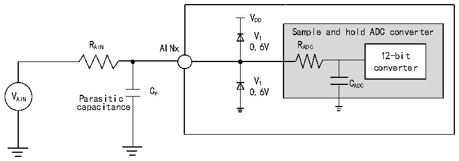
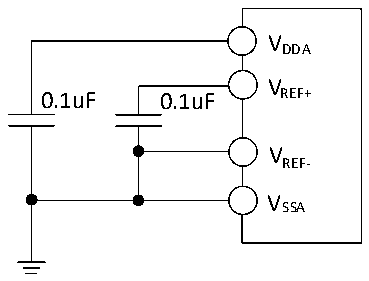

<!-- source-page: 66 -->

[← p.65](0065.md) · [index](../README.md) · [PDF p.66](https://ch32-riscv-ug.github.io/CH32V407/datasheet_zh/CH32V407DS0.PDF#page=66) · [p.67 →](0067.md)

<!-- header: CH32V407、V467数据手册 https://wch.cn -->

> ⬆ **Table continued** — rendered in full at [page 65](0065.md). <!-- p66-table-001 -->

<!-- p66-table-002 (table-3-38@1) -->
<table><caption>表3-38 ADC误差</caption><tr><th>符号</th><th>参数</th><th>条件</th><th>最小值</th><th>典型值</th><th>最大值</th><th>单位</th></tr><tr><td>EO</td><td>偏移误差</td><td rowspan="3" style="text-align:left">f = 30MHz， ADC R &lt; 2kΩ， AIN V = 3.3VDDA</td><td></td><td>±3</td><td>±6</td><td rowspan="3">LSB</td></tr><tr><td>ED</td><td>微分非线性误差</td><td></td><td>±3</td><td>±5</td></tr><tr><td>EL</td><td>积分非线性误差</td><td></td><td>±4</td><td>±6</td></tr></table>

Cp 表示PCB与焊盘上的寄生电容（大约5pF），可能与焊盘和PCB布局质量有关。较大的Cp 数值将  
降低转换精度，解决办法是降低fADC 值。  

图3-23 ADC典型连接图  
 <!-- rendered from the PDF; verify at https://ch32-riscv-ug.github.io/CH32V407/datasheet_zh/CH32V407DS0.PDF#page=66 -->

🖼 Text parsed from the figure above

VDD  
Sample and hold ADC converter  
VT  
R AIN AINx 0.6V R ADC  
12-bit  
converter  
C 0 V . T 6V C ADC  
V AIN Parasitic P  
capacitance  

图3-24 模拟电源及退耦电路参考  
 <!-- rendered from the PDF; verify at https://ch32-riscv-ug.github.io/CH32V407/datasheet_zh/CH32V407DS0.PDF#page=66 -->

🖼 Text parsed from the figure above

VDDA  
V  
0.1uF 0.1uF REF+  
VREF-  
VSSA  

### 3.3.22 温度传感器特性

<!-- p66-table-003 (table-3-39@1) -->
<table><caption>表3-39 温度传感器特性</caption><tr><th>符号</th><th>参数</th><th>条件</th><th>最小值</th><th>典型值</th><th>最大值</th><th>单位</th></tr><tr><td style="text-align:left">RTS</td><td>温度传感器测量范围</td><td></td><td>-40</td><td></td><td>85</td><td></td></tr><tr><td style="text-align:left">ATSC</td><td>温度传感器的测量误差</td><td></td><td></td><td>±12</td><td></td><td></td></tr><tr><td>Avg_Slope</td><td>平均斜率（负温度系数）</td><td></td><td>3.8</td><td>4.3</td><td>4.8</td><td>mV/℃</td></tr><tr><td style="text-align:left">V25</td><td>在25℃时的电压</td><td></td><td>1.34</td><td>1.40</td><td>1.46</td><td>V</td></tr><tr><td style="text-align:left">TS_temp</td><td>当读取温度时，ADC采样时间</td><td style="text-align:left">f = 14MHz ADC</td><td></td><td></td><td>17.1</td><td>us</td></tr></table>

<!-- image: p66-draw-image-00001 bbox=[502.8, 786.36, 522.24, 796.68] -->
<!-- footer: V1.2 64 -->
