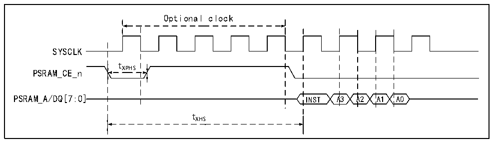
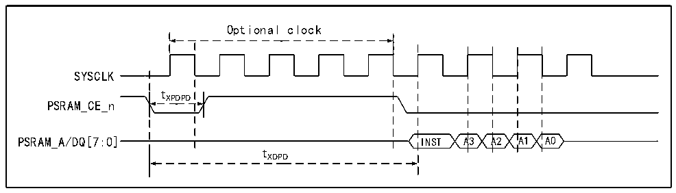

<!-- source-page: 70 -->

[← p.69](0069.md) · [index](../README.md) · [PDF p.70](https://ch32-riscv-ug.github.io/CH32V407/datasheet_zh/CH32V407DS0.PDF#page=70) · [p.71 →](0071.md)

<!-- header: CH32V407、V467数据手册 https://wch.cn -->

> ⬆ **Table continued** — rendered in full at [page 69](0069.md). <!-- p70-table-001 -->

注：1.仅对于批号倒数第五位不为0的CH32V467芯片，PSRAM可支持超过200MHz时钟，支持变量和  
指令访问，支持字节写；且在停止模式（调压器处于低功耗模式）下，数据可保持。  

图3-25 PSRAM时序图（退出半睡眠模式）  
 <!-- rendered from the PDF; verify at https://ch32-riscv-ug.github.io/CH32V407/datasheet_zh/CH32V407DS0.PDF#page=70 -->

🖼 Text parsed from the figure above

Optional clock  
SYSCLK  
tXPHS  
PSRAM_CE_n  
PSRAM_A/DQ[7:0] INST A3 A2 A1 A0  
tXHS  

图3-26 PSRAM时序图（退出深睡眠模式）  
 <!-- rendered from the PDF; verify at https://ch32-riscv-ug.github.io/CH32V407/datasheet_zh/CH32V407DS0.PDF#page=70 -->

🖼 Text parsed from the figure above

Optional clock  
SYSCLK  
tXPDPD  
PSRAM_CE_n  
PSRAM_A/DQ[7:0] INST A3 A2 A1 A0  
tXDPD  

<!-- image: p70-draw-image-00001 bbox=[502.8, 786.36, 522.24, 796.68] -->
<!-- footer: V1.2 68 -->
