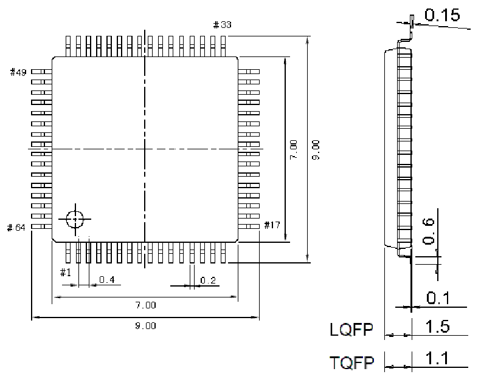

<!-- source-page: 73 -->

[← p.72](0072.md) · [index](../README.md) · [PDF p.73](https://ch32-riscv-ug.github.io/CH32V407/datasheet_zh/CH32V407DS0.PDF#page=73) · [p.74 →](0074.md)

<!-- header: CH32V407、V467数据手册 https://wch.cn -->

## 4.3 LQFP64封装

 <!-- p73-draw-image-00002 rendered from the PDF -->

<!-- image: p73-draw-image-00001 bbox=[502.8, 779.28, 522.24, 789.6] -->
<!-- footer: V1.2 71 -->
