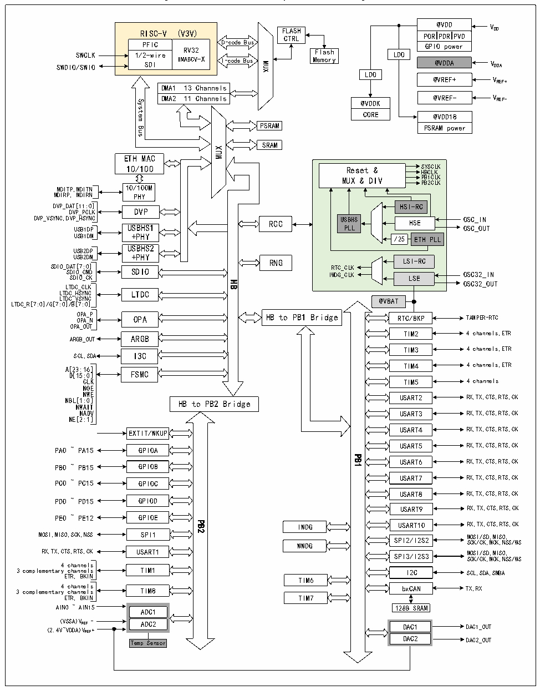

<!-- source-page: 4 -->

[← p.3](0003.md) · [index](../README.md) · [PDF p.4](https://ch32-riscv-ug.github.io/CH32V407/datasheet_en/CH32V407RM.PDF#page=4) · [p.5 →](0005.md)

<!-- header: CH32V407 Reference Manual https://wch-ic.com -->

Figure 1-1-2 CH32V467 System block diagram  
 <!-- rendered from the PDF; verify at https://ch32-riscv-ug.github.io/CH32V407/datasheet_en/CH32V407RM.PDF#page=4 -->

🖼 Text parsed from the figure above

@VDD  POR PDR PVD GPIO power  
RISC-V (V3V) PFIC  PFIC1/2-wire SDI  RV32IMABCV-X  
RISC-V (V3V) FLASH  
CTRL  
D-code Bus  
GPIO power  
1/2-wire RV32 Flash  
LDO  
SWCLK  
IMABCV-X MemI-codeBusory SDI  
@VDDA VDDA  
MUX  
SWDIO/SWIO  
LDO  
@VREF+ VREF+  
DMA1 13 Channels  
@VREF- VREF-  
DMA2 11 Channels  
System  
@VDDK  
CORE @VDD18  
PSRAM PSRAM power  
Bus  
SRAM  
MUX  
ETH MAC  
10/100 Reset &amp; S H Y B S C C L L K K  
MUX &amp; DIVPB2CLK PB1CLK  
MDITP,MDITN 10/100M  
MDIRP, MDIRN PHY  
DVP_DAT[11:0] HSI-RC  
DVP_PCLK DVP  
DVP_VSYNC,DVP_HSYNC USBHS HSE OSC_IN  
RCC  
USB1DP USBHS1 PLL OSC_OUT  
USB1DM +PHY /25 ETH PLL  
USBHS2  
USB2DP  
USB2DM +PHY  
LSI-RC  
RNG  
SDIO_D S S A D T I DI [ O 7 _ O : C _ 0 C MD ] K SDIO I R WD TC G_ _ C C L L K K LSE OSC32_IN  
HB  
OSC32_OUT  
LTDC_CLK  
LTDC_HSYNC LTDC  
LTDC_VSYNC @VBAT  
LTDC_R[7:0]/G[7:0]/B[7:0]  
OPA_P OPA_N OPA  
HB to PB1 Bridge  
RTC/BKP TAMPER-RTC  
OPA_OUT  
TIM2 4 channels,ETR  
ARGB_OUT ARGB  
TIM3 4 channels,ETR  
SCL,SDA I3C  
TIM4 4 channels,ETR  
A[23:16]  
D[15:0] FSMC  
TIM5 4 channels  
CLK  
NOE  
NWE NBL[1:0]  
USART2 RX,TX,CTS,RTS,CK  
HB to PB2 Bridge  
NWAIT  
NADV  
USART3 RX,TX,CTS,RTS,CK  
NE[2:1]  
USART4 RX,TX,CTS,RTS,CK  
EXTIT/WKUP  
USART5 RX,TX,CTS,RTS,CK  
PA0 ~ PA15 GPIOA  
PB1  
USART6 RX,TX,CTS,RTS,CK  
PB0 ~ PB15 GPIOB  
USART7 RX,TX,CTS,RTS,CK  
PC0 ~ PC15 GPIOC  
USART8 RX,TX,CTS,RTS,CK  
PD0 ~ PD15 GPIOD  
USART9 RX,TX,CTS,RTS,CK  
PE0 ~ PE12 GPIOE  
PB2  
USART10 RX,TX,CTS,RTS,CK  
IWDG  
MOSI,MISO,SCK,NSS SPI1  
WWDG SPI2/I2S2 M S O C S K I / / C S K, D, M M CK IS , O N , SS /WS  
RX,TX,CTS,RTS,CK USART1  
SPI3/I2S3 M S O C S K I / / C S K, D, M M CK IS , O N , SS /WS  
4 channels  
3 complementary channels TIM1 ETR, BKIN  
I2C SCL,SDA,SMBA TIM6  
4 channels 3 complementary channels TIM8  
bxCAN TX,RX  
TIM7  
ETR, BKIN  
AIN0 ~ AIN15  
128B SRAM  
ADC1  
(2.4V (V ~V SS DD A) A V ) R V E R F E F - + ADC2 DAC1 DAC1_OUT  
DAC1  DAC2  
Temp Sensor DAC2 DAC2_OUT  

The system is equipped with: General-purpose DMA controller to reduce the CPU burden and improve  
efficiency; clock tree hierarchy management to reduce the total power consumption of peripherals, as well as  
data protection mechanisms, clock security system protection mechanisms and other measures to increase  
<!-- image: p4-draw-image-00001 bbox=[490.8, 794.16, 510.72, 804.96] -->
<!-- footer: V1.2 2 -->
