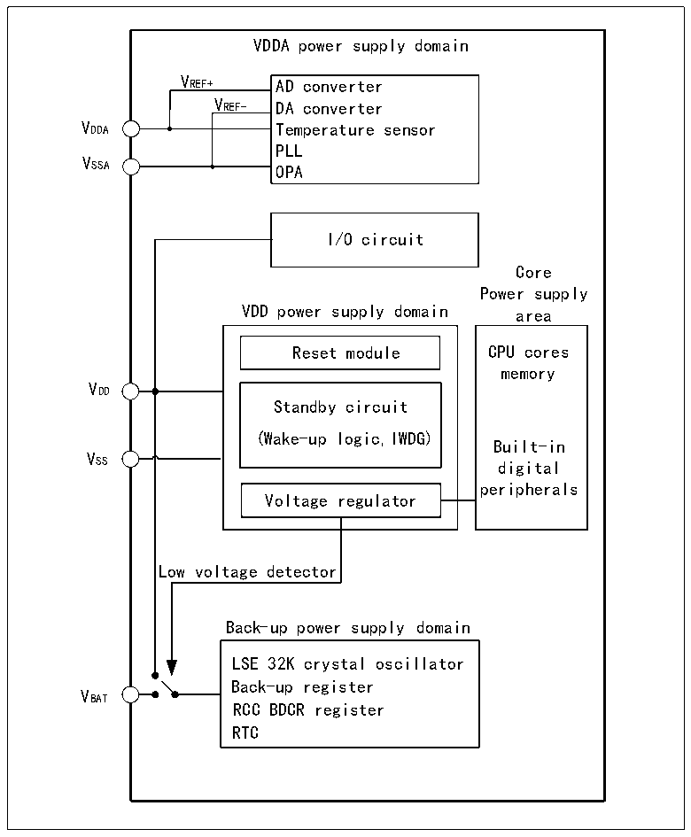

<!-- source-page: 9 -->

[← p.8](0008.md) · [index](../README.md) · [PDF p.9](https://ch32-riscv-ug.github.io/CH32V407/datasheet_en/CH32V407RM.PDF#page=9) · [p.10 →](0010.md)

<!-- header: CH32V407 Reference Manual https://wch-ic.com -->

# Chapter 2 Power Control (PWR)

## 2.1 Overview

The operating voltage VDD ranges from 2.9 to 3.6 V. The built-in voltage regulator provides the low-voltage  
power supply required by the core. When the main power supply, VDD, is powered down, a backup power  
source such as a battery can provide power for the real-time clock (RTC) through the VBAT pin. If no backup  
power is required, it is recommended that VDD be connected directly to the VBAT pin.  
The VDDA and VSSA pins are specifically designed to supply power to analog-related circuits in the system,  
including ADCs, DACs, temperature sensors, and others. VREF+ and VREF- serve as reference points for certain  
analog circuits and are internally connected to VDDA and VSSA.  

Figure 2-1 Block diagram of power supply structure  
 <!-- rendered from the PDF; verify at https://ch32-riscv-ug.github.io/CH32V407/datasheet_en/CH32V407RM.PDF#page=9 -->

🖼 Text parsed from the figure above

VDDA power supply domain  
VREF+ AD converter  
VREF- DA converter  
V  
PLL  
VSSA  
OPA  
I/O circuit  
Core  
Power supply  
VDD power supply domain area  
Reset module CPU cores  
memory  
VDD  
Standby circuit  
(Wake-up logic,IWDG)  
Built-in  
VSS  
digital  
peripherals  
Voltage regulator  
Low voltage detector  
Back-up power supply domain  
LSE 32K crystal oscillat or  
Back-up register  
VBAT  
RCC BDCR register  
RTC  

The following parameters also apply to the CH32V467 product (refer to the CH32V407DS0 for specific  
values):  
VDD18: Supplies power to the on-chip PSRAM module.  
<!-- image: p9-draw-image-00001 bbox=[490.8, 794.16, 510.72, 804.96] -->
<!-- footer: V1.2 7 -->
