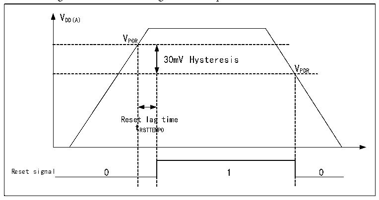

<!-- source-page: 10 -->

[← p.9](0009.md) · [index](../README.md) · [PDF p.10](https://ch32-riscv-ug.github.io/CH32V407/datasheet_en/CH32V407RM.PDF#page=10) · [p.11 →](0011.md)

<!-- header: CH32V407 Reference Manual https://wch-ic.com -->
When the main power supply (VDD) is turned off, the analog switch switches to VBAT, and the backup area is  
powered by the VBAT pin. At this point, pins PC13 through PC15 cannot be used as GPIOs and are limited to  
the following functions:  
● PC13 can be used as a TAMPER pin, RTC alarm, or second output.  
● PC14 and PC15 can only be used as LSE pins.  
Once the main power supply (VDD) has stabilized, the system automatically switches to VDD to power the  
backup domain, and pins PC13~PC15 can be used as GPIOs.  
When pins PC13~PC15 are used as GPIO outputs, the clock speed must be limited to 2MHz or less, the  
maximum load capacitance is 30pF, and they must not be used in applications that continuously draw or supply  
current, such as LED drivers.  
<em>Note: During the restoration of the main power supply VDD, the internal VBAT power supply remains connected</em>  
<em>to the external backup power source via the corresponding VBAT pin. If VDD stabilizes within a time shorter</em>  
<em>than the reset delay time tRSTTEMPO and is more than 0.6V higher than VBAT, there may be a brief moment when</em>  
<em>current may flow through the diode between VDD and VBAT into VBAT, and subsequently into the backup power</em>  
<em>source (such as a battery) via the VBAT pin. If the backup power source cannot withstand such an instantaneous</em>  
<em>current surge, it is recommended to install a forward-biased, low-dropout diode between the backup power</em>  
<em>source and the VBAT pin.</em>  

## 2.2 Power Management

### 2.2.1 Power-on Reset and Power-down Reset

The system integrated a power-on reset POR and a power-down reset PDR circuit. When the chip supply  
voltage VDD33 falls below the corresponding threshold voltage, the system is reset by the relevant circuit, and  
no additional external reset circuit is required. Please refer to the corresponding datasheet for the parameters  
of the power-on threshold voltage VPOR and the power-down threshold voltage VPDR.  

Figure 2-2 Schematic diagram of the operation of POR and PDR  
 <!-- rendered from the PDF; verify at https://ch32-riscv-ug.github.io/CH32V407/datasheet_en/CH32V407RM.PDF#page=10 -->

🖼 Text parsed from the figure above

VDD(A)  
VPOR  
30mV Hysteresis  Reset  lag t RSTTEM  g time MPO  
VPDR  

### 2.2.2 Programmable Voltage Detector

The programmable voltage detector, PVD, is mainly used to monitor the change of the main power supply of  
the system, compared with the threshold voltage set by PLS[1:0] of the power control register PWR_CTLR,  
and together with the setting of the external interrupt register (EXTI), the relevant interrupt can be generated  
in order to notify the system to carry out the pre-dropout operation, such as the data saving, in time.  
<!-- image: p10-draw-image-00001 bbox=[490.8, 794.16, 510.72, 804.96] -->
<!-- footer: V1.2 8 -->
