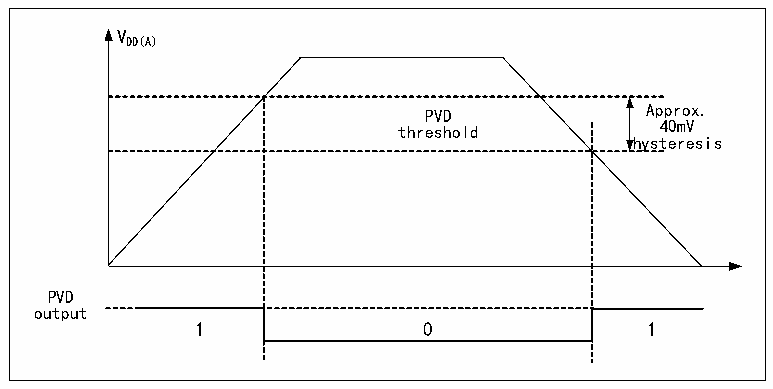

<!-- source-page: 11 -->

[← p.10](0010.md) · [index](../README.md) · [PDF p.11](https://ch32-riscv-ug.github.io/CH32V407/datasheet_en/CH32V407RM.PDF#page=11) · [p.12 →](0012.md)

<!-- header: CH32V407 Reference Manual https://wch-ic.com -->
The specific configuration is as follows:  
1) Set the PLS[1:0] fields of the PWR_CTLR register to select the voltage threshold to be monitored.  
2) Optional interrupt handling. The PVD function is internally linked to the rising/falling edge trigger setting  
on pin 16 of the EXTI module. Enabling this interrupt (by configuring EXTI) causes a PVD interrupt to  
be generated when VDD drops below the PVD threshold or rises above it.  
3) Set the PVD bit of the PWR_CTLR register to enable the PVD function.  
4) Read the PVD0 bit of PWR_CSR status register to obtain the relationship between the current system  
main power supply and the threshold value set by PLS[1:0], and perform the corresponding soft processing.  
When the VDD voltage is higher than the PLS[1:0] setting threshold, the PVD0 position is 0; when the VDD  
voltage is lower than the PLS[1:0] setting threshold, the PVD0 position is 1.  

Figure 2-3 Schematic diagram of PVD operation  
 <!-- rendered from the PDF; verify at https://ch32-riscv-ug.github.io/CH32V407/datasheet_en/CH32V407RM.PDF#page=11 -->

🖼 Text parsed from the figure above

VDD(A)  
PVD threshold  0  
hysteresis  
PVD  
output  

## 2.3 Low-power Modes

After a system reset, the microcontroller is in a normal operating state (run mode), where system power can  
be saved by reducing the system main frequency or turning off the unused peripheral clock or reducing the  
operating peripheral clock. If the system does not need to work, you can set the system to enter low-power  
mode and let the system jump out of this state by specific events.  
Microcontrollers currently offer 3 low-power modes, divided in terms of operating differences between  
processors, peripherals, voltage regulators, etc.  
● Sleep mode: The core stops running and all peripherals (including core private peripherals) are still  
running.  
● Stop mode: All clocks are stopped; The system continues to run after waking up.  
● Standby mode: All clocks are stopped; The microcontroller resets after waking up (power reset).  

<!-- p11-table-002 (table-2-1@1) pages 11-12 -->
<table><caption>Table 2-1 Low-power mode list</caption><tr><th>Mode</th><th>Entry</th><th>Wake-up source</th><th>Effect on clock</th><th>Voltage regulator</th></tr><tr><td rowspan="2">SLEEP</td><td>WFI</td><td>Any interrupt</td><td rowspan="2" style="text-align:left">Core clock OFF, no effect on other clocks</td><td rowspan="2">Normal</td></tr><tr><td>WFE</td><td>Wake-up event</td></tr><tr><td>STOP</td><td style="text-align:left">Set SLEEPDEEP to 1 Clear PDDS to 0 WFI or WFE</td><td style="text-align:left">Any external interrupt/event (EXTI signal), an external reset signal on NRST, or an IWDG reset; the EXTI signal includes one of the 77 external I/O pins, the PVD output, the RTC alarm, the I3C wake-up signal, and the USB wake-up signal.</td><td style="text-align:left">HSE, HSI, PLL, and peripheral clocks are disabled.</td><td style="text-align:left">Normal: LPDS=0 or Low power: LPDS=1</td></tr><tr><td>STANDBY</td><td style="text-align:left">Set SLEEPDEEP to 1 Set PDDS to 1 WFI or WFE</td><td style="text-align:left">Any external event (EXTI signal), an external reset signal on NRST, an IWDG reset, or a rising edge on the WKUP pin, where the EXTI signal includes one of the 77 external I/O ports or the RTC alarm.</td><td style="text-align:left">HSE, HIS, PLL and peripheral clocks are disabled</td><td>Disabled</td></tr></table>

<!-- image: p11-draw-image-00001 bbox=[490.8, 794.16, 510.72, 804.96] -->
<!-- footer: V1.2 9 -->
