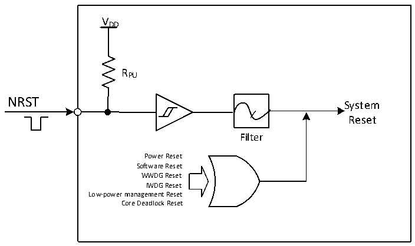

<!-- source-page: 18 -->

[← p.17](0017.md) · [index](../README.md) · [PDF p.18](https://ch32-riscv-ug.github.io/CH32V407/datasheet_en/CH32V407RM.PDF#page=18) · [p.19 →](0019.md)

<!-- header: CH32V407 Reference Manual https://wch-ic.com -->
performed instead of entering shutdown mode.  
Core deadlock reset: When the LKUPEN bit of the EXTEN_CTR register is enabled, if the core runs  
abnormally and cannot be recovered and a deadlock occurs, the system will be reset.  

Figure 3-1 System reset structure  
 <!-- rendered from the PDF; verify at https://ch32-riscv-ug.github.io/CH32V407/datasheet_en/CH32V407RM.PDF#page=18 -->

🖼 Text parsed from the figure above

VDD  
RPU  
NRST  
System  
Reset  
Filter  
Power Reset  
Software Reset  
WWDG Reset  
IWDG Reset  
Low-power management Reset  
Core Deadlock Reset  

### 3.2.3 Backup Domain Reset

When a backup domain reset occurs, only the backup domain registers are reset, including the backup registers,  
the RCC_BDCTLR registers (RTC enable and LSE oscillator). The conditions for its generation include:  
● Caused by VDD or VBAT power-up with both VDD and VBAT powered down  
● Set BDRST to 1 of the RCC_BDCTLR register  
● Set BKPRST to 1 of the RCC_PB1PRSTR register  
<!-- image: p18-draw-image-00001 bbox=[495.36, 794.16, 515.28, 804.96] -->
<!-- footer: V1.2 16 -->
