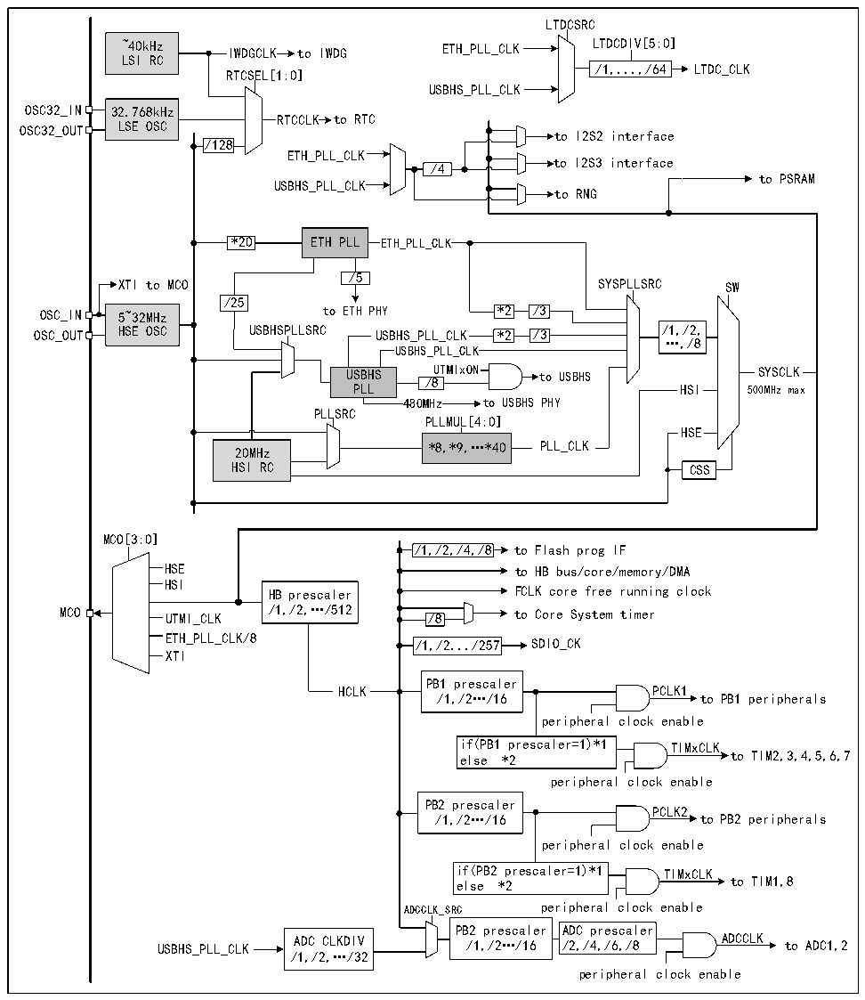

<!-- source-page: 19 -->

[← p.18](0018.md) · [index](../README.md) · [PDF p.19](https://ch32-riscv-ug.github.io/CH32V407/datasheet_en/CH32V407RM.PDF#page=19) · [p.20 →](0020.md)

<!-- header: CH32V407 Reference Manual https://wch-ic.com -->

## 3.3 Clock

### 3.3.1 System Clock Structure

Figure 3-2 Clock tree block diagram  
 <!-- rendered from the PDF; verify at https://ch32-riscv-ug.github.io/CH32V407/datasheet_en/CH32V407RM.PDF#page=19 -->

🖼 Text parsed from the figure above

LTDCSRC  
~40kHz IWDGCLK to IWDG ETH_PLL_CLK LTDCDIV[5:0]  
LSI RC  
/1,...,/64 LTDC_CLK  
RTCSEL[1:0]  
USBHS_PLL_CLK  
32.768kHz LSE OSC  
RTCCLK to RTC  
OSC32_OUT LSE OSC to I2S2 interface  
/128  
ETH_PLL_CLK  
to I2S3 interface  
/4  
to PSRAM  
USBHS_PLL_CLK  
to RNG  
*20 ETH PLL ETH_PLL_CLK  
/5  
XTI to MCO SYSPLLSRC SW  
/25  
OSC_IN 5~32MHz to ETH PHY *2 /3  
OSC_OUT HSE OSC USBHSPLLSRC USBHS_PLL_CLK *2 /3 /1,/2,  
…,/8  
USBHS_PLL_CLK  
USBHS UTMIxON to USBHS SYSCLK  
/8  
PLL HSI 500MHz max  
480MHz to USBHS PHY  
PLLSRC  
PLLMUL[4:0]  
HSE  
20MHz *8,*9,…*40 PLL_CLK  
HSI RC CSS  
MCO[3:0]  
/1,/2,/4,/8 to Flash prog IF  
/1,/2,/4,/8  /1,/2,/4,/8  
HSE to HB bus/core/memory/DMA  
HSI  
HB prescaler FCLK core free running clock  
UTMI_CLK  
MCO UTMI_CLK /1,/2,…/512 /8 to Core System timer  
ETH_PLL_CLK/8  
/1,/2.../257  /1,/2.../257  
XTI  
PB1 prescaler  
HCLK PCLK1  
/1,/2…/16 to PB1 peripherals  
peripheral clock enable  
if(PB1 prescaler=1)*1 TIMxCLK  
else *2 to TIM2,3,4,5,6,7  
peripheral clock enable  
PB2 prescaler  
PCLK2  
/1,/2…/16 to PB2 peripherals  
peripheral clock enable  
if(PB2 prescaler=1)*1 TIMxCLK  
else *2 to TIM1,8  
ADCCLK_SRC peripheral clock enable  
PB2 prescaler ADC prescaler  
USBHS_PLL_CLK ADC CLKDIV /1,/2…/16 /2,/4,/6,/8 ADCCLK to ADC1,2  
/1,/2,…/32  
peripheral clock enable  

### 3.3.2 High-speed Clock (HSI/HSE)

HSI is a high-speed clock signal generated by the RC oscillator of 20MHz in the system. The HIS RC oscillator  
can provide the system clock without any external devices. Its start-up time is very short, but the clock  
frequency accuracy is poor. The HSI is turned on and off by setting the HSION bit in the RCC_CTLR register,  
and the HSIRDY bit indicates whether the HSIRC oscillator is stable. The system defaults to HSION and  
<!-- image: p19-draw-image-00001 bbox=[495.36, 794.16, 515.28, 804.96] -->
<!-- footer: V1.2 17 -->
