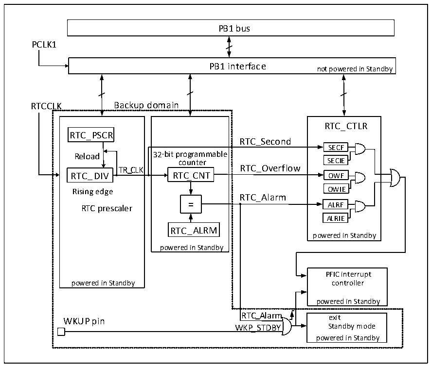

<!-- source-page: 48 -->

[← p.47](0047.md) · [index](../README.md) · [PDF p.48](https://ch32-riscv-ug.github.io/CH32V407/datasheet_en/CH32V407RM.PDF#page=48) · [p.49 →](0049.md)

<!-- header: CH32V407 Reference Manual https://wch-ic.com -->

# Chapter 6 Real Time Clock (RTC)

The Real Time Clock (RTC) is a standalone timer module with a programmable counter up to 32 bits, which  
can be used with software to realize the real time clock function, and the counter value can be modified to  
reconfigure the current time and date of the system. The RTC module is in the backup power supply area, and  
the system reset and wake-up from Standby mode do not have any effect on it.  

## 6.1 Main Features

● Prescaler coefficients up to 220  
● 32-bit programmable counter  
● Multiple clock sources, interrupts  
● Independent reset  

## 6.2 Function Description

### 6.2.1 Overview

Figure 6-1 RTC structure diagram  
 <!-- rendered from the PDF; verify at https://ch32-riscv-ug.github.io/CH32V407/datasheet_en/CH32V407RM.PDF#page=48 -->

🖼 Text parsed from the figure above

PB1 bus  
PCLK1  
PB1 interface  
not powered in Standby  
RTCCLK Backup domain  
32-bit programmable counter RTC_CNTRTC_ALRM powered in Standby  
RTC_CTLR  
RTC_PSCR  
RTC_Second  
SECF  
counter SECIE  
TR_CLK RTC_Overflow  
Rising edge OWIE  
RTC_Alarm  
ALRIE  
powered in Standby  
PFIC interrupt  
powered in Standby controller  
powered in Standby  
RTC_Alarm  
exit  
WKUP pin  
WKP_STDBY Standby mode  
powered in Standby  

As shown in figure 6-1, the RTC module is mainly composed of 3 parts: HB bus interface, frequency divider  
and counter, control and status register, in which the frequency divider and counter are in the backup area and  
can be powered by VBAT. After inputting the frequency divider (RTC_DIV), the RTCCK is divided into  
<!-- image: p48-draw-image-00001 bbox=[495.36, 794.16, 515.28, 804.96] -->
<!-- footer: V1.2 46 -->
