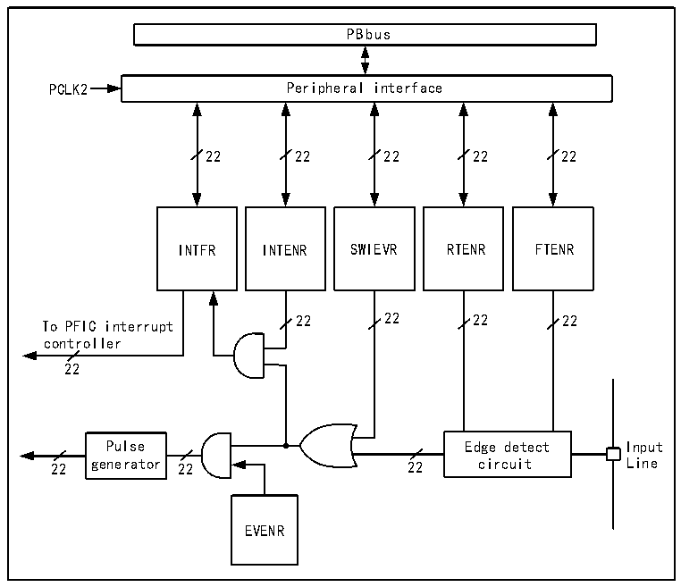

<!-- source-page: 87 -->

[← p.86](0086.md) · [index](../README.md) · [PDF p.87](https://ch32-riscv-ug.github.io/CH32V407/datasheet_en/CH32V407RM.PDF#page=87) · [p.88 →](0088.md)

<!-- header: CH32V407 Reference Manual https://wch-ic.com -->

> ⬆ **Table continued** — rendered in full at [page 84](0084.md). <!-- p87-table-001 -->

### 9.4.3 External Interrupt and Event Controller (EXTI)

#### 9.4.3.1 Overview

Figure 9-1 External interrupt (EXTI) interface block diagram  
 <!-- rendered from the PDF; verify at https://ch32-riscv-ug.github.io/CH32V407/datasheet_en/CH32V407RM.PDF#page=87 -->

🖼 Text parsed from the figure above

PBbus  
PCLK2 Peripheral interface  
22 22 22 22 22  
INTFR INTENR SWIEVR RTENR FTENR  
To PFIC interrupt 22 22 22 22  
controller  
22  
Pulse Edge detect Input  
22 generator 22 22 circuit Line  
EVENR  

As can be seen from figure 9-1, the trigger source of the external interrupt can be either a software interrupt  
(SWIEVR) or an actual external interrupt channel, and the signal of the external interrupt channel is first  
screened by the edge detection circuit. As long as a software interrupt or an external interrupt signal is  
generated, it will be output to the event enable and interrupt enable AND gate circuits through the OR gate  
circuit in the figure. As long as an interrupt is enabled or an event is enabled, an interrupt or event will be  
generated. The six registers of EXTI are accessed by the processor through the PB2 interface.  
<!-- image: p87-draw-image-00001 bbox=[495.36, 794.16, 515.28, 804.96] -->
<!-- footer: V1.2 85 -->
