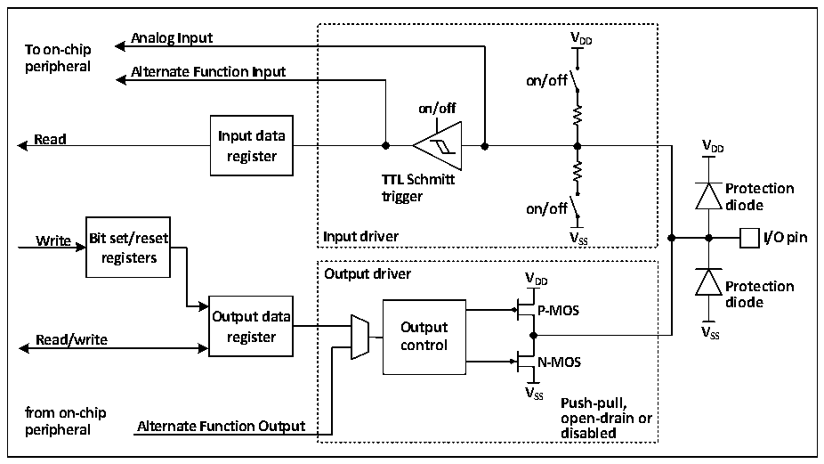

<!-- source-page: 113 -->

[← p.112](0112.md) · [index](../README.md) · [PDF p.113](https://ch32-riscv-ug.github.io/CH32V407/datasheet_en/CH32V407RM.PDF#page=113) · [p.114 →](0114.md)

<!-- header: CH32V407 Reference Manual https://wch-ic.com -->

# Chapter 10 GPIO and Alternate Functions (GPIO/AFIO)

The GPIO port can be configured into a variety of input or output modes, has a built-in pull-up or pull-down  
resistor that can be turned off, and can be configured as a push-pull or open-drain function. The GPIO port can  
also be reused for other functions.  

## 10.1 Main Features

Each pin of the port can be configured into one of the following modes:  
● Floating input  
● Pull-up input  
● Pull-down input  
● Analog input  
● Open-drain output  
● Push-pull output  
● Input and output of alternate function  
Many pins have alternate functions, and many other peripherals map their own output and input channels to  
these pins. The specific application of these alternate pins needs to be with reference to each peripheral, and  
this chapter shall specify whether these pins are alternate and remapped.  

## 10.2 Function Description

### 10.2.1 Overview

Figure 10-1 Basic structure of GPIO module  
 <!-- rendered from the PDF; verify at https://ch32-riscv-ug.github.io/CH32V407/datasheet_en/CH32V407RM.PDF#page=113 -->

🖼 Text parsed from the figure above

<strong>Analog Input V DD</strong>  
<strong>To on-chip</strong>  
<strong>peripheral Alternate Function Input</strong>  
<strong>on/off</strong>  
<strong>on/off</strong>  
<strong>Read Input data</strong>  
<strong>V</strong>  
<strong>register DD</strong>  
<strong>TTL Schmitt</strong>  
<strong>Protection</strong>  
<strong>trigger</strong>  
<strong>on/off diode</strong>  
<strong>Write Bit set/reset Input driver V SS I/O pin</strong>  
<strong>registers</strong>  
<strong>Output driver V</strong>  
<strong>DD Protection</strong>  
<strong>diode</strong>  
<strong>P-MOS</strong>  
<strong>Output data</strong>  
<strong>Read/write register O co u n t t p r u o t l V SS</strong>  
<strong>N-MOS</strong>  
<strong>V</strong>  
<strong>SS Push-pull,</strong>  
<strong>from on-chip open-drain or</strong>  
<strong>peripheral Alternate Function Output disabled</strong>  

As shown in figure 10-1, the IO port structure, each pin has 2 protection diodes inside the chip, and the IO  
port can be divided into input and output drive modules. The input driver has a weak pull-up resistor, which  
can be connected to AD and other analog input peripherals; if you input to a digital peripheral, you need to go  
through a TTL Schmitt trigger, and then connect to the GPIO input register or other multiplexed peripherals.  
The output driver has a pair of MOS tubes, and the IO port can be configured to open leakage or push-pull  
<!-- image: p113-draw-image-00001 bbox=[499.92, 794.16, 519.84, 804.96] -->
<!-- footer: V1.2 111 -->
