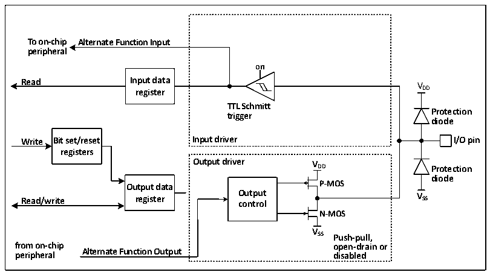
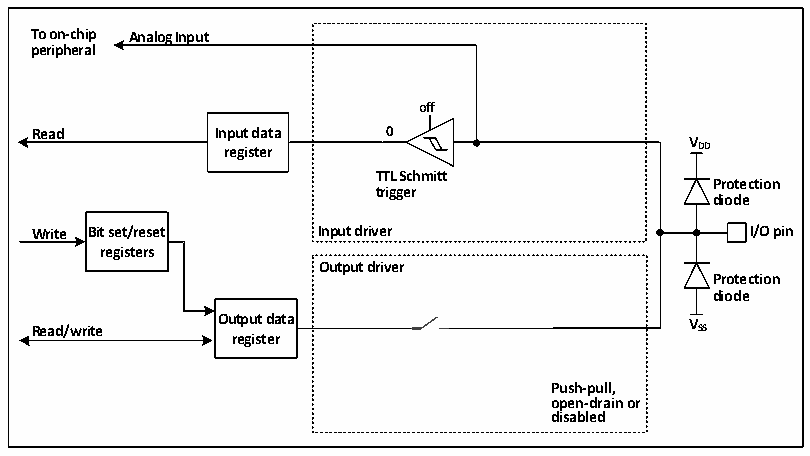

<!-- source-page: 116 -->

[← p.115](0115.md) · [index](../README.md) · [PDF p.116](https://ch32-riscv-ug.github.io/CH32V407/datasheet_en/CH32V407RM.PDF#page=116) · [p.117 →](0117.md)

<!-- header: CH32V407 Reference Manual https://wch-ic.com -->

### 10.2.8 Alternate Function Configuration

Figure 10-4 Structure block diagram when GPIO module is multiplexed by other peripherals  
 <!-- rendered from the PDF; verify at https://ch32-riscv-ug.github.io/CH32V407/datasheet_en/CH32V407RM.PDF#page=116 -->

🖼 Text parsed from the figure above

<strong>To on-chip Alternate Function Input</strong>  
<strong>peripheral</strong>  
<strong>on</strong>  
<strong>Read Input data V</strong>  
<strong>register DD</strong>  
<strong>TTL Schmitt</strong>  
<strong>Protection</strong>  
<strong>trigger</strong>  
<strong>diode</strong>  
<strong>Write Bit set/reset Input driver I/O pin</strong>  
<strong>registers</strong>  
<strong>Output driver V</strong>  
<strong>DD Protection</strong>  
<strong>diode</strong>  
<strong>Output data P-MOS</strong>  
<strong>Read/write register O co u n t t p r u o t l V SS</strong>  
<strong>N-MOS</strong>  
<strong>V</strong>  
<strong>SS Push-pull,</strong>  
<strong>from on-chip open-drain or</strong>  
<strong>Alternate Function Output</strong>  
<strong>peripheral disabled</strong>  

When the alternate function is enabled, the output driver is enabled and can be configured in open-drain or  
push-pull mode as needed, the Schmitt trigger is also turned on, the input and output lines of the alternate  
function are connected, but the output data register is disconnected, and the level that appears on the IO pin  
will be sampled to the input data register at each PB2 clock. In open-drain mode, reading the input data register  
will get the current state of the IO port. In push-pull mode, reading the output data register will get the last  
written value.  

### 10.2.9 Analog Input Configuration

Figure 10-5 Configuration structure block diagram of GPIO module as analog input  
 <!-- rendered from the PDF; verify at https://ch32-riscv-ug.github.io/CH32V407/datasheet_en/CH32V407RM.PDF#page=116 -->

🖼 Text parsed from the figure above

<strong>To on-chip Analog Input</strong>  
<strong>peripheral</strong>  
<strong>off</strong>  
<strong>Read Input data 0</strong>  
<strong>V</strong>  
<strong>register DD</strong>  
<strong>TTL Schmitt</strong>  
<strong>Protection</strong>  
<strong>trigger</strong>  
<strong>diode</strong>  
<strong>Write Bit set/reset Input driver I/O pin</strong>  
<strong>registers</strong>  
<strong>Output driver</strong>  
<strong>Protection</strong>  
<strong>diode</strong>  
<strong>Output data V</strong>  
<strong>Read/write SS</strong>  
<strong>register</strong>  
<strong>Push-pull,</strong>  
<strong>open-drain or</strong>  
<strong>disabled</strong>  

When the analog input is enabled, the output buffer is disconnected, the input of the Schmitt trigger in the  
input driver is disabled to prevent consumption on the IO port, the pull-up resistor is prohibited, and the read  
input data register will always be 0.  
<!-- image: p116-draw-image-00001 bbox=[499.92, 794.16, 519.84, 804.96] -->
<!-- footer: V1.2 114 -->
