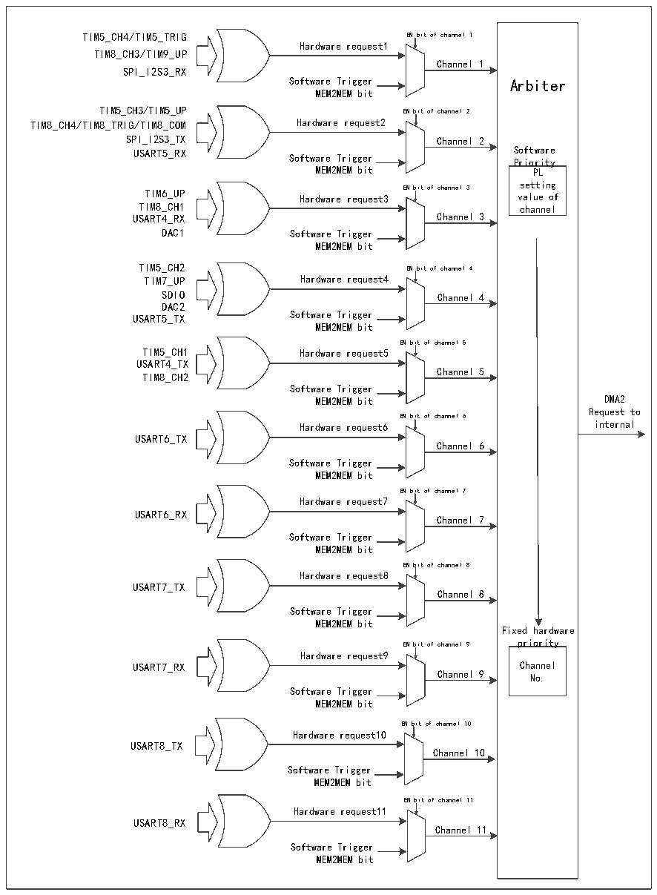
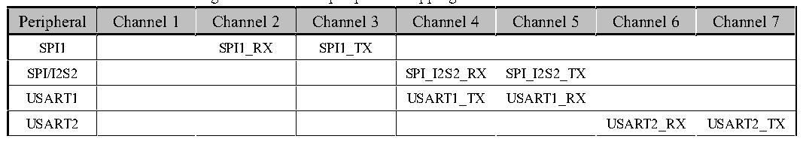

<!-- source-page: 149 -->

[← p.148](0148.md) · [index](../README.md) · [PDF p.149](https://ch32-riscv-ug.github.io/CH32V407/datasheet_en/CH32V407RM.PDF#page=149) · [p.150 →](0150.md)

<!-- header: CH32V407 Reference Manual https://wch-ic.com -->

Figure 11-2 DMA2 request mapping  
 <!-- rendered from the PDF; verify at https://ch32-riscv-ug.github.io/CH32V407/datasheet_en/CH32V407RM.PDF#page=149 -->

🖼 Text parsed from the figure above

TIM5_CH4/TIM5_TRIG EN bit of channel 1  
Hardware request1  
TIM8_CH3/TIM9_UP  
Channel 1  
SPI_I2S3_RX  
Software Trigger Arbiter  
MEM2MEM bit  
TIM5_CH3/TIM5_UP EN bit of channel 2  
TIM8_CH4/TIM8_TRIG/TIM8_COM Hardware request2  
SPI_I2S3_TX Channel 2  
USART5_RX Software Trigger S P o r f i t o w r a i r t e y  
MEM2MEM bit PL  
setting  
TIM6_UP Hardware request3 EN bit of channel 3 value of  
TIM8_CH1 channel  
USART4_RX Channel 3  
DAC1 Software Trigger  
MEM2MEM bit  
TIM5_CH2 EN bit of channel 4  
TIM7_UP Hardware request4  
SDIO Channel 4  
DAC2  
USART5_TX Software Trigger  
MEM2MEM bit  
EN bit of channel 5  
TIM5_CH1 Hardware request5  
USART4_TX  
Channel 5  
TIM8_CH2  
Software Trigger  
MEM2MEM bit DMA2  
Request to  
EN bit of channel 6  
Hardware request6 internal  
USART6_TX  
Channel 6  
Software Trigger  
MEM2MEM bit  
EN bit of channel 7  
Hardware request7  
USART6_RX  
Channel 7  
Software Trigger  
MEM2MEM bit  
EN bit of channel 8  
Hardware request8  
USART7_TX  
Channel 8  
Software Trigger  
MEM2MEM bit  
Fixed hardware  
EN bit of channel 9 priority  
Hardware request9  
USART7_RX Channel  
Channel 9 No.  
Software Trigger  
MEM2MEM bit  
EN bit of channel 10  
Hardware request10  
USART8_TX  
Channel 10  
Software Trigger  
MEM2MEM bit  
EN bit of channel 11  
Hardware request11  
USART8_RX  
Channel 11  
Software Trigger  
MEM2MEM bit  

Figure 11-2 DMA1 peripheral mapping table for each channel  
 <!-- rendered from the PDF; verify at https://ch32-riscv-ug.github.io/CH32V407/datasheet_en/CH32V407RM.PDF#page=149 -->

🖼 Text parsed from the figure above

Peripheral  Channel 1  Channel 2  Channel 3  Channel 4  Channel 5  Channel 6  Channel 7  SPI1  SPI1_RX  SPI1_TX  SPI/I2S2  SPI_I2S2_RX  SPI_I2S2_TX  USART1  USART1_TX  USART1_RX  USART2  USART2_RX  USART2_TX  USART3  USART3_TX  USART3_RX  I2C  I2C_TX  I2C_RX  I3C  I3C_TX  I3C_RX  TIM1  TIM1_CH1  TIM1_CH2  TIM1_CH4TIM1_TRIGTIM1_COM  TIM1_UP  TIM1_CH3  TIM2  TIM2_CH3  TIM2_UP  TIM2_CH1  TIM2_CH2TIM2_CH4  TIM3  TIM3_CH3  TIM3_UPTIM3_CH4  TIM3_CH1TIM3_TRIG  TIM4  TIM4_CH1  TIM4_CH2  TIM4_CH3  TIM4_UP  

<!-- image: p149-draw-image-00001 bbox=[499.92, 794.16, 519.84, 804.96] -->
<!-- footer: V1.2 147 -->
