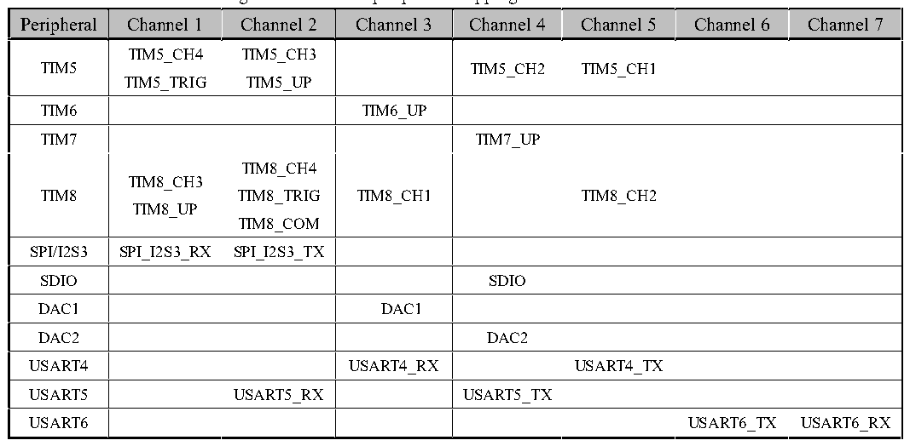

<!-- source-page: 150 -->

[← p.149](0149.md) · [index](../README.md) · [PDF p.150](https://ch32-riscv-ug.github.io/CH32V407/datasheet_en/CH32V407RM.PDF#page=150) · [p.151 →](0151.md)

<!-- header: CH32V407 Reference Manual https://wch-ic.com -->

> ⬆ **Table continued** — rendered in full at [page 149](0149.md). <!-- p150-table-001 -->

<!-- p150-table-002 (table-11-1@1) -->
<table><tr><th>Peripheral</th><th>Channel 8</th><th>Channel 9</th><th>Channel 10</th><th>Channel 11</th><th>Channel 12</th><th>Channel 13</th></tr><tr><td>ADC1</td><td></td><td></td><td></td><td></td><td>ADC1</td><td></td></tr><tr><td>ADC2</td><td></td><td></td><td></td><td></td><td></td><td>ADC2</td></tr><tr><td>USART9</td><td>USART9_TX</td><td>USART9_RX</td><td></td><td></td><td></td><td></td></tr><tr><td>USART10</td><td></td><td></td><td>USART10_TX</td><td>USART10_RX</td><td></td><td></td></tr><tr><td>13C</td><td>I3C_TC</td><td></td><td></td><td></td><td></td><td></td></tr><tr><td>ARGB</td><td></td><td></td><td>ARGB</td><td></td><td></td><td></td></tr></table>

Figure 11-3 DMA2 peripheral mapping table for each channel  
 <!-- rendered from the PDF; verify at https://ch32-riscv-ug.github.io/CH32V407/datasheet_en/CH32V407RM.PDF#page=150 -->

🖼 Text parsed from the figure above

Peripheral  Channel 1  Channel 2  Channel 3  Channel 4  Channel 5  Channel 6  Channel 7  TIM5  TIM5_CH4TIM5_TRIG  TIM5_CH3TIM5_UP  TIM5_CH2  TIM5_CH1  TIM6  TIM6_UP  TIM7  TIM7_UP  TIM8  TIM8_CH3TIM8_UP  TIM8_CH4TIM8_TRIGTIM8_COM  TIM8_CH1  TIM8_CH2  SPI/I2S3  SPI_I2S3_RX  SPI_I2S3_TX  SDIO  SDIO  DAC1  DAC1  DAC2  DAC2  USART4  USART4_RX  USART4_TX  USART5  USART5_RX  USART5_TX  USART6  USART6_TX  USART6_RX  

<!-- p150-table-004 (table-11-1@1) -->
<table><tr><th>Peripheral</th><th>Channel 8</th><th>Channel 9</th><th>Channel 10</th><th>Channel 11</th></tr><tr><td>USART7</td><td>USART7_TX</td><td>USART7_RX</td><td></td><td></td></tr><tr><td>USART8</td><td></td><td></td><td>USART8_TX</td><td>USART8_RX</td></tr></table>

## 11.3 Register Description

<!-- image: p150-draw-image-00001 bbox=[499.92, 794.16, 519.84, 804.96] -->
<!-- footer: V1.2 148 -->
