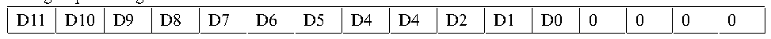
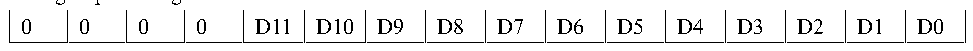

<!-- source-page: 163 -->

[← p.162](0162.md) · [index](../README.md) · [PDF p.163](https://ch32-riscv-ug.github.io/CH32V407/datasheet_en/CH32V407RM.PDF#page=163) · [p.164 →](0164.md)

<!-- header: CH32V407 Reference Manual https://wch-ic.com -->
of multiple regular channels from not taking the data from the ADCx_RDATAR register in time, the DMA  
function of ADC can be turned on. The hardware generates an DMA request at the end of the conversion of  
the regular channel (EOC setting) and transfers the translated data from the ADCx_RDATAR register to the  
destination address specified by the user.  
After the channel configuration of the DMA controller module is completed, write the DMA location 1 of the  
ADCx_CTLR2 register and turn on the DMA function of ADC.  
<em>Note: the injection group transformation does not support the DMA feature.</em>  
<strong>6) Data alignment</strong>  
The ALIGN bit in the ADCx_CTLR2 register selects the data storage alignment after ADC conversion. 12-bit  
data supports left and right alignment modes.  
The data register ADCx_RDATAR of the regular group channel stores the actual converted 12-bit digital value,  
while the data register ADCx_IDATARx of the injected group channel is the value written after the actual  
converted data minus the offset of the ADCx_IOFRx register, so there are positive and negative SIGNB.  

Figure 12-2 Data left alignment  
 <!-- rendered from the PDF; verify at https://ch32-riscv-ug.github.io/CH32V407/datasheet_en/CH32V407RM.PDF#page=163 -->

Rule group data register  

🖼 Text parsed from the figure above

D11  D10  D9  D8  D7  D6  D5  D4  D4  D2  D1  D0  0  0  0  0  

Injected group data register  

<!-- p163-table-002 (table-11-5@1) -->
<table><tr><th>SIGNB</th><th>D11</th><th>D10</th><th>D9</th><th>D8</th><th>D7</th><th>D6</th><th>D5</th><th>D4</th><th>D3</th><th>D2</th><th>D1</th><th>D0</th><th>0</th><th>0</th><th>0</th></tr></table>

Figure 12-3 Data right alignment  
 <!-- rendered from the PDF; verify at https://ch32-riscv-ug.github.io/CH32V407/datasheet_en/CH32V407RM.PDF#page=163 -->

Rule group data register  

🖼 Text parsed from the figure above

0  0  0  0  D11  D10  D9  D8  D7  D6  D5  D4  D3  D2  D1  D0  

Injected group data register  

<!-- p163-table-004 (table-11-5@1) -->
<table><tr><th>SIGNB</th><th>SIGNB</th><th>SIGNB</th><th>SIGNB</th><th>D11</th><th>D10</th><th>D9</th><th>D8</th><th>D7</th><th>D6</th><th>D5</th><th>D4</th><th>D3</th><th>D2</th><th>D1</th><th>D0</th></tr></table>

### 12.2.3 External Trigger Source

The start event of an ADC transformation can be triggered by an external event. If the EXTTRIG or  
JEXTTRIG bit of the ADCx_CTLR2 register is set, the conversion of the rule group or injection group channel  
can be triggered by external events, respectively. At this point, the configuration of the EXTSEL[2:0] and  
JEXTSEL[2:0] bits determines the external event sources of the rule group and the injection group.  

<!-- p163-table-005 (table-12-1@1) -->
<table><caption>Table 12-1 External trigger sources of regular group channel</caption><tr><th>EXTSEL[2:0]</th><th>Trigger source</th><th>Type</th></tr><tr><td>000</td><td>CC1 event of timer 1</td><td rowspan="6">Internal signal from on-chip timers</td></tr><tr><td>001</td><td>CC2 event of timer 1</td></tr><tr><td>010</td><td>CC3 event of timer 1</td></tr><tr><td>011</td><td>CC2 event of timer 2</td></tr><tr><td>100</td><td>TRGO event of timer 3</td></tr><tr><td>101</td><td>CC4 event of timer 4</td></tr><tr><td>110</td><td>EXTI line 11/ TIM8_TRGO</td><td>From external pin/internal timer signal</td></tr><tr><td>111</td><td>SWSTART position 1 software trigger</td><td>Software control bit</td></tr></table>

<!-- image: p163-draw-image-00001 bbox=[499.92, 794.16, 519.84, 804.96] -->
<!-- footer: V1.2 161 -->
