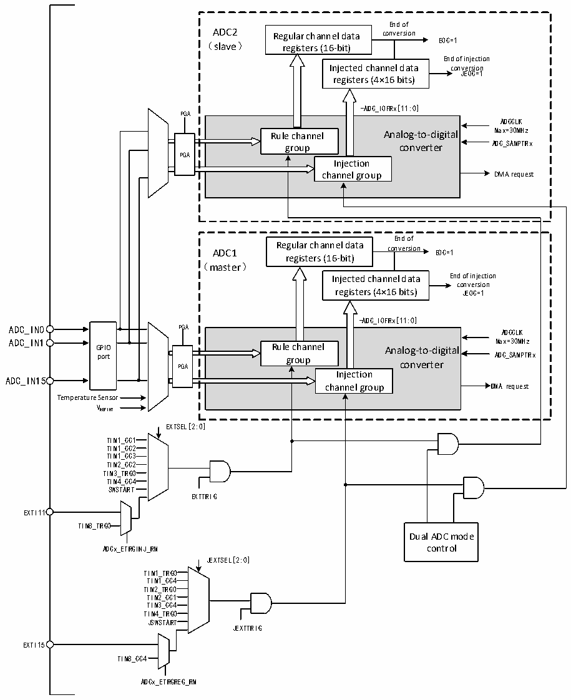

<!-- source-page: 169 -->

[← p.168](0168.md) · [index](../README.md) · [PDF p.169](https://ch32-riscv-ug.github.io/CH32V407/datasheet_en/CH32V407RM.PDF#page=169) · [p.170 →](0170.md)

<!-- header: CH32V407 Reference Manual https://wch-ic.com -->
● Synchronous Injection Mode + Fast Alternation Mode  
● Synchronous Injection Mode + Slow Alternation Mode  
Note: 1. In dual ADC mode, the DMA bit must be enabled to allow the main data register to read conversion  
data from the slave ADC.  

Figure 12-5 Dual ADC block diagram  
 <!-- rendered from the PDF; verify at https://ch32-riscv-ug.github.io/CH32V407/datasheet_en/CH32V407RM.PDF#page=169 -->

🖼 Text parsed from the figure above

End of  
ADC2 Regular channel data conversion  
EOC=1  
（slave） registers (16-bit)  
End of injection  
Injected channel data conversion  
JEOC=1  
registers (4×16 bits)  
-ADC_IOFRx[11:0]  
PGA  
Rule channel Analog-to-digital group converter Injection channel group  PGA  
ADCCLK  
End of  
ADC1 Regular channel data conversion EOC=1  
registers (16-bit)  
（master）  
Injected channel data End of injection  
conversion  
registers (4×16 bits) JEOC=1  
-ADC_IOFRx[11:0]  
GPIO port  
Rule channel Analog-to-digital group converter Injection channel group  PGA  
ADCCLK  
ADC_IN15  
Temperature Sensor  
VREFINT  
TIM1_CC1  
TIM1_CC2  
TIM1_CC3  
TIM2_CC2  
TIM3_TRG0  
TIM4_CC4  
SWSTART  
EXTTRIG  
EXTI11  
TIM8_TRG0  
Dual ADC mode  
ADCx_ETRGINJ_RM control  
JEXTSEL[2:0]  
TIM1_TRG0  
TIM1_CC4  
TIM2_TRG0  
TIM2_CC1  
TIM3_CC4  
TIM4_TRG0  
JSWSTART  
JEXTTRIG  
EXTI15  
TIM8_CC4  
ADCx_ETRGREG_RM  

# 1) Independent Mode

In this mode, the dual ADCs work asynchronously and independently.  
<!-- image: p169-draw-image-00001 bbox=[499.92, 794.16, 519.84, 804.96] -->
<!-- footer: V1.2 167 -->
