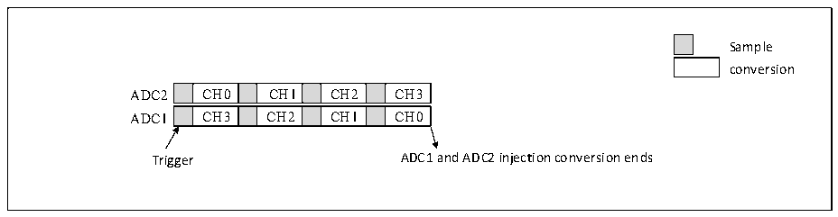
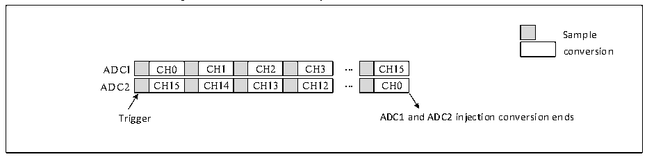

<!-- source-page: 170 -->

[← p.169](0169.md) · [index](../README.md) · [PDF p.170](https://ch32-riscv-ug.github.io/CH32V407/datasheet_en/CH32V407RM.PDF#page=170) · [p.171 →](0171.md)

<!-- header: CH32V407 Reference Manual https://wch-ic.com -->
<strong>2) Synchronous injection mode</strong>  
In this mode, it is used to convert a channel group. Set JEXTSEL[2:0] in ADC1_CTLR2 to select the trigger  
source, which will also synchronize the trigger for ADC2. Upon conversion completion, the converted data is  
stored in ADCx_IDATARx for each ADCx. If any ADC interrupt is enabled, a JEOC interrupt will be  
generated after conversion ends.  

Figure 12-6 4-channel synchronous injection conversion  
 <!-- rendered from the PDF; verify at https://ch32-riscv-ug.github.io/CH32V407/datasheet_en/CH32V407RM.PDF#page=170 -->

🖼 Text parsed from the figure above

Sample  
conversion  
CH0  CH1  CH2  CH3  CH3  CH2  CH1  CH0  
Trigger ADC1 and ADC2 injection conversion ends  

<em>Note: 1. The conversion channels of ADC1 and ADC2 should not overlap at the same moment.</em>  
<em>2. In synchronous mode, ADC1 and ADC2 should have conversion sequences of equal duration, or the</em>  
<em>duration of the longer sequence should be shorter than the trigger interval to ensure both sequences complete</em>  
<em>conversion with each trigger.</em>  
<strong>3) Synchronous rule mode</strong>  
In this mode, the conversion rule channel sequence is used to configure EXTSEL[2:0] in ADC1_CTLR2 to  
select the trigger source, which also synchronizes the trigger for ADC2. Upon conversion completion, a 32-  
bit DMA transfer request is generated to transfer the contents of the ADC1_RDATAR data register to SRAM.  
The upper 16 bits contain ADC2 conversion data, while the lower 16 bits contain ADC1 conversion data.  
Enabling interrupts for either ADC will generate an EOC interrupt.  

Figure 12-7 16-channel synchronous rule conversion  
 <!-- rendered from the PDF; verify at https://ch32-riscv-ug.github.io/CH32V407/datasheet_en/CH32V407RM.PDF#page=170 -->

🖼 Text parsed from the figure above

Sample  
conversion  
CH0  CH1  CH2  CH3  CH15  CH14  CH13  CH12  
CH15  CH0  
Trigger ADC1 and ADC2 injection conversion ends  

<em>Note: 1. The conversion channels of ADC1 and ADC2 should not overlap at the same moment.</em>  
<em>2. In synchronous mode, ADC1 and ADC2 should have conversion sequences of equal duration, or the</em>  
<em>duration of the longer sequence should be shorter than the trigger interval to ensure both sequences complete</em>  
<em>conversion with each trigger.</em>  
<strong>4) Fast alternating mode</strong>  
This mode applies only to the regular channel (typically the sole channel). Configure EXTSEL[2:0] in  
ADC1_CTLR2 to select the trigger source. Upon trigger generation, ADC2 initiates conversion immediately,  
while ADC1 begins conversion after a delay of 7 ADC clock cycles. If both ADCs are enabled in continuous  
mode (CONT set), they will perform alternating conversions on the regular channel. If interrupts are enabled,  
ADC1 will generate an EOC interrupt. If DMA is also enabled, this will trigger a 32-bit DMA transfer request,  
transferring the contents of the ADC1_RDATAR data register to SRAM. The upper 16 bits contain ADC2  
<!-- image: p170-draw-image-00001 bbox=[499.92, 794.16, 519.84, 804.96] -->
<!-- footer: V1.2 168 -->
