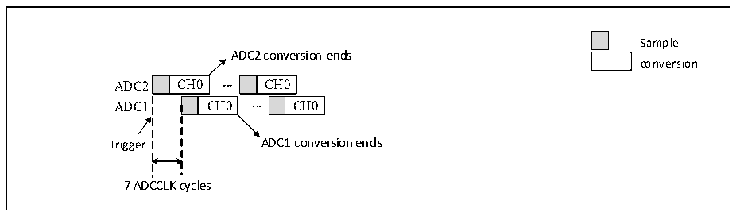
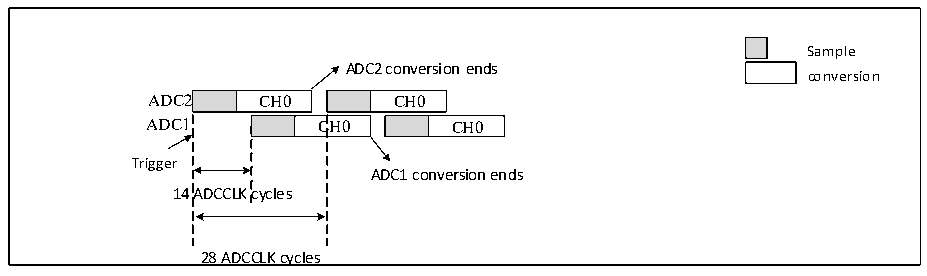

<!-- source-page: 171 -->

[← p.170](0170.md) · [index](../README.md) · [PDF p.171](https://ch32-riscv-ug.github.io/CH32V407/datasheet_en/CH32V407RM.PDF#page=171) · [p.172 →](0172.md)

<!-- header: CH32V407 Reference Manual https://wch-ic.com -->
conversion data, while the lower 16 bits contain ADC1 conversion data.  

Figure 12-8 Single channel fast alternating continuous conversion  
 <!-- rendered from the PDF; verify at https://ch32-riscv-ug.github.io/CH32V407/datasheet_en/CH32V407RM.PDF#page=171 -->

🖼 Text parsed from the figure above

Sample  
ADC2 conversion ends  
conversion  
CH0  CH0  CH0  
CH0  
7 ADCCLK cycles  

<em>Note: The sampling time should be less than 7 ADC clock cycles, so as to avoid the problem of overlapping</em>  
<em>sampling periods when ADC1 and ADC2 sample the same channel.</em>  
<strong>5) Slow alternating mode</strong>  
This mode is only applicable to the regular channel and supports only one channel. Configure EXTSEL[2:0]  
in ADC1_CTLR2 to select the trigger source. Upon trigger generation, ADC2 initiates conversion immediately,  
while ADC1 starts conversion after a delay of 14 ADC clock cycles. After another delay of 14 ADC clock  
cycles, ADC2 initiates conversion again, repeating this cycle. If interrupts are enabled, ADC1 will generate an  
EOC interrupt. If DMA is simultaneously enabled, a 32-bit DMA transfer request will be generated,  
transferring the contents of the ADC1_RDATAR data register to SRAM. The upper 16 bits contain the ADC2  
conversion data, while the lower 16 bits contain the ADC1 conversion data.  

Figure 12-9 Single channel slow alternating continuous conversion  
 <!-- rendered from the PDF; verify at https://ch32-riscv-ug.github.io/CH32V407/datasheet_en/CH32V407RM.PDF#page=171 -->

🖼 Text parsed from the figure above

Sample  
ADC2 conversion ends  
conversion  
CH0  
CH0  C  CH0  
CH0  
Trigger  
ADC1 conversion ends  
14 ADCCLK cycles  
28 ADCCLK cycles  

<em>Note: 1. The sampling time should be less than 14 ADC clock cycles to avoid overlapping with the next</em>  
<em>sampling cycle;</em>  
<em>2. A new ADC2 conversion will automatically start after 28 ADC clock cycles;</em>  
<em>3. The CONT bit does not need to be set.</em>  
<strong>6) Alternate trigger mode</strong>  
This mode applies only to injection channel groups. Configure JEXTSEL[2:0] in ADC1_CTLR2 to select the  
trigger source. Upon the first trigger event, all injection channels on ADC1 undergo conversion. Upon the  
second trigger event, all injection channels on ADC2 undergo conversion. This cycle repeats sequentially. If  
interrupts are enabled, a JEOC interrupt is generated when all injection channels on ADC1 complete  
conversion, and another JEOC interrupt is generated when all injection channels on ADC2 complete  
conversion.  
<!-- image: p171-draw-image-00001 bbox=[499.92, 794.16, 519.84, 804.96] -->
<!-- footer: V1.2 169 -->
