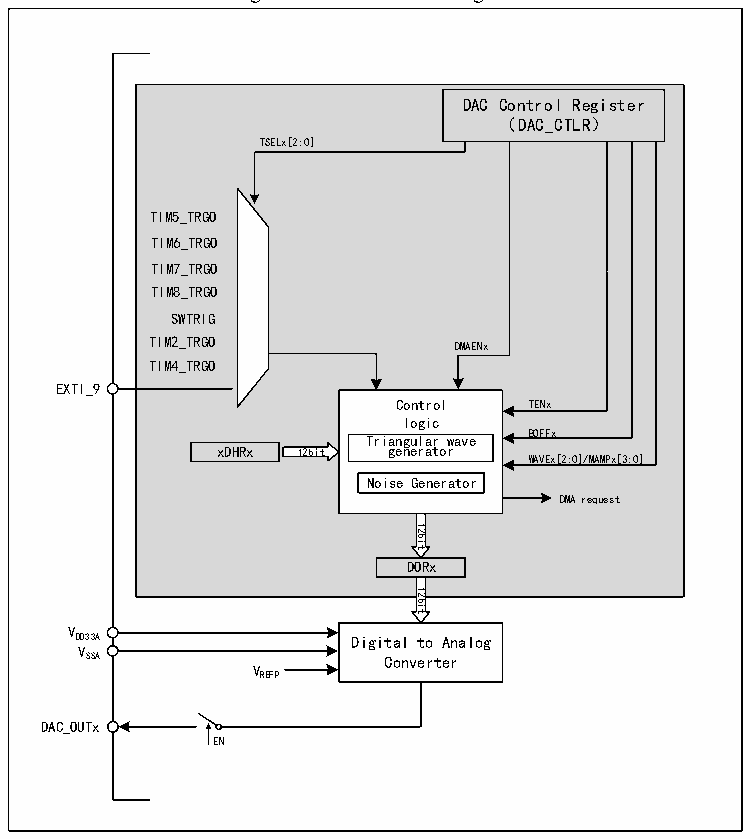

<!-- source-page: 187 -->

[← p.186](0186.md) · [index](../README.md) · [PDF p.187](https://ch32-riscv-ug.github.io/CH32V407/datasheet_en/CH32V407RM.PDF#page=187) · [p.188 →](0188.md)

<!-- header: CH32V407 Reference Manual https://wch-ic.com -->

### 13.2.1 DAC Structure

Figure 13-1 DAC block diagram  
 <!-- rendered from the PDF; verify at https://ch32-riscv-ug.github.io/CH32V407/datasheet_en/CH32V407RM.PDF#page=187 -->

🖼 Text parsed from the figure above

DAC Control Register  
（DAC_CTLR）  
TSELx[2:0]  
TIM5_TRGO  
TIM6_TRGO  
TIM7_TRGO  
TIM8_TRGO  
SWTRIG  
TIM2_TRGO DMAENx  
TIM4_TRGO  
EXTI_9  
Control TENx  
logic  
Triangular wave BOFFx  
xDHRx 12bit generator  
WAVEx[2:0]/MAMPx[3:0]  
Noise Generator  
DMA request  
12bit  
DORx  
12bit  
VDD33A  
Digital to Analog  
VSSA  
Converter  
VREFP  
DAC_OUTx  
EN  

### 13.2.2 DAC Channel Configuration

#### 13.2.2.1 Enable DAC:

Set the ENx bit in the DAC_CTLR register to 1, to enable the analog power to DAC channel x. After a period  
of start-up time, DAC channel x can be enabled. The DAC contains 2 analog output channels which can output  
independently or simultaneously.  
<em>Note: In order to avoid parasitic interference and additional power consumption, the corresponding pins of</em>  
<em>the DAC channel need to be set to analog input (AIN) mode in advance.</em>  

#### 13.2.2.2 Enable Output Buffer:

DAC integrates output buffers, which can be used to reduce the output impedance and increase the drive  
capacity to directly drive the external loads. Each DAC channel output buffer can be enabled or disabled by  
setting the BOFFx bit in the DAC_CTLR register.  

#### 13.2.2.3 Data Format:

In single DAC channel mode, data formats include 8-bit right alignment, 12-bit left alignment and 12-bit right  
alignment.  
<!-- image: p187-draw-image-00001 bbox=[499.92, 794.16, 519.84, 804.96] -->
<!-- footer: V1.2 185 -->
