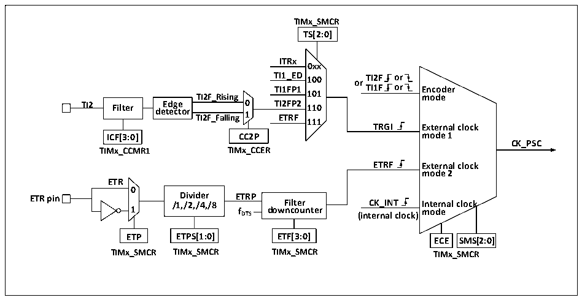

<!-- source-page: 202 -->

[← p.201](0201.md) · [index](../README.md) · [PDF p.202](https://ch32-riscv-ug.github.io/CH32V407/datasheet_en/CH32V407RM.PDF#page=202) · [p.203 →](0203.md)

<!-- header: CH32V407 Reference Manual https://wch-ic.com -->

### 14.2.2 Clock Input

Figure 14-2 CK_PSC source block diagram of advanced-control timer  
 <!-- rendered from the PDF; verify at https://ch32-riscv-ug.github.io/CH32V407/datasheet_en/CH32V407RM.PDF#page=202 -->

🖼 Text parsed from the figure above

<strong>TIMx_SMCR</strong>  
<strong>TS[2:0]</strong>  
<strong>ITRx</strong>  
<strong>0xx</strong>  
<strong>TI1_ED 100 or TI2F or</strong>  
<strong>TI1FP1 TI1F or Encoder</strong>  
<strong>TI2F_Rising 101 mode</strong>  
<strong>TI2 Filter de E t d e g c e tor TI2F_Falling 0 1 T E I2 T F R P F 2 110</strong>  
<strong>111</strong>  
<strong>TRGI External clock</strong>  
<strong>ICF[3:0] CC2P mode 1</strong>  
<strong>CK_PSC</strong>  
<strong>TIMx_CCMR1 TIMx_CCER</strong>  
<strong>ETRF External clock</strong>  
<strong>mode 2</strong>  
<strong>ETR</strong>  
<strong>0</strong>  
<strong>ETR pin /1 D ,/ i 2 vi , d /4 e , r /8 ETRP Filter CK_INT Internal clock</strong>  
<strong>1 fDTS downcounter</strong>  
<strong>mode</strong>  
<strong>(internal clock)</strong>  
<strong>ETP ETPS[1:0] ETF[3:0] ECE SMS[2:0]</strong>  
<strong>TIMx_SMCR TIMx_SMCR TIMx_SMCR TIMx_SMCR</strong>  

There are many clock sources for advanced-control timer CK_PSC, which can be divided into 4 categories:  
1) The route of external clock pin (ETR) input clock: ETR→ETRP→ETRF;  
2) Internal PB clock input route: CK_INT;  
3) The route from the compare/capture channel pin (TIMx_CHx): TIMx_CHx→TIx→TIxFPx; this route is  
also used in encoder mode;  
4) Input from other internal timers: ITRx;  
The actual operation can be divided into 4 categories by determining the input pulse selection of the SMS from  
the CK_PSC source:  
1) Select the internal clock source (CK_INT);  
2) External clock source mode 1;  
3) External clock source mode 2;  
4) Encoder mode;  
The 4 clock sources mentioned above can be selected by these 4 operations.  

#### 14.2.2.1 Internal Clock Source (CK_INT)

If the advanced-control timer is started when the SMS field is kept at 000b, then the internal clock source  
(CK_INT) is selected as the clock. At this moment, CK_INT is CK_PSC.  

#### 14.2.2.2 External Clock Source Mode 1

If SMS is set to 111b, the external clock source mode1 is enabled. When external clock source 1 is enabled,  
TRGI is selected as the source of CK_PSC. It is worth noting that you need to configure TS to select the source  
of TRGI. For TS, the following pulses can be used as the clock sources:  
1) Internal Trigger (ITRx, x is 0,1,2,3);  
2) Signal of compare/capture 1 after passing through the edge detector (TI1F_ED);  
3) Signals TI1FP1 and TI2FP2 of compare/capture channel;  
4) Signal ETRF from external clock pin.  

#### 14.2.2.3 External Clock Source Mode 2

<!-- image: p202-draw-image-00001 bbox=[499.92, 794.16, 519.84, 804.96] -->
<!-- footer: V1.2 200 -->
