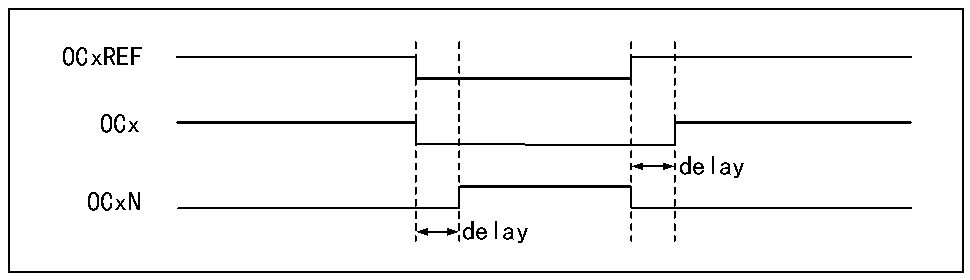

<!-- source-page: 209 -->

[← p.208](0208.md) · [index](../README.md) · [PDF p.209](https://ch32-riscv-ug.github.io/CH32V407/datasheet_en/CH32V407RM.PDF#page=209) · [p.210 →](0210.md)

<!-- header: CH32V407 Reference Manual https://wch-ic.com -->
When the edge alignment is used, the core counter counts up or down. In the scenario of PWM mode 1, when  
the value of the core counter is greater than that of the compare/capture register, OCxREF will be high; when  
the value of the core counter is less than the compare capture register (such as when the core counter increases  
to the value of R16_TIMx_ATRLR and returns to all 0), OCxREF drops to low.  
● Central alignment  
When the center-aligned mode is used, the core counter will run in a mode where up counting and down  
counting are performed alternately, and OCxREF performs rising and falling jumps when the values of the  
core counter and the compare/capture register are consistent. However, in 3 types of central alignment mode  
of comparison flag, the bit setting timing is different somewhat. When the center-alignment mode is used, it is  
the best to generate a software update flag (setting the UG bit) before starting the core counter.  

### 14.3.7 Complementary Output and Dead-time

The compare/capture channel generally has 2 output pins (compare/capture channel 4 has only one output pin),  
to output 2 complementary signals (OCx and OCxN). OCx and OCxN can be independently set by the CCxP  
and CCxNP bits. The output enable is set independently through CCxE and CCxNE, and the deadband and  
other controls are performed through the MOE, OIS, OISN, OSSI and OSSR bits. Meanwhile, OCx and OCxN  
outputs are enabled to insert into the deadband, each channel has a 10-bit deadband generator. If there is a  
break circuit, set the MOE bit. OCx and OCxN are generated by OCxREF in association. If OCx and OCxN  
are both high and effective, then OCx will be the same as OCxREF, but the rising edge of OCx is equivalent  
to OCxREF with a delay. OCxN is opposite to OCxREF, and its rising edge has a delay relative to the falling  
edge of the reference signal, and if the delay is greater than the effective output width, the corresponding pulse  
will not be generated.  
Figure 14-4 shows the relationship between OCx, OCxN and OCxREF, and shows the deadband.  

Figure 14-4 Complementary output and deadband  
 <!-- rendered from the PDF; verify at https://ch32-riscv-ug.github.io/CH32V407/datasheet_en/CH32V407RM.PDF#page=209 -->

🖼 Text parsed from the figure above

OCxREF  
OCx  
delay  
OCxN  
delay  

### 14.3.8 Break Signal

When the break signal is generated, the output enable signal and the invalid level will be modified according  
to the MOE, OIS, OISN, OSSI and OSSR bits. But OCx and OCxN will not be at the effective level at any  
time. The break event source can come from the break input pin, or it can be a clock failure event, and the  
clock failure event will be generated by CSS (Clock Security System).  
After the system reset, the break function will be disabled by default (MOE bit is low). Setting the BKE bit  
can enable the break function. The polarity of the input break signal can be set by setting BKP. The BKE and  
BKP signals can be written at the same time. There will be an APB clock delay before the actual write, so you  
need to wait for an PB cycle to read the written value correctly.  
When the selected level appears on the break pin, the system will generate the following actions:  
<!-- image: p209-draw-image-00001 bbox=[499.92, 794.16, 519.84, 804.96] -->
<!-- footer: V1.2 207 -->
