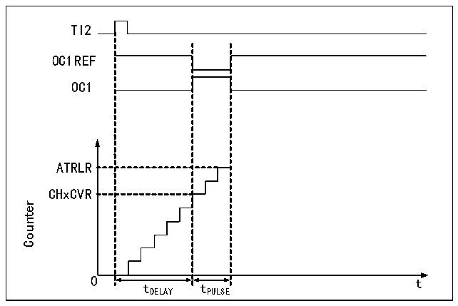

<!-- source-page: 210 -->

[← p.209](0209.md) · [index](../README.md) · [PDF p.210](https://ch32-riscv-ug.github.io/CH32V407/datasheet_en/CH32V407RM.PDF#page=210) · [p.211 →](0211.md)

<!-- header: CH32V407 Reference Manual https://wch-ic.com -->
1) The MOE bit is asynchronously cleared, and the output is set to the invalid status, idle status or reset status  
according to the setting of the OSSI bit;  
2) After MOE is cleared, each output channel will output the level determined by OISx;  
3) During the supplementary output: the output will be in an invalid status, depending on the polarity;  
4) If BIE is set, an interrupt will be generated when BIF is set; if the BDE bit is set, a DMA request will be  
generated;  
5) If AOE is set, the MOE bit will be automatically set during the next update of event UEV.  

### 14.3.9 Single Pulse Mode

The single pulse mode can be used to allow the microcontroller to respond to a specific event to generate a  
pulse after a delay. The delay and pulse width are programmable. Setting the OPM bit can make the core  
counter stop when the next update event UEV is generated (the counter turns over to 0).  
As shown in Figure 14-5, it is necessary to detect the beginning of a rising edge on the TI2 input pin. After  
delaying Tdelay, a positive pulse of length Tpulse will be generated on OC1:  

Figure 14-5 Single pulse generation  
 <!-- rendered from the PDF; verify at https://ch32-riscv-ug.github.io/CH32V407/datasheet_en/CH32V407RM.PDF#page=210 -->

🖼 Text parsed from the figure above

TI2  
OC1REF  
OC1  
ATRLR  
CHxCVR  
Counter  
0 t  
tDELAY tPULSE  

1) Set TI2 as trigger. Set CC2S to 01b and map TI2FP2 to TI2; set CC2P bit to 0b and set TI2FP2 to rising  
edge detection; set TS to 110b and set TI2FP2 as the trigger source; set SMS to 110b, and TI2FP2 is used to  
start the counter;  
2) Tdelay is determined by the value of the compare/capture register, and Tpulse is determined by the value  
of the auto-reload value register and the value of the compare/capture register.  

### 14.3.10 Encoder Mode

The encoder mode is a typical application of the timer. It can be used to access the dual-phase output of the  
encoder. The counting direction of the core counter is synchronized with the rotating shaft of the encoder. Each  
pulse outputted by the encoder will increase the core counter by adding one or subtracting one. The steps to  
use the encoder are: set the SMS field to 001b (counting only on TI2 edge), 010b (counting only on TI1 edge)  
or 011b (counting on both TI1 and TI2 edges), and connect the encoder to compare/capture channel 1, 2 input  
terminals, set a value for the reload value register and this value can be set to be greater. In the encoder mode,  
the internal compare/capture register of timer, prescaler, repeat count register, etc. all work normally. The  
following table shows the relationship between the counting direction and the encoder signal.  
<!-- image: p210-draw-image-00001 bbox=[499.92, 794.16, 519.84, 804.96] -->
<!-- footer: V1.2 208 -->
