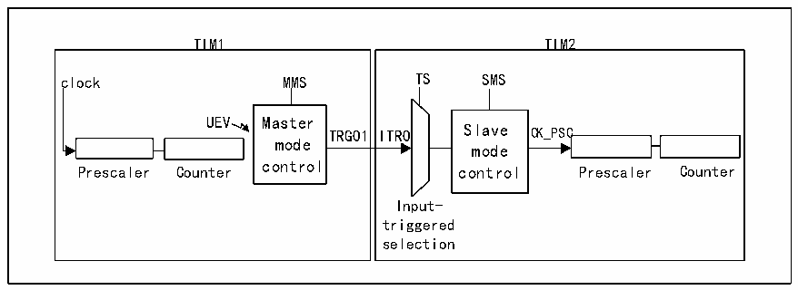

<!-- source-page: 211 -->

[← p.210](0210.md) · [index](../README.md) · [PDF p.211](https://ch32-riscv-ug.github.io/CH32V407/datasheet_en/CH32V407RM.PDF#page=211) · [p.212 →](0212.md)

<!-- header: CH32V407 Reference Manual https://wch-ic.com -->

<!-- p211-table-001 (table-14-1@1) -->
<table><caption>Table 14-1 Relationship between counting direction of timer encoder mode and encoder signal</caption><tr><th rowspan="2">Counting active edge</th><th rowspan="2" style="text-align:left">Relative signal level</th><th colspan="2">TI1FP1 signal edge</th><th colspan="2">TI2FP2 signal</th></tr><tr><td style="text-align:left">Rising edge</td><td style="text-align:left">Falling edge</td><td style="text-align:left">Rising edge</td><td style="text-align:left">Falling edge</td></tr><tr><td rowspan="2">Only count at TI1 edge</td><td>High</td><td>Downcount</td><td>Upcount</td><td rowspan="2" colspan="2">Not count</td></tr><tr><td>Low</td><td>Upcount</td><td>Downcount</td></tr><tr><td rowspan="2">Only count at TI2 edge</td><td>High</td><td rowspan="2" colspan="2">Not count</td><td>Upcount</td><td>Downcount</td></tr><tr><td>Low</td><td>Downcount</td><td>Upcount</td></tr><tr><td rowspan="2" style="text-align:left">Count on both edges of TI1 and TI2</td><td>High</td><td>Downcount</td><td>Upcount</td><td>Upcount</td><td>Downcount</td></tr><tr><td>Low</td><td>Upcount</td><td>Downcount</td><td>Downcount</td><td>Upcount</td></tr></table>

### 14.3.11 Timer Synchronization Mode

TIMx timers are internally wired together for timer synchronization or cascading. When a timer is configured  
in master mode, it can reset, start, stop, or provide a clock to the counter of another timer configured in slave  
mode.  
<strong>Using one timer as a prescaler for another timer</strong>  

Figure 14-10 Master/Slave timer example  
 <!-- rendered from the PDF; verify at https://ch32-riscv-ug.github.io/CH32V407/datasheet_en/CH32V407RM.PDF#page=211 -->

🖼 Text parsed from the figure above

TIM1 TIM2  
TIM1 clock MMS UEV Master TRGO1 mode control Prescaler Counter  TIM2 TS SMS ITRO Slave CK_PSC mode control Prescaler Counter Input- triggered selection  

For example, Timer 1 can be configured as a prescaler for Timer 2. To this end:  
1) Configure timer 1 as the main mode and output a periodic trigger signal every time an update event UEV  
occurs. If MMS=010 is written to R16_TIM1_CTLR2, TRGO1 will output a rising edge every time an  
update event is generated.  
2) To connect the TRGO1 output of Timer 1 to Timer 2, Timer 2 must be configured in slave mode, using  
ITR0 as the internal trigger. This is selected via the TS bit in the R16_TIM2_SMCFGR register (write  
TS=000).  
3) Then set the slave mode controller to external clock mode 1 (write SMS=111 in R16_TIM2_SMCFGR  
register). In this way, the clock of Timer 2 will be provided by the rising edge of the periodic trigger signal  
of Timer 1 (corresponding to the counter overflow of Timer 1).  
4) Finally, both timers must be enabled simultaneously by setting their corresponding CEN bits  
(R16_TIMx_CTLR1 register) to 1.  
<em>Note: If the OCx signal of timer 1 is selected as the trigger output (MMS=1xx), the rising edge of this signal</em>  
<em>will be used to drive the counter of timer 2</em>  
<strong>Use one timer to enable another timer</strong>  
In this example, Timer 2 is enabled by comparing 1 to the output of Timer 1. Only when OC1REF of Timer 1  
<!-- image: p211-draw-image-00001 bbox=[499.92, 794.16, 519.84, 804.96] -->
<!-- footer: V1.2 209 -->
