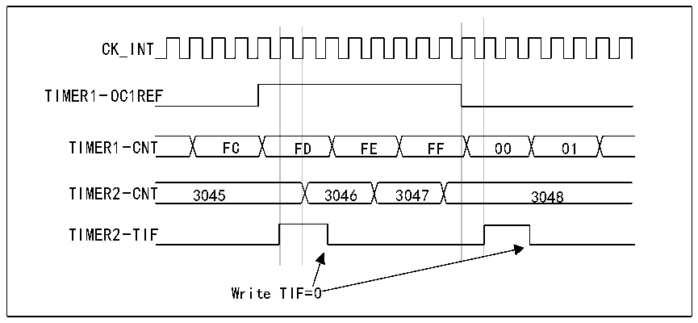

<!-- source-page: 212 -->

[← p.211](0211.md) · [index](../README.md) · [PDF p.212](https://ch32-riscv-ug.github.io/CH32V407/datasheet_en/CH32V407RM.PDF#page=212) · [p.213 →](0213.md)

<!-- header: CH32V407 Reference Manual https://wch-ic.com -->
is high, Timer 2 counts based on the divided internal clock. The clock frequency of both counters is divided  
by 3 through the prescaler based on CK_INT (fCK_CNT=fCK_INT/3).  
1) Configure timer 1 in master mode and send its output compare 1 reference signal (OC1REF) as the trigger  
output (MMS=100 in the R16_TIM1_CR2 register).  
2) Configure the OC1REF waveform for Timer 1 (R16_TIM1_CCMR1 register).  
3) Configure Timer 2 to receive an input trigger from Timer 1 (TS=000 in the R16_TIM2_SMCFGR register).  
4) Configure Timer 2 in gated mode (SMS=101 in R16_TIM2_SMCFGR register).  
5) Enable Timer 2 by writing &#x27;1&#x27; to the CEN bit (R16_TIM2_CTLR1 register).  
6) Start Timer 1 by writing &#x27;1&#x27; to the CEN bit (R16_TIM1_CTLR1 register).  
<em>Note: The clock of counter 2 is not synchronized with counter 1. This mode only affects the counter enable</em>  
<em>signal of timer 2.</em>  

Figure 14-11 Use OC1REF of timer 1 to implement gating control of timer 2  
 <!-- rendered from the PDF; verify at https://ch32-riscv-ug.github.io/CH32V407/datasheet_en/CH32V407RM.PDF#page=212 -->

🖼 Text parsed from the figure above

CK_INT  
F  FD  F  
TIMER1-OC1REF  
TIMER2-TIF  
Write TIF=0  

The Timer 2 counter and prescaler are not initialized before starting. So counting starts from the respective  
current value. Both timers can be reset from a specified value before starting Timer 1. This allows you to write  
any desired value into the timer counter. Both timers can be easily reset by software using the UG bit in the  
R16_TIMx_SWEVGR register.  
In the next example, Timer1 is synchronized with Timer2. Timer 1 is in master mode and starts counting from  
0. Timer 2 is in slave mode and starts counting from 0xE7. The prescaler ratios of both timers are the same.  
Timer 2 will be stopped when Timer 1 is disabled by writing &#x27;0&#x27; to the CEN bit in the R16_TIM1_CTLR1  
register:  
1) Configure timer 1 in master mode and send its output compare 1 reference signal (OC1REF) as a trigger  
output (MMS=100 in the R16_TIM1_CTLR2 register).  
2) Configure the OC1REF waveform for Timer 1 (R16_TIM1_CHCTLR1 register).  
3) Configure Timer 2 to receive an input trigger from Timer 1 (TS=000 in the R16_TIM2_SMCFGR register).  
4) Configure Timer 2 in gated mode (SMS=101 in R16_TIM2_SMCFGR register).  
5) Reset Timer 1 by writing &#x27;1&#x27; to the UG bit (R16_TIM1_SWEVGR register).  
6) Reset Timer 2 by writing &#x27;1&#x27; to the UG bit (R16_TIM2_SWEVGR register).  
7) Initialize Timer 2 to 0xE7 by writing &#x27;0xE7&#x27; in the timer 2 counter (R16_TIM2_CNTL).  
8) Enable Timer 2 by writing &#x27;1&#x27; to the CEN bit (R16_TIM2_CTLR1 register).  
9) Start Timer 1 by writing &#x27;1&#x27; to the CEN bit (R16_TIM1_CTLR1 register).  
10) Stop Timer 1 by writing &#x27;0&#x27; to the CEN bit (R16_TIM1_CTLR1 register).  
<!-- image: p212-draw-image-00001 bbox=[499.92, 794.16, 519.84, 804.96] -->
<!-- footer: V1.2 210 -->
