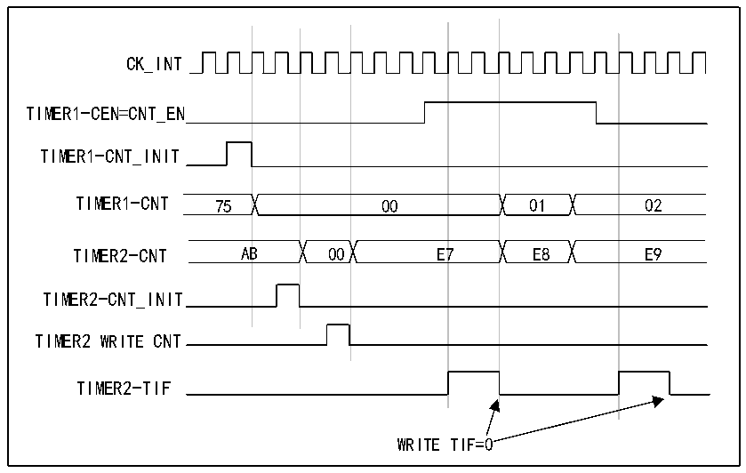

<!-- source-page: 213 -->

[← p.212](0212.md) · [index](../README.md) · [PDF p.213](https://ch32-riscv-ug.github.io/CH32V407/datasheet_en/CH32V407RM.PDF#page=213) · [p.214 →](0214.md)

<!-- header: CH32V407 Reference Manual https://wch-ic.com -->

Figure 14-12 Use the enable signal of timer 1 to implement gating control on timer 2  
 <!-- rendered from the PDF; verify at https://ch32-riscv-ug.github.io/CH32V407/datasheet_en/CH32V407RM.PDF#page=213 -->

🖼 Text parsed from the figure above

CK_INT  
01E8  00  00  00E7  B  7  7  
TIMER1-CEN=CNT_EN  
TIMER1-CNT_INIT  
TIMER2-CNT_INIT  
TIMER2 WRITE CNT  
TIMER2-TIF  
WRITE TIF=0  

<strong>Use one timer to start another timer</strong>  
In this example, the update event of timer 1 is used to enable timer 2. Whenever Timer 1 generates an update  
event, Timer 2 starts counting from the current value (which may not be 0) based on the divided internal clock.  
When timer 2 receives the trigger signal, its CEN bit is automatically set to 1, and the counter starts counting  
until &quot;0&quot; is written to the CEN bit of the R16_TIM2_CTLR1 register to stop counting. The clock frequency of  
both counters is divided by 3 through the prescaler based on CK_INT (fCK_CNT=fCK_INT/3).  
1) Configure timer 1 in master mode and send its update event (UEV) as a trigger output (MMS=010 in the  
R16_TIM1_CTLR2 register).  
2) Configure the period of timer 1 (R16_TIM1_ATRLR register).  
3) Configure Timer 2 to receive an input trigger from Timer 1 (TS=000 in the R16_TIM2_SMCFGR register).  
4) Configure timer 2 in trigger mode (SMS=110 in R16_TIM2_SMCFGR register).  
5) Start Timer 1 by writing &#x27;1&#x27; to the CEN bit (R16_TIM1_CTLR1 register).  
<!-- image: p213-draw-image-00001 bbox=[499.92, 794.16, 519.84, 804.96] -->
<!-- footer: V1.2 211 -->
