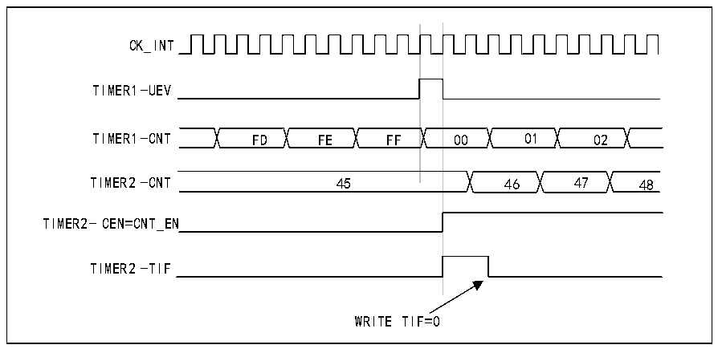
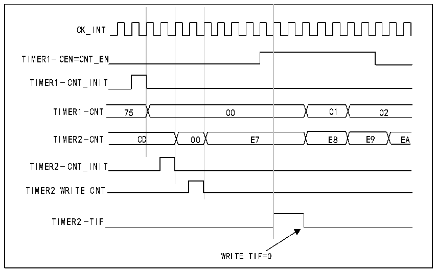

<!-- source-page: 214 -->

[← p.213](0213.md) · [index](../README.md) · [PDF p.214](https://ch32-riscv-ug.github.io/CH32V407/datasheet_en/CH32V407RM.PDF#page=214) · [p.215 →](0215.md)

<!-- header: CH32V407 Reference Manual https://wch-ic.com -->

Figure 14-13 Using the update event of timer 1 to trigger timer 2  
 <!-- rendered from the PDF; verify at https://ch32-riscv-ug.github.io/CH32V407/datasheet_en/CH32V407RM.PDF#page=214 -->

🖼 Text parsed from the figure above

CK_INT  
TIMER1-UEV  
00  01  02  
TIMER1-CNT FD FE FF 00 01 02  
TIMER2-CNT 45 46 47 48  
TIMER2- CEN=CNT_EN  
TIMER2-TIF  
WRITE TIF=0  

As shown in the above example, the user can initialize both counters before starting counting. Figure 14-14  
shows the counting behavior with the same configuration as Figure 14-13, but in trigger mode (SMS=110 in  
the R16_TIM2_SMCFGR register) instead of gated mode.  

Figure 14-14 Use the enable signal of timer 1 to trigger timer 2  
 <!-- rendered from the PDF; verify at https://ch32-riscv-ug.github.io/CH32V407/datasheet_en/CH32V407RM.PDF#page=214 -->

🖼 Text parsed from the figure above

00  00  D  00  E7  
CK_INT  
TIMER1-CEN=CNT_EN  
TIMER1-CNT_INIT  
TIMER2-CNT_INIT  
TIMER2 WRITE CNT  
TIMER2-TIF  
WRITE TIF=0  

<strong>Using one timer as a prescaler for another timer</strong>  
For example, Timer 1 can be configured as a prescaler for Timer 2. To this end:  
1) Configure timer 1 in master mode and send its update event (UEV) as a trigger output (MMS=010 in the  
R16_TIM1_CTLR2 register). This results in a periodic signal being output each time the counter  
overflows.  
2) Configure the period of timer 1 (R16_TIM1_ATRLR register).  
3) Configure Timer 2 to receive an input trigger from Timer 1 (TS=000 in the R16_TIM2_SMCFGR register).  
4) Configure Timer 2 in external clock mode (SMS=111 in R16_TIM2_SMCFGR register).  
5) Start Timer 2 by writing &#x27;1&#x27; to the CEN bit (R16_TIM2_CTLR1 register).  
<!-- image: p214-draw-image-00001 bbox=[499.92, 794.16, 519.84, 804.96] -->
<!-- footer: V1.2 212 -->
