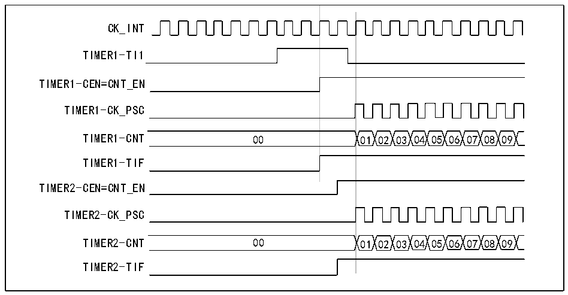

<!-- source-page: 215 -->

[← p.214](0214.md) · [index](../README.md) · [PDF p.215](https://ch32-riscv-ug.github.io/CH32V407/datasheet_en/CH32V407RM.PDF#page=215) · [p.216 →](0216.md)

<!-- header: CH32V407 Reference Manual https://wch-ic.com -->
6) Start Timer 1 by writing &#x27;1&#x27; to the CEN bit (R16_TIM1_CTLR1 register).  
<strong>Use an external trigger to start 2 timers synchronously</strong>  
In this example, timer 1 is enabled when a rising edge occurs at the TI1 input of timer 1. When timer 1 is  
enabled, timer 2 is enabled at the same time. To ensure that the two counters are aligned, Timer 1 must be  
configured in master/slave mode (corresponding to TI1 as slave and corresponding to Timer 2 as master):  
1) Configure timer 1 in master mode and send its enable signal as a trigger output (MMS=001 in the  
R16_TIM1_CTLR2 register).  
2) Configure Timer 1 in slave mode to receive input triggers from TI1 (TS=100 in R16_TIM1_SMCFGR  
register).  
3) Configure timer 1 in trigger mode (SMS=110 in R16_TIM1_SMCFGR register).  
4) Configure Timer 1 in master/slave mode by writing MSM=1 (R16_TIMx_SMCR register).  
5) Configure Timer 2 to receive an input trigger from Timer 1 (TS=000 in the R16_TIM2_SMCFGR register).  
6) Configure timer 2 in trigger mode (SMS=110 in R16_TIM2_SMCFGR register).  
When a rising edge occurs on TI1 (Timer 1), both counters start counting synchronously according to the  
internal clock, and both TIF flags are set to 1.  
<em>Note: In this example, both timers are initialized before starting (by setting their respective UG bits to 1). Both</em>  
<em>counters start counting at 0, but an offset between the two can be easily inserted by writing to either counter</em>  
<em>register (R16_TIMx_CNT). It can be noted that the master/slave mode creates a delay between CNT_EN and</em>  
<em>CK_PSC of timer 1.</em>  

Figure 14-15 Trigger Timer 1 and Timer 2 using the TI1 input of Timer 1  
 <!-- rendered from the PDF; verify at https://ch32-riscv-ug.github.io/CH32V407/datasheet_en/CH32V407RM.PDF#page=215 -->

🖼 Text parsed from the figure above

CK_INT  
TIMER1-TI1  
TIMER1-CEN=CNT_EN  
TIMER1-CK_PSC  
TIMER1-CNT 00 01 02 03 04 05 06 07 08 09  
TIMER1-TIF  
TIMER2-CEN=CNT_EN  
TIMER2-CK_PSC  
TIMER2-CNT 00 01 02 03 04 05 06 07 08 09  
TIMER2-TIF  

The timer can output clock pulses (TRGO) and also receive inputs from other timers (ITRx). The source of  
ITRx for different timers (the TRGO from other timers) varies. The internal trigger connections within the  
timer are shown in Table 14-2.  

<!-- p215-table-002 (table-14-2@1) -->
<table><caption>Table 14-2 Relationship between counting direction of timer encoder mode and encoder signal</caption><tr><th>Slave timer</th><th>ITR0(TS=000)</th><th>ITR1(TS=001)</th><th>ITR2(TS=010)</th><th>ITR3(TS=011)</th></tr><tr><td>TIM1</td><td>-</td><td>TIM2</td><td>TIM3</td><td>TIM4</td></tr></table>

<!-- image: p215-draw-image-00001 bbox=[499.92, 794.16, 519.84, 804.96] -->
<!-- footer: V1.2 213 -->
